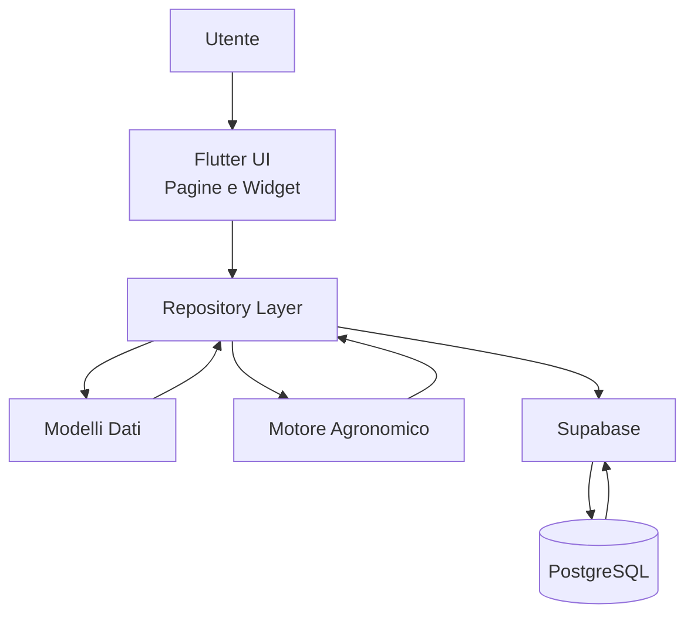
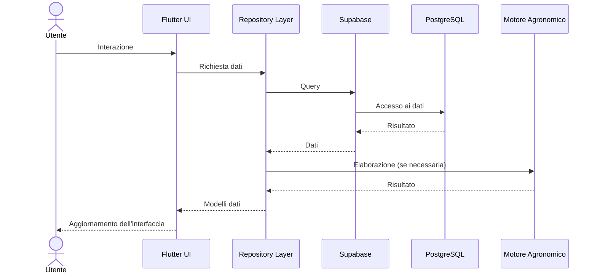

# ORTO SMART

### DOC-001

# Manuale Tecnico e Architetturale

**Versione:** 2.2
**Stato:** Approvato

**Autore:** Renzo Siega
**Progetto:** Orto Smart

**Data prima emissione:** 26/07/2026
**Ultimo aggiornamento:** 28/08/2026

**Repository:** `ortosmart/orto-smart`

---

# Informazioni sul documento

| Campo | Valore |
|--------|--------|
| Documento | DOC-001 |
| Titolo | Manuale Tecnico e Architetturale |
| Versione | 2.2 |
| Stato | Approvato |
| Progetto | Orto Smart |
| Linguaggio | Flutter / Dart |
| Backend | Supabase / PostgreSQL |
| Repository | ortosmart/orto-smart |
| Prima emissione | 26/07/2026 |
| Ultimo aggiornamento | 28/08/2026 |

---

# Cronologia delle revisioni

| Versione | Data       | Descrizione                                                                                                                                                            |
| -------- | ---------- | ---------------------------------------------------------------------------------------------------------------------------------------------------------------------- |
| 0.1      | 26/07/2026 | Prima emissione del Manuale Tecnico                                                                                                                                    |
| 0.2      | 27/07/2026 | Aggiornamento architettura e struttura documentale                                                                                                                     |
| 1.0      | 31/07/2026 | Revisione completa e approvazione del Manuale Tecnico                                                                                                                  |
| 1.1      | 08/08/2026 | Aggiornamento del Motore Agronomico con RecommendationPipeline, DecisionEngine e DecisionWeights                                                                       |
| 1.2      | 10/08/2026 | Consolidamento dell'evoluzione del Motore Agronomico con FamilyNeedsEngine, integrazione delle priorità familiari e fondamenta dati e di validazione del futuro SuccessionPlanningEngine |
| 1.3      | 11/08/2026 | Prima implementazione del SuccessionPlanningEngine, generazione temporale dei lotti e introduzione della regola sulle conversioni supportate |
| 1.4      | 11/08/2026 | Introduzione di AgronomicWindow, AgronomicWindowValidator e AgronomicWindowEngine per la prima verifica separata della compatibilità agronomica dei lotti pianificati |
| 1.5      | 12/08/2026 | Associazione delle finestre agronomiche a colture e varietà mediante CropAgronomicWindowRule, AgronomicWindowResolver, AgronomicWindowEvaluation e AgronomicWindowService |
| 1.6      | 16/08/2026 | Aggiornamento dell'architettura di persistenza con la baseline Database V1 congelata nella Sessione S017: 52 entità di dominio, struttura tecnica `profile_edit_locks`, ownership, accesso familiare monoutente, modello single-writer, sicurezza, integrità e strategia di implementazione incrementale |
| 1.7      | 16/08/2026 | Aggiornamento della S018 con supporto alle finestre agronomiche multiple e predisposizione dell'ambiente locale Supabase mediante WSL 2, Docker Desktop e Supabase CLI per la futura implementazione incrementale della baseline Database V1 |
| 1.8      | 18/08/2026 | Aggiornamento della S019 con prima migration Database V1, implementazione delle Fondazioni, schema `private`, helper autorizzativi, trigger metadata, prima matrice di sicurezza con 13 policy RLS, verifiche locali positive e negative e definizione delle RPC sicure e atomiche come prossimo incremento tecnico |
| 1.9      | 20/08/2026 | Aggiornamento della S020 con hardening di `profile_edit_locks`, implementazione e verifica delle prime cinque RPC server-side per acquisizione, heartbeat, rilascio, richiesta e annullamento del takeover, consolidamento delle regole di sicurezza concorrente e distinzione delle operazioni di takeover ancora da completare |
| 2.0      | 23/08/2026 | Aggiornamento con la Sessione S021: completamento del protocollo `profile_edit_locks`, hardening delle transizioni concorrenti, audit server-side e definizione del successivo Write Path autoritativo delle entità di Categoria A |
| 2.1      | 24/08/2026 | Aggiornamento con la Sessione S022: introduzione del primo Write Path autoritativo di Categoria A per `gardens`, Profile Write Authority, RPC `create_garden` e `update_garden`, blocco delle scritture dirette su `public.gardens` e validazioni server-side del Write Path |
| 2.2      | 28/08/2026 | Aggiornamento con la Sessione S023: hardening concorrente di `update_garden`, Write Path autoritativo di `seasons`, introduzione dell’identità tecnica del client e della sessione applicativa, integrazione Flutter della Profile Write Authority, gate locale fail-closed e adapter tipizzato per le scritture delle stagioni |

---

# Indice

## 1. Scopo del documento
1.1 Finalità  
1.2 Destinatari  
1.3 Obiettivi  
1.4 Aggiornamento del documento

## 2. Architettura generale
2.1 Obiettivo  
2.2 Visione architetturale  
2.3 Architettura a livelli  
2.4 Tecnologie utilizzate  
2.5 Principi architetturali  
2.6 Componenti principali  
2.7 Flusso generale delle informazioni  
2.8 Evoluzione dell'architettura  
2.9 Considerazioni finali

## 3. Struttura del progetto
3.1 Obiettivo  
3.2 Organizzazione generale  
3.3 Struttura delle directory principali  
3.4 Cartella core  
3.5 Cartella data  
3.6 Cartella models  
3.7 Cartella repositories  
3.8 Cartella pages  
3.9 Cartella widgets  
3.10 Cartella services  
3.11 File principali  
3.12 Considerazioni finali

## 4. Modello dati
4.1 Obiettivo  
4.2 Principi del modello dati  
4.3 Entità principali  
4.4 Relazioni tra le entità  
4.5 Flusso dei dati applicativi  
4.6 Evoluzione del modello dati  
4.7 Considerazioni finali

## 5. Database PostgreSQL
5.1 Obiettivo  
5.2 Architettura del database  
5.3 Tabelle principali  
5.4 Relazioni e vincoli  
5.5 Integrità dei dati  
5.6 Prestazioni  
5.7 Sicurezza  
5.8 Evoluzione futura  
5.9 Considerazioni finali

## 6. Repository Layer
6.1 Obiettivo  
6.2 Architettura del Repository Layer  
6.3 Repository implementati  
6.4 Flusso delle operazioni  
6.5 Gestione degli errori  
6.6 Vantaggi dell'architettura  
6.7 Evoluzione futura  
6.8 Considerazioni finali

## 7. Interfaccia Utente
7.1 Obiettivo  
7.2 Architettura dell'interfaccia  
7.3 Navigazione  
7.4 Pagine principali  
7.5 Widget principali  
7.6 Gestione dello stato  
7.7 Principi di progettazione  
7.8 Evoluzione futura  
7.9 Considerazioni finali

## 8. Motore Agronomico
8.1 Obiettivo  
8.2 Architettura del Motore Agronomico  
8.3 Componenti principali  
8.4 Flusso delle elaborazioni  
8.5 Validazione  
8.6 Vantaggi dell'architettura  
8.7 Evoluzione futura  
8.8 Considerazioni finali

## 9. Test e Qualità del Software
9.1 Obiettivo  
9.2 Strategia di test  
9.3 Flutter Analyze  
9.4 Test automatici  
9.5 Qualità del codice  
9.6 Gestione delle regressioni  
9.7 Evoluzione futura  
9.8 Considerazioni finali

## 10. Evoluzione del Progetto
10.1 Visione generale  
10.2 Principi evolutivi  
10.3 Aree di sviluppo  
10.4 Scalabilità dell'architettura  
10.5 Integrazioni future  
10.6 Roadmap di alto livello  
10.7 Considerazioni finali

---

# Prefazione

Il presente Manuale Tecnico e Architetturale costituisce il documento di riferimento per la progettazione software di **Orto Smart**.

Il suo obiettivo è descrivere in modo organico l'architettura dell'applicazione, le principali scelte progettuali e l'organizzazione dei componenti che ne costituiscono il funzionamento.

Il manuale è stato redatto con l'intento di documentare non solo lo stato attuale del progetto, ma anche i principi architetturali che ne guideranno l'evoluzione futura, mantenendo una chiara distinzione tra la struttura del sistema, il processo di sviluppo e la pianificazione delle attività.

La documentazione è organizzata in capitoli tematici, ciascuno dedicato a uno specifico livello dell'architettura software, con l'obiettivo di facilitare la consultazione, la manutenzione e l'evoluzione del progetto nel tempo.

Il presente documento costituisce il riferimento tecnico ufficiale di Orto Smart e viene aggiornato in occasione delle principali evoluzioni dell'architettura dell'applicazione.

---

# 1. Scopo del documento

## 1.1 Finalità

Il presente Manuale Tecnico costituisce il documento di riferimento per l'architettura software del progetto **Orto Smart**.

Il suo scopo è descrivere in modo sistematico la struttura dell'applicazione, le tecnologie impiegate, l'organizzazione del codice, il modello dati, i principali componenti software e le scelte progettuali adottate durante lo sviluppo.

Il documento rappresenta il riferimento tecnico ufficiale del progetto e deve essere mantenuto costantemente allineato all'evoluzione del codice sorgente.

---

## 1.2 Destinatari

Il manuale è destinato principalmente a:

- sviluppatori coinvolti nel progetto;
- futuri collaboratori;
- manutentori dell'applicazione;
- chiunque abbia la necessità di comprendere l'architettura e il funzionamento interno di Orto Smart.

Non costituisce un manuale d'uso dell'applicazione, ma un documento tecnico dedicato agli aspetti progettuali e implementativi.

---

## 1.3 Obiettivi

Gli obiettivi principali del Manuale Tecnico sono:

- documentare l'architettura software dell'applicazione;
- descrivere l'organizzazione del progetto e dei suoi componenti;
- illustrare il modello dati e la struttura del database;
- documentare le principali scelte architetturali;
- facilitare la manutenzione e l'evoluzione del software;
- fornire una base di riferimento per lo sviluppo delle future funzionalità.

---

## 1.4 Aggiornamento del documento

Il Manuale Tecnico è parte integrante del progetto Orto Smart.

Ogni modifica significativa dell'architettura, del database o dei principali componenti dell'applicazione deve essere accompagnata dal corrispondente aggiornamento del presente Manuale Tecnico.

Mantenere il Manuale Tecnico sincronizzato con il codice sorgente garantisce la coerenza della documentazione e facilita la manutenzione del progetto nel lungo periodo.

# 2. Architettura del sistema

## 2.1 Obiettivi dell'architettura

L'architettura di **Orto Smart** è stata progettata per realizzare un'applicazione robusta, modulare, facilmente estendibile e capace di accompagnare l'evoluzione del progetto nel lungo periodo.

Fin dalle prime fasi di sviluppo è stato adottato un approccio orientato alla separazione delle responsabilità (*Separation of Concerns*), organizzando il software in componenti indipendenti e ben definiti. Ogni componente svolge un ruolo specifico e comunica con gli altri attraverso interfacce chiare, riducendo le dipendenze e semplificando la manutenzione del codice.

Questa impostazione consente di introdurre nuove funzionalità, correggere eventuali problemi e migliorare le prestazioni senza dover modificare l'intera struttura dell'applicazione.

Gli obiettivi principali dell'architettura sono:

- separare l'interfaccia utente dalla logica applicativa;
- isolare l'accesso ai dati mediante il **Repository Layer**;
- mantenere il Motore Agronomico indipendente dal database e dall'interfaccia utente;
- favorire il riutilizzo dei componenti software;
- semplificare le attività di test, manutenzione ed evoluzione del progetto;
- garantire un'architettura scalabile, adatta all'integrazione di nuove funzionalità.

L'architettura è stata inoltre progettata per supportare gli sviluppi previsti del progetto, tra cui l'espansione del Motore Agronomico, la gestione avanzata delle attività, l'integrazione con sistemi di irrigazione automatica, l'utilizzo dei dati meteorologici e l'introduzione di ulteriori moduli intelligenti.

L'obiettivo finale è disporre di una base software stabile, coerente e facilmente manutenibile, capace di sostenere la crescita di Orto Smart senza compromettere la qualità del codice e della documentazione.

## 2.2 Principi progettuali

L'architettura di Orto Smart si basa su un insieme di principi progettuali che guidano tutte le decisioni di sviluppo. L'obiettivo è realizzare un'applicazione ordinata, coerente e facilmente evolvibile, mantenendo una chiara separazione tra le diverse responsabilità del sistema.

Ogni nuova funzionalità viene progettata nel rispetto di questi principi, così da preservare nel tempo la qualità del codice e la semplicità dell'architettura.

I principi fondamentali adottati sono i seguenti.

### Modularità

L'applicazione è suddivisa in moduli indipendenti, ciascuno con una responsabilità ben definita. Questa organizzazione consente di sviluppare, modificare o sostituire un componente senza influire sul funzionamento degli altri.

### Separazione delle responsabilità

Ogni livello dell'applicazione svolge un compito specifico.

- L'interfaccia utente gestisce la presentazione dei dati e l'interazione con l'utente.
- I Repository si occupano esclusivamente dell'accesso ai dati.
- I modelli rappresentano le entità del dominio applicativo.
- Il Motore Agronomico implementa la logica decisionale e gli algoritmi di elaborazione.

Questa suddivisione riduce l'accoppiamento tra i componenti e rende il sistema più semplice da comprendere e mantenere.

### Riutilizzo del codice

Le funzionalità comuni vengono implementate una sola volta e rese disponibili ai diversi moduli dell'applicazione. Questo approccio riduce la duplicazione del codice e facilita la manutenzione.

### Testabilità

L'architettura è progettata per consentire il test dei singoli componenti in modo indipendente. La separazione tra logica applicativa, accesso ai dati e interfaccia utente permette di verificare il comportamento di ciascun modulo senza dipendere dagli altri.

### Scalabilità

La struttura dell'applicazione è predisposta per accogliere nuove funzionalità senza richiedere modifiche sostanziali all'architettura esistente. Nuovi moduli potranno essere integrati mantenendo la stessa organizzazione del progetto.

### Manutenibilità

Il codice è organizzato in modo chiaro e coerente, favorendo interventi di manutenzione rapidi e riducendo il rischio di introdurre errori durante l'evoluzione del software.

### Efficienza

Le scelte architetturali sono orientate a un utilizzo efficiente delle risorse, con particolare attenzione all'organizzazione del database, alla riduzione delle duplicazioni e all'ottimizzazione delle comunicazioni tra applicazione e backend.

L'adozione sistematica di questi principi costituisce la base dell'architettura di Orto Smart e garantisce una crescita ordinata del progetto nel tempo.

## 2.3 Architettura generale

L'architettura di Orto Smart è organizzata secondo una struttura a livelli (*layered architecture*), nella quale ogni componente svolge una funzione specifica e comunica esclusivamente con i livelli adiacenti.

Questa organizzazione consente di mantenere il codice ordinato, ridurre le dipendenze tra i moduli e facilitare l'introduzione di nuove funzionalità senza compromettere la stabilità dell'applicazione.

Lo schema seguente rappresenta la struttura logica dell'intero sistema.



**Figura 2.1 – Architettura logica di Orto Smart.**

L'utente interagisce esclusivamente con l'interfaccia sviluppata in Flutter. L'interfaccia non accede direttamente al database, ma utilizza il Repository Layer come punto di accesso ai dati.

Il Repository Layer gestisce tutte le comunicazioni con Supabase, trasforma i dati provenienti dal database in modelli Dart e li rende disponibili all'applicazione.

Il Motore Agronomico utilizza i dati forniti dai Repository per eseguire analisi, elaborazioni e suggerimenti, senza effettuare accessi diretti al database. Questa separazione rende il sistema più modulare, facilmente testabile e semplice da estendere.

L'intera architettura è progettata per mantenere indipendenti i diversi livelli dell'applicazione, garantendo un'elevata manutenibilità e una crescita ordinata del progetto.

## 2.4 Componenti dell'architettura

L'architettura di Orto Smart è composta da un insieme di componenti specializzati che collaborano tra loro per garantire una chiara separazione delle responsabilità e una gestione efficiente dell'applicazione.

Ogni componente svolge un ruolo ben definito e comunica con gli altri esclusivamente attraverso interfacce chiare, mantenendo basso l'accoppiamento e favorendo la manutenibilità del sistema.

### Flutter UI

L'interfaccia utente è sviluppata con Flutter e rappresenta il punto di contatto tra l'utente e l'applicazione.

Gestisce:

- pagine;
- widget;
- navigazione;
- acquisizione degli input dell'utente;
- presentazione dei dati.

La UI non contiene logica di business né accede direttamente al database.

---

### Repository Layer

Il Repository Layer costituisce il livello di accesso ai dati.

I Repository centralizzano tutte le operazioni di lettura e scrittura verso Supabase, trasformando i dati provenienti dal database in oggetti Dart utilizzabili dall'applicazione.

Questo livello isola completamente l'interfaccia utente dalla struttura del database. L'organizzazione e le responsabilità dei Repository sono approfondite nel Capitolo 6.

---

### Modelli dati

I modelli rappresentano le principali entità del dominio applicativo.

Ogni modello descrive la struttura dei dati e fornisce i metodi necessari per la conversione tra gli oggetti Dart e i record del database.

I modelli non contengono logica di business né effettuano interrogazioni dirette al database.

---

### Motore Agronomico

Il Motore Agronomico rappresenta il componente intelligente dell'applicazione.

Riceve i dati dai Repository, applica algoritmi e regole agronomiche e restituisce analisi, suggerimenti e risultati utilizzati dall'interfaccia utente.

La sua indipendenza dal database e dall'interfaccia utente ne facilita lo sviluppo, il collaudo e l'estensione con nuovi algoritmi. Il Motore Agronomico viene descritto in dettaglio nel Capitolo 8.

---

### Supabase

Supabase costituisce il backend dell'applicazione.

Fornisce il database PostgreSQL, i servizi di autenticazione, le API di accesso ai dati e i meccanismi di sicurezza necessari al corretto funzionamento del sistema.

L'applicazione comunica esclusivamente con Supabase attraverso il Repository Layer.

---

### PostgreSQL

PostgreSQL rappresenta il livello di persistenza dei dati.

Contiene tutte le informazioni gestite dall'applicazione, organizzate secondo un modello relazionale progettato per garantire integrità, efficienza ed espandibilità.

Il database costituisce la fonte autorevole di tutti i dati utilizzati da Orto Smart. La struttura del database e il modello dati vengono approfonditi nei Capitoli 4 e 5.

---

L'interazione coordinata di questi componenti consente di mantenere un'architettura ordinata, modulare e facilmente evolvibile, rendendo possibile l'introduzione di nuove funzionalità senza alterare la struttura generale dell'applicazione.

## 2.5 Flusso dei dati

Il flusso dei dati all'interno di Orto Smart segue un percorso ben definito, progettato per mantenere separate le responsabilità dei diversi livelli dell'applicazione.

Ogni richiesta dell'utente attraversa una serie di componenti specializzati che elaborano i dati e restituiscono il risultato all'interfaccia. Nessun componente accede direttamente a livelli che non rientrano nelle proprie responsabilità, garantendo così un'architettura ordinata e facilmente manutenibile.

Il diagramma seguente rappresenta il flusso logico delle informazioni.



**Figura 2.2 – Flusso dei dati tra i principali componenti dell'applicazione.**

Il processo può essere riassunto nelle seguenti fasi:

1. L'utente esegue un'azione attraverso l'interfaccia dell'applicazione.
2. La Flutter UI inoltra la richiesta al Repository competente.
3. Il Repository comunica con Supabase per leggere o aggiornare i dati.
4. Supabase interroga il database PostgreSQL ed esegue l'operazione richiesta.
5. I dati vengono restituiti al Repository.
6. Se necessario, il Repository richiede un'elaborazione al Motore Agronomico.
7. Il Repository restituisce all'interfaccia i modelli dati già pronti per l'utilizzo.
8. La Flutter UI aggiorna la schermata mostrando il risultato all'utente.

Questo flusso garantisce che ogni componente operi esclusivamente nell'ambito delle proprie responsabilità, migliorando la leggibilità del codice, facilitando i test e riducendo il rischio di effetti collaterali durante l'evoluzione del progetto.

## 2.6 Vantaggi dell'architettura

L'architettura adottata da Orto Smart offre numerosi vantaggi sia durante lo sviluppo sia nelle future attività di manutenzione ed evoluzione del progetto.

La suddivisione dell'applicazione in componenti indipendenti consente di mantenere il codice ordinato, ridurre la complessità e semplificare l'introduzione di nuove funzionalità.

I principali vantaggi sono i seguenti.

### Manutenibilità

La chiara separazione delle responsabilità permette di intervenire su un singolo componente senza influenzare il funzionamento degli altri, riducendo il rischio di introdurre errori durante le modifiche.

### Scalabilità

L'architettura è predisposta per accogliere nuovi moduli e nuove funzionalità mantenendo invariata la struttura generale dell'applicazione. Questo consente una crescita progressiva del progetto senza dover riprogettare il software.

### Testabilità

Ogni componente può essere verificato in modo indipendente. La separazione tra interfaccia utente, accesso ai dati e logica applicativa facilita la realizzazione di test automatici e rende più semplice individuare eventuali anomalie.

### Riutilizzo del codice

La suddivisione in moduli favorisce il riutilizzo delle componenti comuni, riducendo la duplicazione del codice e migliorandone la qualità complessiva.

### Affidabilità

L'isolamento delle responsabilità limita gli effetti delle modifiche e rende il comportamento dell'applicazione più prevedibile e stabile nel tempo.

### Evoluzione del progetto

L'architettura costituisce una base solida per l'introduzione di nuove funzionalità, come l'espansione del Motore Agronomico, la gestione avanzata delle attività, l'integrazione con sistemi di irrigazione automatica e l'utilizzo di ulteriori sorgenti dati.

Nel complesso, l'architettura di Orto Smart è stata progettata per garantire un equilibrio tra semplicità, flessibilità ed estendibilità, accompagnando l'evoluzione del progetto senza compromettere la qualità del software.

## 2.7 Evoluzione futura

L'architettura di Orto Smart è stata progettata con una visione di lungo periodo, prevedendo fin dalle prime fasi di sviluppo la possibilità di integrare nuove funzionalità senza modificare la struttura portante dell'applicazione.

L'organizzazione modulare del sistema consente di ampliare progressivamente le capacità dell'applicazione, mantenendo invariati i principi progettuali descritti nei paragrafi precedenti.

Tra le principali aree di evoluzione previste rientrano:

- ampliamento del Motore Agronomico con nuovi algoritmi di analisi e supporto decisionale;
- gestione avanzata delle attività e pianificazione automatica dei lavori nell'orto;
- integrazione con sistemi di irrigazione automatica basati su Raspberry Pi ed ESP32;
- utilizzo dei dati meteorologici per supportare irrigazione, pianificazione e analisi agronomiche;
- introduzione di moduli dedicati a raccolti, fertilizzazioni, trattamenti, costi, ricavi e statistiche;
- sviluppo di funzionalità intelligenti basate sull'analisi storica dei dati raccolti.

L'architettura potrà inoltre essere estesa con nuovi servizi e componenti senza compromettere il funzionamento dei moduli esistenti, preservando la compatibilità con le versioni precedenti dell'applicazione.

L'obiettivo è accompagnare la crescita di Orto Smart mantenendo nel tempo un software affidabile, facilmente manutenibile e in grado di adattarsi alle future esigenze del progetto.

# 3. Struttura del progetto

## 3.1 Obiettivo

La struttura del progetto rappresenta l'organizzazione fisica del codice sorgente di Orto Smart.

L'obiettivo principale è mantenere una chiara separazione tra i diversi componenti dell'applicazione, facilitando lo sviluppo, la manutenzione e l'introduzione di nuove funzionalità.

L'organizzazione delle cartelle riflette direttamente l'architettura descritta nel capitolo precedente: ogni directory è dedicata a una specifica responsabilità e contiene esclusivamente gli elementi necessari allo svolgimento del proprio compito.

Questa impostazione rende il progetto più semplice da comprendere, favorisce il riutilizzo del codice e permette di individuare rapidamente il punto in cui intervenire durante lo sviluppo.

La struttura è progettata per evolvere insieme all'applicazione, mantenendo nel tempo ordine, coerenza e scalabilità.

## 3.2 Organizzazione generale

Il codice sorgente principale dell'applicazione è contenuto nella cartella `lib/`, che rappresenta il cuore del progetto Flutter.

Al suo interno il codice è organizzato in directory specializzate, ciascuna dedicata a un preciso livello dell'architettura software.

La seguente struttura rappresenta l'organizzazione attuale del progetto.

```text
lib/
├── core/
│   └── config/
├── data/
│   ├── models/
│   └── repositories/
├── pages/
├── services/
├── widgets/
├── main.dart
└── supabase_config.dart
```

Ogni directory svolge una responsabilità specifica e contribuisce a mantenere il progetto ordinato e facilmente manutenibile.

Nei paragrafi successivi verrà descritto il ruolo di ciascun componente della struttura.

## 3.3 Struttura delle directory principali

La cartella `lib/` contiene tutti i componenti software sviluppati per Orto Smart. La sua organizzazione segue i principi architetturali descritti nel Capitolo 2, mantenendo una netta separazione tra interfaccia utente, logica applicativa, gestione dei dati e configurazione.

Ogni directory è dedicata a uno specifico ambito funzionale, riducendo l'accoppiamento tra i componenti e facilitando la manutenzione del codice.

Le principali directory del progetto sono:

| Directory | Responsabilità |
|-----------|----------------|
| `core/` | Configurazioni e componenti condivisi dell'applicazione. |
| `data/` | Modelli del dominio e Repository per l'accesso ai dati. |
| `pages/` | Schermate dell'applicazione e gestione della navigazione. |
| `widgets/` | Componenti grafici riutilizzabili. |
| `services/` | Servizi applicativi e logica di supporto. |
| `main.dart` | Punto di ingresso dell'applicazione Flutter. |
| `supabase_config.dart` | Parametri di configurazione della connessione a Supabase. |

Questa organizzazione consente di individuare rapidamente il punto in cui intervenire durante lo sviluppo, mantenendo il codice ordinato e facilmente comprensibile anche all'aumentare delle funzionalità dell'applicazione.

## 3.4 Cartella `core`

La directory `core/` contiene gli elementi condivisi dall’intera applicazione che non appartengono a uno specifico modulo funzionale.

La struttura comprende attualmente:

- `config/`, per le configurazioni generali del progetto;
- `identity/`, per l’identità tecnica persistente del client e l’identità della sessione applicativa;
- `profile/`, per il contesto del Profile corrente e il gate della sessione Profile;
- `write_authority/`, per il coordinamento applicativo della Profile Write Authority.

La sottocartella `identity/` distingue due concetti:

- l’identità stabile dell’installazione o istanza client, conservata localmente;
- l’identità della sessione applicativa, nuova a ogni avvio e non persistita come continuazione automatica di una sessione precedente.

La persistenza dell’identificatore stabile del client utilizza `shared_preferences` versione `2.5.5`, mentre la generazione degli identificatori tecnici utilizza `uuid` versione `4.6.0`. Il token del lease non appartiene all’identità persistente del client e non viene conservato in questo storage.

La sottocartella `profile/` mantiene il contesto applicativo del Profile e impedisce l’accesso al ciclo operativo protetto finché identità, appartenenza e stato della sessione non sono stati risolti in modo coerente.

La sottocartella `write_authority/` contiene il modello del lock, lo scheduler, il controller, lo scope applicativo e i risultati tipizzati delle scritture protette. Il controller mantiene lo stato locale della Write Authority, coordina acquisizione, heartbeat, scadenza e rilascio del lease e applica un comportamento fail-closed quando l’autorità non può essere dimostrata.

Il gate locale costituisce un controllo preventivo dell’applicazione: evita di avviare scritture note come non autorizzate, ma non sostituisce mai le verifiche autoritative eseguite dal database all’interno delle RPC.

Lo scopo della directory `core/` è centralizzare queste responsabilità trasversali, evitando duplicazioni e mantenendo uniforme il comportamento dell’applicazione.

## 3.5 Cartella `data`

La directory `data/` raccoglie tutti i componenti dedicati alla gestione dei dati dell'applicazione.

Questo livello rappresenta il collegamento tra il database Supabase e la logica applicativa, occupandosi della rappresentazione delle entità del dominio e dell'accesso ai dati.

La cartella è suddivisa in due aree principali:

- `models/`, che contiene le classi che rappresentano le entità dell'applicazione;
- `repositories/`, che implementa l'accesso ai dati e le comunicazioni con Supabase.

Questa organizzazione mantiene separata la struttura dei dati dalla logica di accesso al database, semplificando la manutenzione e rendendo il codice più leggibile e facilmente estendibile.

## 3.6 Cartella `models`

La directory `models/` contiene le classi che rappresentano il modello dati di Orto Smart.

Ogni modello descrive una specifica entità del dominio applicativo, come orti, aiuole, colture, stagioni, piantagioni e gli altri elementi gestiti dal sistema.

Le classi presenti in questa cartella hanno il compito di:

- rappresentare i dati provenienti dal database;
- convertire i record di Supabase in oggetti Dart;
- convertire gli oggetti Dart nei dati da salvare nel database;
- garantire una struttura dati coerente all'interno dell'applicazione.

I modelli non contengono logica di business né effettuano operazioni di accesso al database. La loro responsabilità è esclusivamente quella di rappresentare le informazioni in modo strutturato.

Dalla Sessione S023 il modello `Season` espone anche `rowVersion`, necessario per applicare il controllo di concorrenza ottimistico durante le scritture autoritative. Il valore rappresenta la versione server-side della riga e non viene incrementato autonomamente dal client.

Questa separazione consente di mantenere il codice più ordinato, facilita il riutilizzo delle classi e rende più semplice l'introduzione di nuove entità durante l'evoluzione del progetto.

## 3.7 Cartella `repositories`

La directory `repositories/` implementa il Repository Layer descritto nel Capitolo 2.

Ogni Repository è responsabile dell'accesso ai dati relativi a una specifica entità dell'applicazione.

Le principali responsabilità dei Repository sono:

- eseguire le interrogazioni di lettura verso Supabase;
- invocare le RPC autoritative previste per le scritture protette;
- convertire i risultati nei modelli e nei risultati tipizzati Dart;
- validare in modo fail-closed i payload restituiti dal backend;
- gestire gli errori di comunicazione e gli esiti applicativi;
- fornire all’applicazione un’interfaccia uniforme per l’accesso ai dati.

I Repository non attribuiscono autonomamente l’autorità di scrittura. Quando un’operazione è protetta, ottengono il lease dal livello Profile Write Authority e demandano al database la verifica definitiva di identità, ownership, client, sessione, token, lease, takeover, invarianti e versione della riga.

Grazie a questa architettura, le pagine dell'applicazione non comunicano mai direttamente con il database, ma utilizzano esclusivamente i Repository.

Questo approccio riduce l'accoppiamento tra i componenti, facilita i test e permette di modificare il backend senza influire sul resto dell'applicazione.

## 3.8 Cartella `pages`

La directory `pages/` contiene tutte le schermate dell'applicazione, ovvero i componenti che costituiscono l'interfaccia utente di Orto Smart.

Ogni pagina rappresenta una specifica funzionalità del sistema, come la dashboard, la gestione dell'orto, delle aiuole, delle colture, dell'irrigazione o delle attività.

Le pagine hanno il compito di:

- gestire l'interazione con l'utente;
- acquisire gli input;
- richiedere i dati ai Repository;
- visualizzare le informazioni ricevute;
- aggiornare l'interfaccia in base allo stato dell'applicazione.

Le pagine non implementano direttamente la logica di business né effettuano accessi al database. Ogni operazione sui dati viene delegata ai Repository o ai servizi dedicati, mantenendo una chiara separazione delle responsabilità.

## 3.9 Cartella `widgets`

La directory `widgets/` raccoglie i componenti grafici riutilizzabili dell'applicazione.

Un widget rappresenta una porzione dell'interfaccia che può essere utilizzata in più pagine senza duplicare il codice. Questo approccio favorisce la modularità dell'interfaccia utente e rende più semplice la manutenzione del progetto.

Tra gli esempi di widget riutilizzabili rientrano:

- schede informative;
- pulsanti personalizzati;
- componenti grafici;
- layout delle aiuole;
- elementi di navigazione;
- finestre di dialogo.

L'utilizzo di widget dedicati consente di mantenere le pagine più semplici e leggibili, migliorando l'organizzazione del codice e facilitando eventuali modifiche future.

## 3.10 Cartella `services`

La directory `services/` contiene i servizi applicativi che implementano funzionalità trasversali utilizzate da più componenti del sistema.

I servizi permettono di concentrare in un unico punto operazioni che non appartengono né all'interfaccia utente né ai Repository, mantenendo il codice ordinato e facilmente riutilizzabile.

Con l'evoluzione del progetto questa cartella ospiterà, ad esempio:

- servizi di supporto al Motore Agronomico;
- gestione delle notifiche;
- elaborazioni automatiche;
- integrazione con sistemi esterni;
- servizi meteorologici;
- gestione dell'irrigazione automatica;
- funzionalità condivise tra più moduli.

La presenza di una directory dedicata ai servizi contribuisce a mantenere l'architettura modulare e facilita l'introduzione di nuove funzionalità senza modificare i componenti esistenti.

## 3.11 File principali

Oltre alle directory principali, il progetto comprende alcuni file fondamentali per l'avvio e la configurazione dell'applicazione.

### `main.dart`

È il punto di ingresso dell’applicazione Flutter.

Ha il compito di inizializzare l’ambiente di esecuzione, Supabase e i servizi necessari all’avvio. Dalla Sessione S023 coordina inoltre:

- il caricamento o la creazione dell’identità tecnica persistente del client;
- la creazione di una nuova identità della sessione applicativa;
- la risoluzione del contesto Profile;
- il rilascio conservativo delle acquisizioni obsolete riferite allo stesso client;
- la creazione del controller e dello scheduler della Profile Write Authority;
- il gate della sessione Profile;
- l’esposizione della Write Authority tramite lo scope applicativo;
- il rilascio delle risorse nel ciclo di chiusura dell’applicazione.

Una nuova sessione applicativa non eredita automaticamente un lease ottenuto da una sessione precedente. Le funzionalità protette vengono rese disponibili soltanto dopo la costruzione coerente del contesto Profile e della relativa autorità di scrittura.

### `supabase_config.dart`

Contiene i parametri di configurazione utilizzati per la connessione al backend Supabase.

La separazione della configurazione dal resto del codice migliora l'organizzazione del progetto e semplifica la gestione delle impostazioni dell'applicazione.

## 3.12 Considerazioni finali

La struttura del progetto Orto Smart è stata progettata per garantire ordine, modularità e facilità di manutenzione durante l'intero ciclo di vita dell'applicazione.

La suddivisione del codice in directory specializzate riflette direttamente l'architettura descritta nel Capitolo 2 e consente di mantenere chiaramente separate le responsabilità dei diversi componenti del sistema.

Questa organizzazione permette di:

- individuare rapidamente il codice relativo a una specifica funzionalità;
- semplificare lo sviluppo di nuovi moduli;
- ridurre il rischio di introdurre errori durante le modifiche;
- favorire il riutilizzo del codice;
- rendere il progetto facilmente comprensibile anche a nuovi sviluppatori.

La struttura attuale rappresenta una base solida ma sufficientemente flessibile per accompagnare la crescita di Orto Smart. Con l'introduzione di nuove funzionalità potranno essere aggiunte ulteriori directory e componenti, mantenendo comunque i principi di modularità, separazione delle responsabilità e scalabilità che caratterizzano l'intera architettura del progetto.

Nel Capitolo 4 verrà descritto il modello dati dell'applicazione, analizzando le principali entità gestite da Orto Smart e le relazioni che le collegano all'interno del database.

# 4. Modello dati

## 4.1 Obiettivo

Il modello dati rappresenta il fondamento dell'intera applicazione Orto Smart.

Il suo scopo è descrivere in modo strutturato tutte le informazioni gestite dal sistema, definendo le principali entità del dominio applicativo e le relazioni esistenti tra esse.

Una progettazione accurata del modello dati garantisce coerenza, integrità e semplicità di evoluzione del software, consentendo di introdurre nuove funzionalità senza compromettere la compatibilità con la struttura esistente.

Il modello dati costituisce inoltre il collegamento tra il database PostgreSQL, i Repository e il Motore Agronomico, assicurando una rappresentazione uniforme delle informazioni all'interno dell'applicazione.

## 4.2 Principi del modello dati

Il modello dati di Orto Smart è stato progettato seguendo gli stessi principi che guidano l'intera architettura software dell'applicazione: semplicità, modularità, coerenza ed estendibilità.

L'obiettivo è rappresentare in modo fedele gli elementi che caratterizzano la gestione di un orto, mantenendo una struttura sufficientemente flessibile da supportare l'evoluzione del progetto nel tempo.

La progettazione del modello dati si basa sui seguenti principi fondamentali.

### Coerenza

Ogni informazione viene rappresentata una sola volta, evitando duplicazioni e mantenendo un'unica fonte autorevole per ciascun dato.

### Integrità

Le relazioni tra le entità sono definite in modo da garantire la consistenza dei dati e prevenire la presenza di informazioni incoerenti o non valide.

### Modularità

Ogni entità descrive uno specifico concetto del dominio applicativo e può evolvere indipendentemente dalle altre, riducendo l'accoppiamento tra i diversi componenti del sistema.

### Estendibilità

Il modello dati è stato progettato per consentire l'introduzione di nuove entità e nuove relazioni senza richiedere modifiche sostanziali alla struttura esistente.

### Efficienza

Particolare attenzione è dedicata all'ottimizzazione dello spazio di archiviazione e alla riduzione delle ridondanze, mantenendo il database semplice, performante e facilmente manutenibile.

Questi principi costituiscono la base su cui vengono progettate tutte le tabelle del database e le corrispondenti classi del modello dati utilizzate dall'applicazione.

## 4.3 Entità principali

Il modello dati di Orto Smart è composto da un insieme di entità che rappresentano gli elementi fondamentali per la gestione dell'orto e delle attività agronomiche.

Ogni entità descrive uno specifico concetto del dominio applicativo ed è rappresentata sia all'interno del database PostgreSQL sia tramite una corrispondente classe Dart utilizzata dall'applicazione.

Le sezioni seguenti descrivono le principali entità attualmente implementate nel sistema, evidenziandone il ruolo all'interno del dominio applicativo e le relazioni con gli altri componenti del modello dati.

### Garden

Rappresenta un orto gestito dall'applicazione.

Contiene le informazioni generali dell'orto, come il nome, la posizione e le impostazioni principali. Costituisce l'entità principale alla quale sono collegate tutte le aiuole.

### Bed

Rappresenta una singola aiuola.

Ogni aiuola appartiene a un orto ed è caratterizzata da proprietà geometriche, come lunghezza e larghezza, oltre che dalle informazioni necessarie alla gestione delle coltivazioni.

### Crop

Rappresenta una coltura.

Contiene le informazioni agronomiche utilizzate dal sistema, come il nome della coltura e i parametri necessari al Motore Agronomico per elaborare suggerimenti e verifiche.

### Season

Rappresenta una stagione agricola.

Permette di organizzare le coltivazioni in periodi distinti, mantenendo separata la cronologia delle diverse annate.

### Planting

Rappresenta una coltivazione presente in un'aiuola.

Ogni piantagione è associata a una specifica coltura, appartiene a una stagione e contiene tutte le informazioni necessarie alla gestione dello spazio occupato e delle caratteristiche della coltivazione.

L'insieme di queste entità costituisce il nucleo del modello dati attualmente utilizzato dall'applicazione e rappresenta la base su cui verranno sviluppate le future funzionalità di Orto Smart.

## 4.4 Relazioni tra le entità

Le entità descritte nel paragrafo precedente non sono indipendenti, ma sono collegate tra loro attraverso relazioni che rappresentano la struttura logica dell'applicazione.

Questo insieme di relazioni rappresenta il nucleo del modello dati, evitando duplicazioni e garantendo l'integrità dei dati.

Lo schema seguente rappresenta le principali relazioni attualmente implementate.

```text
Garden
   │
   └───────< Bed
                │
                └───────< Planting >─────── Crop
                               │
                               ▼
                            Season
```

Le relazioni principali sono le seguenti.

- Un **Garden** può contenere una o più **Bed**.
- Ogni **Bed** appartiene a un solo **Garden**.
- Una **Bed** può contenere più **Planting**.
- Ogni **Planting** appartiene a una sola **Bed**.
- Ogni **Planting** è associata a una sola **Crop**.
- Una **Crop** può essere utilizzata in molte **Planting**.
- Ogni **Planting** appartiene a una sola **Season**.
- Una **Season** può comprendere numerose **Planting**.

Questa organizzazione rappresenta il nucleo del modello dati attualmente utilizzato da Orto Smart e costituisce la base per l'integrazione delle future funzionalità, come la gestione dell'irrigazione, delle attività, delle rotazioni colturali e delle analisi agronomiche.


## 4.5 Flusso dei dati applicativi

Le entità del modello dati costituiscono il punto di collegamento tra il database, la logica applicativa e l'interfaccia utente.

Ogni informazione segue un percorso ben definito che garantisce coerenza, separazione delle responsabilità e facilità di manutenzione.

Il flusso generale dei dati può essere riassunto come segue.

```text
PostgreSQL
      │
      ▼
Supabase
      │
      ▼
Repository
      │
      ▼
Modelli Dart
      │
      ▼
Motore Agronomico
      │
      ▼
Flutter UI
```

Durante la lettura dei dati, i Repository recuperano le informazioni dal database tramite Supabase e le convertono nei corrispondenti modelli Dart.

Il Motore Agronomico utilizza tali modelli per effettuare elaborazioni, verifiche e suggerimenti, senza accedere direttamente al database.

L'interfaccia utente riceve infine dati già elaborati e pronti per la visualizzazione, mantenendo completamente separata la logica di presentazione dalla logica applicativa.

Questa organizzazione rende il sistema facilmente testabile, favorisce il riutilizzo del codice e consente di introdurre nuove funzionalità senza modificare il flusso generale delle informazioni.

## 4.6 Evoluzione del modello dati

Il modello dati di Orto Smart è stato progettato con un approccio incrementale, prevedendo fin dalle prime fasi di sviluppo la possibilità di estendere il sistema senza modificare la struttura fondamentale delle entità già implementate.

Le entità attualmente presenti costituiscono il nucleo operativo dell'applicazione e supportano la gestione degli orti, delle aiuole, delle colture, delle stagioni e delle piantagioni.

Con l'evoluzione del progetto il modello dati verrà progressivamente ampliato per supportare nuove funzionalità, tra cui:

- gestione delle attività agronomiche;
- registrazione degli eventi di irrigazione;
- gestione delle fertilizzazioni e dei trattamenti;
- monitoraggio dei raccolti;
- gestione dei costi e dei ricavi;
- statistiche e analisi storiche;
- integrazione con il Motore Agronomico per supportare decisioni sempre più avanzate.

L'espansione del modello dati seguirà gli stessi principi descritti nei paragrafi precedenti, privilegiando la modularità, la normalizzazione delle informazioni e la compatibilità con le strutture già esistenti.

Questo approccio consentirà di mantenere il database ordinato, facilmente manutenibile e pronto ad accogliere le future evoluzioni del progetto senza richiedere modifiche sostanziali alle entità già consolidate.

## 4.7 Considerazioni finali

Il modello dati di Orto Smart rappresenta la base sulla quale si sviluppano tutte le funzionalità dell'applicazione.

La suddivisione delle informazioni in entità ben definite, unite da relazioni coerenti e gestite attraverso i Repository, garantisce un'elevata manutenibilità del codice e consente di estendere il sistema senza compromettere le funzionalità esistenti.

L'adozione di un modello dati modulare permette inoltre di integrare progressivamente nuove caratteristiche, mantenendo separati il livello di persistenza, la logica applicativa e l'interfaccia utente.

Nei Capitoli 5, 6, 7 e 8 verranno approfonditi rispettivamente il database PostgreSQL, il Repository Layer, l'Interfaccia Utente e il Motore Agronomico, descrivendo il ruolo e il funzionamento di ciascun componente all'interno dell'architettura di Orto Smart.

# 5. Database PostgreSQL

## 5.1 Obiettivo

Il database PostgreSQL costituisce il livello di persistenza dei dati di Orto Smart ed è responsabile della memorizzazione permanente delle informazioni che richiedono conservazione, integrità, relazioni e ricostruibilità storica.

Orto Smart utilizza **Supabase** come piattaforma Backend-as-a-Service (BaaS), sfruttando PostgreSQL come database relazionale e i servizi della piattaforma per autenticazione, sicurezza e accesso ai dati.

L'architettura della persistenza distingue esplicitamente:

- il database Supabase remoto attualmente utilizzato dall'applicazione;
- la baseline logica e architetturale del **Database V1**, completata e congelata nella Sessione S017;
- l'implementazione fisica incrementale della baseline V1 mediante migration PostgreSQL/Supabase versionate.

La progettazione Database V1 definisce **52 entità di dominio** e una struttura tecnica separata, `profile_edit_locks`.

Con la Sessione S019 è iniziata l'implementazione fisica della baseline mediante la prima migration versionata:

```text
supabase/migrations/20260817103916_database_v1_baseline.sql
```

La prima fase implementativa comprende il blocco **Fondazioni** del Database V1:

- `profiles`;
- `profile_memberships`;
- `gardens`;
- `workers`;
- `seasons`;
- `profile_edit_locks`.

La migration introduce inoltre lo schema `private`, gli helper autorizzativi necessari alla prima matrice di sicurezza, i trigger per la gestione dei metadata e la prima configurazione Row Level Security.

L'intera baseline V1 non è ancora implementata: la traduzione fisica procede incrementalmente per gruppi coerenti di entità e dipendenze, verificando contestualmente schema, integrità e sicurezza.

Il riferimento specialistico per struttura, baseline nominale, relazioni, temporalità, ownership, sicurezza, invarianti e strategia di migrazione è il **DOC-004 – Manuale Database**.

Il presente Manuale Tecnico mantiene invece la visione architetturale generale e il rapporto tra database, Repository, dominio applicativo e interfaccia utente.

## 5.2 Architettura del database

Il database di Orto Smart è basato su PostgreSQL ed è ospitato sulla piattaforma Supabase.

L'architettura Database V1 segue un modello relazionale nel quale le informazioni persistenti sono organizzate in entità e relazioni progettate per preservare:

- integrità referenziale;
- ownership verificabile;
- separazione tra configurazioni e fatti realmente avvenuti;
- separazione tra pianificazione e realtà;
- temporalità e storicizzazione;
- riduzione delle duplicazioni;
- possibilità di evoluzione incrementale.

Una distinzione fondamentale dell'architettura è quella tra **struttura persistente** e **logica decisionale del dominio Dart**.

Il database conserva i fatti, le configurazioni e le informazioni che richiedono persistenza. I risultati che possono essere determinati in modo affidabile dal dominio non devono essere trasformati automaticamente in nuove tabelle persistenti.

Un esempio significativo è `AgronomicWindow`: rimane un risultato calcolato a partire da `agronomic_window_rules` e non corrisponde a una tabella persistente `agronomic_windows`.

L'accesso applicativo ai dati deve continuare a essere mediato dal Repository Layer, mantenendo separati persistenza, dominio e interfaccia utente.

Il flusso architetturale generale rimane:

```text
Flutter UI
        ↓
Application / Domain
        ↓
Repository
        ↓
Supabase Client
        ↓
Supabase / PostgreSQL
```

La sicurezza non viene affidata al client Flutter. Autenticazione, autorizzazione, Row Level Security, vincoli e operazioni sensibili devono essere protetti anche lato database/server.

Il Database V1 adotta inoltre un modello di accesso **monoutente per Garden nel V1**, con un account/profilo principale e possibilità per i componenti dello stesso nucleo familiare di utilizzare il medesimo accesso. Le persone che svolgono attività nell'orto possono essere rappresentate mediante `workers` senza richiedere account applicativi distinti.

Per il coordinamento delle modifiche concorrenti è previsto un modello **single-writer**, supportato dalla struttura tecnica `profile_edit_locks`.

La multiutenza con account distinti e la condivisione dello stesso Garden sono rinviate a evoluzioni future.

La descrizione completa di questi meccanismi è mantenuta nel **DOC-004 – Manuale Database**.

È necessario distinguere:

- il database operativo preesistente utilizzato dall'applicazione;
- la baseline completa del **Database V1**, progettata e congelata nella S017;
- le strutture della nuova baseline già tradotte in SQL e verificate localmente a partire dalla S019.

### Database operativo preesistente

Prima dell'avvio della nuova baseline V1, il nucleo operativo dell'applicazione comprendeva già strutture quali:

- `gardens`;
- `beds`;
- `crops`;
- `seasons`;
- `plantings`.

Queste strutture appartengono alla storia implementativa del progetto e non devono essere confuse con lo stato di avanzamento della nuova baseline Database V1.

In particolare, `plantings` continua a rappresentare concettualmente la coltivazione realmente eseguita e rimane prevista anche nella baseline V1.

### Baseline Database V1

Durante la Sessione S017 è stata completata e congelata una baseline composta da:

- **52 entità di dominio**;
- **1 struttura tecnica separata**, `profile_edit_locks`.

La baseline comprende strutture dedicate a:

- identità, ownership e stagioni;
- catalogo agronomico;
- struttura fisica e geometria dell'orto;
- configurazioni temporali;
- fabbisogni e preferenze;
- pianificazione produttiva;
- attività e lavoro realmente svolto;
- raccolti e valorizzazioni;
- irrigazione;
- fertilizzazioni e trattamenti;
- eventi dell'orto e diario;
- costi e prezzi di mercato;
- contesto ambientale.

L'elenco nominale definitivo delle 52 entità, le rispettive relazioni e i principi di progettazione sono documentati nel **DOC-004 – Manuale Database**.

### Primo incremento SQL della baseline V1

Con la Sessione S019 la baseline non è più soltanto una specifica progettuale: è iniziata la sua traduzione concreta in PostgreSQL/Supabase mediante migration versionate.

La prima migration è:

```text
supabase/migrations/20260817103916_database_v1_baseline.sql
```

Il primo gruppo implementato, denominato **Fondazioni**, comprende:

- `profiles`;
- `profile_memberships`;
- `gardens`;
- `workers`;
- `seasons`;
- `profile_edit_locks`.

La stessa migration introduce inoltre:

- schema `private`;
- helper autorizzativi;
- trigger per i metadata;
- Row Level Security sulle strutture interessate;
- **13 policy RLS** verificate.

La migration è stata ricostruita da zero nell'ambiente locale mediante:

```text
supabase db reset
```

e la struttura effettivamente generata è stata controllata anche mediante un dump diagnostico temporaneo, successivamente eliminato.

Il completamento di questo primo gruppo non equivale al completamento dell'intero Database V1.

Lo stato evolutivo è quindi:

```text
baseline Database V1 congelata
        ↓
Fondazioni implementate e verificate localmente
        ↓
successivi gruppi SQL e meccanismi server-side
        ↓
Database V1 completo
```

La verifica locale della S019 non deve inoltre essere confusa con l'applicazione completa della nuova baseline al database operativo remoto.

L'implementazione continuerà progressivamente per gruppi coerenti di entità e dipendenze, verificando insieme struttura, integrità, ownership e sicurezza.

## 5.4 Relazioni e vincoli

Le entità del Database V1 sono collegate mediante relazioni esplicite, chiavi primarie, chiavi esterne e vincoli progettati per preservare la coerenza del dominio.

Le relazioni non vengono incorporate automaticamente nelle entità principali quando possiedono una propria semantica, devono essere storicizzate oppure possono cambiare nel tempo.

Per questo motivo la baseline V1 introduce, dove necessario, entità relazionali dedicate, ad esempio per:

- associazioni tra aree e aiuole;
- assegnazioni di dispositivi;
- collegamenti tra dispositivi;
- configurazioni delle zone irrigue;
- collegamenti tra fonti idriche;
- target delle zone irrigue;
- target di task, work log ed eventi.

Quando una configurazione possiede validità temporale, il modello può utilizzare intervalli del tipo:

```text
[valid_from, valid_to)
```

In questo modo una nuova configurazione non sovrascrive retroattivamente quella storicamente valida.

Un principio fondamentale riguarda inoltre la separazione tra **configurazione** ed **evento realmente avvenuto**.

Ad esempio:

```text
configurazione irrigua
        ≠
irrigation_event
```

La configurazione descrive come il sistema è organizzato; l'evento registra ciò che è realmente accaduto.

Lo stesso principio viene applicato alla distinzione tra pianificazione e realtà:

```text
planned_plantings
        ↓
plantings
```

e:

```text
tasks
        ↓
work_logs
```

Una pianificazione non viene trasformata implicitamente in un fatto realmente avvenuto.

Le relazioni verso target eterogenei vengono rappresentate mediante strutture dedicate quando questo consente di mantenere il modello più coerente e verificabile, evitando di duplicare inutilmente informazioni nelle entità principali.

I vincoli del database devono inoltre impedire, quando tecnicamente appropriato:

- riferimenti a record inesistenti;
- relazioni incompatibili con l'ownership;
- intervalli temporali non validi;
- sovrapposizioni temporali vietate;
- quantità semanticamente impossibili;
- configurazioni incompatibili con gli invarianti del dominio.

La definizione dettagliata delle relazioni e degli invarianti del Database V1 è mantenuta nel **DOC-004 – Manuale Database**.

## 5.5 Integrità dei dati

L'integrità dei dati costituisce un requisito architetturale del Database V1 e non viene affidata esclusivamente alla logica applicativa Flutter.

Le regole fondamentali che devono rimanere valide indipendentemente dal client vengono protette, quando tecnicamente appropriato, mediante strumenti PostgreSQL quali:

- `PRIMARY KEY`;
- `FOREIGN KEY`;
- `UNIQUE`;
- `NOT NULL`;
- `CHECK`;
- vincoli temporali;
- indici univoci;
- transazioni;
- funzioni o procedure server-side per le operazioni che richiedono atomicità.

Il principio generale adottato è:

```text
integrità del dominio
        ↓
protezione nel database
        ↓
validazione applicativa aggiuntiva
```

La validazione eseguita dall'applicazione migliora l'esperienza utente e consente di intercettare anticipatamente gli errori, ma non sostituisce i vincoli necessari nel livello persistente.

Tra gli invarianti individuati nella progettazione V1 rientrano, a seconda delle entità coinvolte:

- integrità referenziale;
- coerenza dell'ownership;
- validità degli intervalli temporali;
- controllo delle sovrapposizioni temporali quando non ammesse;
- identità stabile delle aiuole rispetto alla loro geometria storica;
- separazione tra pianificazione e fatti realmente avvenuti;
- validità delle quantità;
- coerenza dei target e delle relazioni;
- separazione tra configurazione irrigua ed eventi di irrigazione;
- coerenza delle regole agronomiche;
- preservazione degli eventi storici;
- idempotenza delle operazioni automatiche quando richiesta;
- rispetto del modello single-writer;
- coerenza degli snapshot ambientali.

Le correzioni di informazioni storiche non devono distruggere arbitrariamente la ricostruibilità degli eventi realmente avvenuti.

Analogamente, un dato sconosciuto non deve essere sostituito automaticamente con un valore neutro che ne modifichi il significato.

Il principio architetturale adottato è quindi quello di privilegiare **l'integrità e la correttezza del dato rispetto alla comodità del client**.

La definizione dettagliata degli invarianti e delle relative strategie di protezione è mantenuta nel **DOC-004 – Manuale Database**.

## 5.6 Prestazioni e ottimizzazione

La progettazione del Database V1 privilegia innanzitutto correttezza, integrità e chiarezza del modello dati. Le ottimizzazioni devono essere introdotte sulla base di esigenze reali e misurabili, evitando complessità premature.

Un principio fondamentale è la riduzione delle duplicazioni.

Un'informazione non deve essere memorizzata più volte quando può essere ricostruita in modo affidabile attraverso relazioni, fatti persistenti o logica applicativa.

Il principio generale è:

```text
dato persistente necessario
        +
dato derivabile
        ↓
persistenza minima sufficiente
```

Questo criterio consente di:

- ridurre l'occupazione dello storage;
- evitare incoerenze tra copie dello stesso dato;
- semplificare gli aggiornamenti;
- preservare una fonte autorevole per ciascuna informazione;
- mantenere più chiara la separazione tra fatti e risultati calcolati.

I risultati derivabili non vengono quindi persistiti automaticamente.

Ad esempio, `AgronomicWindow` rimane un risultato calcolato dalle regole persistenti e non richiede una tabella `agronomic_windows`.

Lo stesso principio viene applicato alla pianificazione: avanzamenti, scostamenti e quantità realmente eseguite devono essere derivati dai fatti reali quando questo è possibile in modo affidabile, invece di essere duplicati senza necessità.

Per il contesto meteorologico, Orto Smart non deve duplicare in Supabase un archivio grezzo completo delle osservazioni già disponibili attraverso le fonti meteorologiche autorevoli. Nel Database V1 vengono conservati soltanto snapshot, collegamenti, sintesi o informazioni ambientali necessarie alla ricostruzione delle decisioni e degli eventi agronomicamente rilevanti.

Gli indici devono essere introdotti in funzione delle effettive modalità di accesso ai dati, con particolare attenzione a:

- chiavi esterne;
- campi utilizzati frequentemente nei filtri;
- intervalli temporali;
- ordinamenti ricorrenti;
- vincoli di unicità;
- relazioni utilizzate frequentemente dal Repository Layer.

La normalizzazione rimane il criterio predefinito. Eventuali denormalizzazioni potranno essere introdotte soltanto quando motivate da esigenze prestazionali concrete e dopo aver valutato il rischio di incoerenza.

La progettazione deve inoltre mantenere attenzione all'efficienza dello storage e delle query, evitando strutture ridondanti o dati persistenti privi di un'utilità applicativa reale.

Le ottimizzazioni future dovranno essere guidate da misurazioni e casi d'uso effettivi, senza compromettere gli invarianti definiti nella baseline Database V1.

Il dettaglio delle convenzioni di persistenza e della strategia di implementazione è mantenuto nel **DOC-004 – Manuale Database**.

## 5.7 Sicurezza

La sicurezza del Database V1 segue un principio **deny-by-default**: l'accesso ai dati non deve essere consentito implicitamente, ma soltanto quando esiste una regola esplicita che lo autorizza.

L'autenticazione dell'utente viene gestita tramite Supabase Auth, mentre l'autorizzazione ai dati deve essere applicata anche lato database.

Il client Flutter è considerato un **client non fidato**.

Questo significa che controlli eseguiti esclusivamente nell'interfaccia utente o nel codice Dart non costituiscono una protezione sufficiente per i dati persistenti.

Il principio architetturale è:

```text
Flutter
        ↓
richiesta
        ↓
autorizzazione server-side
        ↓
RLS / vincoli / operazione protetta
        ↓
PostgreSQL
```

### Row Level Security

Le tabelle esposte attraverso Supabase utilizzano **Row Level Security (RLS)** come uno dei principali meccanismi di protezione contro accessi non autorizzati.

Le policy devono essere progettate in funzione dell'ownership effettiva dei dati, della membership e del ruolo, e non semplicemente della possibilità tecnica del client di conoscere un identificativo.

Nel Database V1 l'ownership applicativa ha come radice il `profile`, mentre il `garden` costituisce uno dei principali confini operativi dei dati dell'orto.

Con la Sessione S019 questo principio è stato applicato concretamente al primo gruppo di Fondazioni.

La prima matrice RLS implementata riguarda:

- `profiles`;
- `profile_memberships`;
- `gardens`;
- `workers`;
- `seasons`;
- `profile_edit_locks`.

Sono state verificate complessivamente:

> **13 policy RLS**

Le policy sono state sottoposte a test manuali sia positivi sia negativi.

Tra gli scenari verificati rientrano:

- isolamento tra Profile differenti;
- comportamento dell'owner;
- comportamento di worker/viewer;
- membership disabilitata;
- accesso ai `gardens`;
- accesso alle `profile_memberships`;
- accesso a `profile_edit_locks`;
- accesso alle `seasons`;
- accesso ai `workers`;
- tentativi di scrittura non autorizzati;
- tentativi di eliminazione non autorizzati.

Il principio di verifica adottato è:

```text
operazione autorizzata
        ↓
deve riuscire

operazione non autorizzata
        ↓
deve fallire
```

La verifica negativa costituisce quindi parte integrante del collaudo della sicurezza e non un controllo opzionale successivo.

La prima matrice RLS implementata nella S019 non esaurisce la sicurezza dell'intero Database V1: le successive strutture dovranno essere protette e collaudate progressivamente secondo lo stesso approccio **deny-by-default** e di privilegio minimo.

### Modello di accesso familiare

Nel V1 viene adottato un modello monoutente: un solo account/profilo applicativo rappresenta l'accesso principale al Garden.

I componenti dello stesso nucleo familiare possono utilizzare il medesimo accesso.

Le persone che partecipano ai lavori dell'orto possono essere rappresentate mediante `workers`, senza che questo comporti automaticamente la creazione di ulteriori account autenticati.

La multiutenza con account distinti e la condivisione dello stesso Garden sono rinviate a evoluzioni future.

### Single-writer

Per evitare modifiche concorrenti incompatibili, il Database V1 adotta un modello **single-writer**.

La struttura tecnica:

```text
profile_edit_locks
```

rimane separata dalle 52 entità di dominio ed è stata fisicamente introdotta con la prima migration Database V1 della Sessione S019.

La tabella costituisce la base persistente per il coordinamento delle modifiche concorrenti sul Profile.

Il lock non sostituisce:

- autenticazione;
- autorizzazione;
- Row Level Security;
- vincoli di integrità;
- controllo atomico delle operazioni sensibili.

Costituisce invece un ulteriore meccanismo di coordinamento del writer.

Con la Sessione S020 è stata avviata l'implementazione delle RPC sicure e atomiche destinate a gestire `profile_edit_locks`. La Sessione S021 ha completato il protocollo e ne ha effettuato l'hardening mediante audit incrociato delle transizioni concorrenti.

Il protocollo completo comprende:

- `acquire_profile_edit_lock`;
- `heartbeat_profile_edit_lock`;
- `release_profile_edit_lock`;
- `request_profile_edit_takeover`;
- `cancel_profile_edit_takeover`;
- `reject_profile_edit_takeover`;
- `grant_profile_edit_takeover`;
- `complete_profile_edit_takeover`;
- `get_profile_edit_lock_state`.

L'acquisizione del lock è riservata all'`owner` del Profile. I ruoli `worker` e `viewer` non possono acquisirlo.

Il protocollo utilizza heartbeat ogni **30 secondi** e un lease del lock pari a **2 minuti**. Le richieste di takeover hanno validità pari a **10 minuti**, mentre il grant di takeover ha validità pari a **60 secondi**. Il silenziamento delle nuove richieste può essere impostato a **5, 15 o 30 minuti**.

Il `lock_token` viene generato lato server mediante materiale casuale di 32 byte. Nel database viene conservato solamente l'hash SHA-256 del token.

Queste operazioni sono realizzate lato server senza consentire al client di modificare direttamente lo stato del lock in modo non controllato.

### Operazioni sensibili

Le operazioni che richiedono controllo atomico, verifiche di ownership o modifica coordinata di più strutture non devono essere affidate a sequenze non protette eseguite dal client.

Quando necessario devono essere utilizzati strumenti server-side e transazioni PostgreSQL in modo che:

```text
verifica
        +
autorizzazione
        +
modifica
        =
operazione atomica
```

La Sessione S019 ha confermato che alcune operazioni delle Fondazioni richiedono un livello di protezione superiore alla sola possibilità di scrivere direttamente sulle tabelle.

La Sessione S020 ha avviato le RPC server-side controllate per `profile_edit_locks`. La Sessione S021 ha completato le RPC mancanti e ha sottoposto l'intero protocollo a un audit concorrente.

Le verifiche della S021 hanno riguardato in particolare:

- serializzazione mediante `FOR UPDATE`;
- rivalidazione di holder, client, sessione, token e lease dopo l'eventuale attesa sul row lock;
- utilizzo di `clock_timestamp()` nei punti temporali autoritativi interessati;
- impossibilità di resuscitare un lease scaduto mediante heartbeat;
- conservazione del lock durante un grant di takeover ancora valido;
- protezione del lease durante l'handoff di takeover;
- precedenza del grant valido nello stato restituito da `get_profile_edit_lock_state`;
- trasferimento atomico mediante `complete_profile_edit_takeover`;
- generazione di un nuovo token al completamento del takeover;
- comportamento conservativo delle operazioni concorrenti.

Il protocollo `profile_edit_lock` e takeover è considerato architetturalmente coerente allo stato attuale.

Le RPC implementate applicano i seguenti principi:

- privilegio minimo;
- verifica dell'identità mediante `auth.uid()`;
- nessuna fiducia nei dati di autorizzazione forniti dal client;
- utilizzo di `SECURITY DEFINER` soltanto quando realmente necessario;
- `search_path` esplicito e sicuro;
- `REVOKE` e `GRANT EXECUTE` espliciti;
- controllo atomico delle modifiche;
- test positivi e negativi;
- verifica dei principali tentativi di bypass.

Il completamento del protocollo `profile_edit_locks` ha consentito nella Sessione S022 l’introduzione del primo **Write Path autoritativo di Categoria A**, applicato all’entità `gardens`. Il Write Path verifica lato server l’identità autenticata, l’ownership attiva del Profile, la Profile Write Authority, il client, la sessione, il token, il lease e lo stato del takeover, senza affidarsi al solo preflight del client.

Per `gardens` sono state introdotte le RPC autoritative `create_garden` e `update_garden`. Le scritture dirette `INSERT`, `UPDATE` e `DELETE` da parte di `authenticated` sono state revocate e le modifiche applicative vengono concentrate nelle RPC server-side, con validazione e controllo atomico delle operazioni.

Nella Sessione S023 `update_garden` è stata rafforzata rendendo obbligatorio `expected_row_version`. La RPC confronta la versione attesa dal client con quella corrente e applica l’aggiornamento soltanto se la condizione rimane valida nella scrittura finale. In caso contrario restituisce `version_conflict`, impedendo che una modifica basata su dati obsoleti sovrascriva un aggiornamento più recente.

La Sessione S023 ha inoltre esteso il Write Path autoritativo all’entità `seasons` mediante:

- `create_season`;
- `update_season`;
- `activate_season`.

Le scritture dirette `INSERT`, `UPDATE` e `DELETE` su `public.seasons` sono state revocate, mentre la lettura rimane disponibile secondo le autorizzazioni previste.

`create_season` crea sempre una nuova stagione inizialmente inattiva. `update_season` modifica esclusivamente i dati descrittivi e temporali, mantiene immutabile `garden_id` e non può modificare direttamente `is_active`.

L’attivazione viene eseguita esclusivamente da `activate_season`. La RPC attiva la stagione target e disattiva nella stessa transazione l’eventuale stagione precedentemente attiva, preservando l’invariante di una sola stagione attiva per Garden.

`update_season` e `activate_season` applicano la concorrenza ottimistica mediante `expected_row_version`. Il contratto server-side distingue gli esiti `created`, `updated`, `activated`, `unchanged`, `version_conflict`, `duplicate_year`, `forbidden`, `write_forbidden`, `not_found` e `invalid_input`.

I Write Path di `gardens` e `seasons` sono considerati completati e coerenti allo stato attuale. L’estensione alle ulteriori entità di Categoria A dovrà mantenere verifiche server-side, privilegi minimi, concorrenza controllata e comportamento fail-closed, adattando il contratto alle invarianti della singola entità.

Le operazioni amministrative protette su `profile_memberships` restano un blocco tecnico successivo e non risultano implementate nella Sessione S023.

Le credenziali privilegiate e i segreti server-side non devono essere incorporati nel client Flutter.

Eventuali dispositivi automatici futuri, come componenti destinati all'irrigazione, dovranno utilizzare un'identità tecnica e autorizzazioni appropriate senza riutilizzare impropriamente le credenziali dell'utente.

Gli eventi generati automaticamente dovranno inoltre essere progettati, quando necessario, con meccanismi di idempotenza per evitare registrazioni duplicate dovute a retry o ripetizioni della stessa operazione.

### Sicurezza e migration

La sicurezza costituisce parte integrante dell'implementazione del database.

La creazione di una nuova struttura persistente non deve quindi essere considerata completa senza aver valutato contestualmente:

- ownership;
- RLS;
- policy;
- vincoli;
- operazioni sensibili;
- eventuale necessità di transazioni;
- test di accesso autorizzato e non autorizzato.

La Sessione S019 ha applicato concretamente questo principio alla prima migration Database V1.

La migration:

```text
supabase/migrations/20260817103916_database_v1_baseline.sql
```

è stata verificata mediante ricostruzione completa dell'ambiente locale con:

```text
supabase db reset
```

Dopo la ricostruzione sono stati controllati:

- le sei tabelle Fondazioni;
- lo schema `private`;
- gli helper autorizzativi;
- i trigger metadata;
- l'attivazione della Row Level Security;
- le **13 policy RLS**;
- il comportamento degli accessi autorizzati;
- il comportamento degli accessi non autorizzati.

La verifica della sicurezza comprende quindi sia casi positivi sia casi negativi.

Il principio operativo applicato nella S019 è:

```text
migration
        ↓
ricostruzione da zero
        ↓
verifica struttura effettiva
        ↓
test accessi consentiti
        ↓
test accessi negati
        ↓
incremento verificato
```

La struttura effettivamente generata è stata inoltre controllata mediante un dump diagnostico locale temporaneo, successivamente eliminato.

Questo metodo dovrà essere mantenuto anche per i successivi incrementi del Database V1: schema e sicurezza devono essere sviluppati e verificati insieme.

La definizione specialistica del modello di sicurezza Database V1 è mantenuta nel **DOC-004 – Manuale Database**.

## 5.8 Evoluzione del database

La Sessione S017 ha completato e congelato la progettazione logica e architetturale del **Database V1**.

La baseline approvata costituisce pertanto il riferimento ufficiale per le successive modifiche della persistenza e comprende:

- **52 entità di dominio**;
- **1 struttura tecnica separata**, `profile_edit_locks`;
- ownership e modello di accesso;
- modello familiare monoutente;
- coordinamento single-writer;
- relazioni e configurazioni temporali;
- temporalità e storicizzazione;
- convenzioni dei dati;
- sicurezza e Row Level Security;
- invarianti e integrità;
- strategia di implementazione e migrazione.

Il controllo nominale finale della S017 ha inoltre stabilito che:

- `AgronomicWindow` rimane un risultato calcolato e `agronomic_windows` non appartiene alle tabelle persistenti V1;
- `irrigation_zone_target_assignments` è il nome SQL definitivo della relativa entità;
- `profile_edit_locks` è infrastruttura tecnica e non appartiene al conteggio delle 52 entità di dominio.

Il completamento della progettazione nella S017 non equivale al completamento dell'implementazione fisica.

Con la Sessione S019 è però iniziata concretamente la traduzione della baseline congelata in strutture PostgreSQL/Supabase versionate e verificabili.

Il primo incremento ha introdotto le **Fondazioni**:

- `profiles`;
- `profile_memberships`;
- `gardens`;
- `workers`;
- `seasons`;
- `profile_edit_locks`.

Lo stato evolutivo deve quindi essere letto come:

```text
Database operativo preesistente
        ↓
baseline Database V1 congelata — S017
        ↓
ambiente locale Supabase predisposto — S018
        ↓
prima migration + Fondazioni + prima sicurezza RLS — S019
        ↓
RPC sicure/atomiche e successivi gruppi della baseline
        ↓
Database V1 completo
```

La S019 rappresenta pertanto il passaggio dalla sola progettazione architetturale alla **prima implementazione fisica verificata** del Database V1.

L'implementazione completa rimane tuttavia in corso: il primo incremento non deve essere interpretato come completamento dell'intera baseline.

Le fasi successive dovranno continuare a tradurre progressivamente la baseline congelata senza riprogettarla liberamente, salvo l'emersione di un errore concreto che richieda una nuova valutazione architetturale.

L'implementazione continuerà in modo incrementale e secondo l'ordine delle dipendenze, evitando una migrazione unica di tipo big bang.

Ogni incremento dovrà considerare congiuntamente:

- schema SQL;
- chiavi e relazioni;
- vincoli;
- ownership;
- RLS e policy;
- indici necessari;
- eventuali funzioni o transazioni server-side;
- compatibilità con il Repository Layer;
- compatibilità con il dominio Dart;
- migrazione degli eventuali dati esistenti;
- test tecnici e applicativi.

Il principio operativo è:

```text
piccola migration
        ↓
verifica database
        ↓
adeguamento Repository / dominio
        ↓
flutter analyze
        ↓
test
        ↓
incremento successivo
```

Le migration dovranno essere tracciabili e versionate nel repository in modo da poter ricostruire l'evoluzione dello schema.

Prima delle modifiche che possano interessare dati esistenti dovrà essere valutata la disponibilità di un adeguato meccanismo di backup e recupero.

Il codice applicativo non dovrà essere adattato mediante scorciatoie che compromettano la separazione tra Repository, dominio e persistenza. Il Repository Layer rimane il confine principale attraverso il quale l'applicazione accede al database.

Le funzionalità esplicitamente escluse dal V1 non devono essere introdotte durante l'implementazione della baseline salvo una nuova decisione architetturale approvata e documentata.

Tra le principali esclusioni V1 rientrano:

- inventario e magazzino;
- lotti di scorta;
- ammortamenti;
- contabilità avanzata;
- GIS/PostGIS;
- multi-writer completo;
- multiutenza avanzata con account distinti e condivisione dello stesso Garden;
- duplicazione in Supabase dell'archivio meteorologico grezzo;
- automazione irrigua completa;
- correzione climatica e meteorologica avanzata.

Eventuali modifiche future alla baseline congelata dovranno essere motivate da esigenze emerse durante l'implementazione o da nuove decisioni di progetto e dovranno essere registrate nella documentazione architetturale.

Il riferimento ufficiale per la baseline congelata e per la strategia dettagliata di implementazione e migrazione è il **DOC-004 – Manuale Database**.

## 5.9 Considerazioni finali

Il Database V1 di Orto Smart dispone, a partire dalla Sessione S017, di una **baseline logica e architetturale completa, approvata e congelata**.

La progettazione definisce il modello persistente necessario a sostenere l'evoluzione dell'applicazione mantenendo separati:

- dati persistenti e risultati calcolati;
- pianificazione e fatti realmente avvenuti;
- configurazioni ed eventi;
- identità stabile e configurazioni variabili nel tempo;
- ownership applicativa e partecipazione dei `workers`;
- sicurezza del database e controlli del client.

La baseline comprende **52 entità di dominio** e la struttura tecnica separata `profile_edit_locks`.

Con la Sessione S019 è iniziata la sua implementazione fisica mediante la prima migration Database V1:

```text
supabase/migrations/20260817103916_database_v1_baseline.sql
```

Il primo incremento implementato comprende le sei tabelle Fondazioni:

- `profiles`;
- `profile_memberships`;
- `gardens`;
- `workers`;
- `seasons`;
- `profile_edit_locks`.

Sono stati inoltre introdotti e verificati lo schema `private`, gli helper autorizzativi, i trigger metadata, la prima matrice RLS e **13 policy RLS**.

La baseline completa non coincide ancora con lo schema fisicamente implementato: la S019 rappresenta il **primo incremento verificato** di un processo di implementazione che deve proseguire progressivamente.

L'evoluzione della persistenza deve preservare i principi stabiliti durante la progettazione S017 e applicati concretamente nella S019:

- integrità prima della comodità del client;
- ownership verificabile;
- sicurezza deny-by-default;
- privilegio minimo;
- Row Level Security;
- test positivi e negativi delle autorizzazioni;
- modello familiare monoutente nel V1;
- coordinamento single-writer;
- storicizzazione delle configurazioni che cambiano nel tempo;
- riduzione delle duplicazioni;
- persistenza soltanto delle informazioni necessarie;
- separazione tra database, Repository Layer e dominio applicativo;
- implementazione incrementale senza migrazioni big bang.

La Sessione S020 ha avviato il successivo incremento tecnico relativo alle **RPC sicure e atomiche** per le operazioni sensibili, con particolare attenzione alla gestione di `profile_edit_locks`.

La Sessione S021 ha completato il protocollo delle RPC per `profile_edit_locks` e ne ha effettuato l'hardening mediante un audit incrociato dell'intero percorso concorrente.

Sono ora implementate e verificate:

- `acquire_profile_edit_lock`;
- `heartbeat_profile_edit_lock`;
- `release_profile_edit_lock`;
- `request_profile_edit_takeover`;
- `cancel_profile_edit_takeover`;
- `reject_profile_edit_takeover`;
- `grant_profile_edit_takeover`;
- `complete_profile_edit_takeover`;
- `get_profile_edit_lock_state`.

L'hardening della S021 ha verificato in particolare la serializzazione delle transizioni concorrenti mediante `FOR UPDATE`, la rivalidazione server-side dopo l'eventuale attesa sul row lock, l'utilizzo dell'orologio PostgreSQL nei punti temporali autoritativi, la protezione del lease durante il grant di takeover, il trasferimento atomico del lock e la generazione di un nuovo token al completamento del trasferimento.

Il protocollo `profile_edit_locks` è considerato architetturalmente coerente allo stato attuale. Nella Sessione S022 è stato utilizzato come fondamento del primo **Write Path autoritativo di Categoria A**, implementato per `gardens`.

Per `gardens` sono implementate e verificate le RPC autoritative `create_garden` e `update_garden`, con controllo server-side della Profile Write Authority, validazione degli input, controllo dell’appartenenza del Garden al Profile e scrittura atomica. Le scritture dirette `INSERT`, `UPDATE` e `DELETE` da parte di `authenticated` sono revocate. Nella Sessione S023 `update_garden` è stata ulteriormente protetta mediante `expected_row_version` e gestione esplicita di `version_conflict`.

La Sessione S023 ha esteso il medesimo modello a `seasons`, introducendo `create_season`, `update_season` e `activate_season`, revocando le scritture dirette e concentrando nel database la validazione, il controllo della Profile Write Authority, la concorrenza ottimistica e l’attivazione atomica della stagione.

Sul lato Flutter sono ora implementati l’identità tecnica persistente del client, l’identità distinta della sessione applicativa, il contesto Profile, il Repository del lock, lo scheduler, il controller, lo scope e il gate della Profile Write Authority. Le scritture protette vengono bloccate localmente in assenza di un lease valido, fermo restando che l’autorità definitiva appartiene alle RPC server-side.

I Write Path delle ulteriori entità di Categoria A restano incrementi successivi. Il prossimo blocco concordato riguarda `beds` e `bed_geometries`, con identità stabile, geometria storicizzata e Write Path autoritativo. Restano inoltre da implementare le operazioni amministrative protette su `profile_memberships`.

Il **DOC-004 – Manuale Database** costituisce il riferimento specialistico ufficiale per la baseline Database V1, mentre il presente capitolo ne documenta il ruolo all'interno dell'architettura complessiva di Orto Smart.

Le future modifiche strutturali al Database V1 dovranno mantenere allineati schema, sicurezza, codice applicativo e documentazione, ed eventuali variazioni della baseline congelata dovranno essere motivate e formalmente tracciate.

# 6. Repository Layer

## 6.1 Obiettivo

Il Repository Layer rappresenta il livello dell'architettura software incaricato della gestione dell'accesso ai dati dell'applicazione.

Il suo compito principale è isolare tutta la logica di comunicazione con il database dal resto del sistema, fornendo un'interfaccia semplice e uniforme per la lettura, l'inserimento, l'aggiornamento e l'eliminazione delle informazioni.

Grazie a questa separazione, l'interfaccia utente, il Motore Agronomico e gli altri componenti dell'applicazione non devono conoscere i dettagli implementativi del database o delle API di Supabase, ma interagiscono esclusivamente con i Repository.

Questo approccio rende il codice più modulare, facilmente manutenibile e maggiormente riutilizzabile, oltre a semplificare le attività di test e l'evoluzione futura dell'applicazione.

Nei paragrafi successivi verranno descritti l'architettura del Repository Layer, i Repository attualmente implementati e il loro ruolo nel funzionamento di Orto Smart.

## 6.2 Architettura del Repository Layer

Il Repository Layer costituisce il livello di collegamento tra la logica applicativa e il database PostgreSQL gestito tramite Supabase.

Ogni Repository è responsabile della gestione di una specifica entità del sistema e incapsula tutte le operazioni di accesso ai dati, evitando che il resto dell'applicazione interagisca direttamente con il database.

L'architettura adottata segue il principio della separazione delle responsabilità (Separation of Concerns), assegnando a ciascun livello un compito ben definito:

- **Interfaccia utente**: gestisce la presentazione delle informazioni e l'interazione con l'utente;
- **Repository**: si occupano delle operazioni di lettura e scrittura dei dati;
- **Modelli**: rappresentano le entità dell'applicazione;
- **Supabase**: gestisce la comunicazione con il database PostgreSQL;
- **Database**: garantisce la persistenza e l'integrità delle informazioni.

Questa organizzazione rende il codice più ordinato, facilita la manutenzione e consente di modificare o estendere il sistema senza impattare sugli altri livelli dell'applicazione.

```text
┌─────────────────────────────┐
│        Flutter UI           │
└──────────────┬──────────────┘
               │
               ▼
┌─────────────────────────────┐
│      Repository Layer       │
└──────────────┬──────────────┘
               │
               ▼
┌─────────────────────────────┐
│       Modelli Dart          │
└──────────────┬──────────────┘
               │
               ▼
┌─────────────────────────────┐
│     Supabase Flutter SDK    │
└──────────────┬──────────────┘
               │
               ▼
┌─────────────────────────────┐
│    PostgreSQL Database      │
└─────────────────────────────┘
```

## 6.3 Repository implementati

Orto Smart adotta un'architettura basata su Repository specializzati, ciascuno dedicato alla gestione di una specifica entità del sistema.

Ogni Repository incapsula le operazioni di accesso ai dati, fornendo metodi dedicati per interrogare, inserire, aggiornare ed eliminare le informazioni archiviate nel database.

Attualmente il progetto comprende i seguenti Repository principali:

### GardenRepository

Gestisce le informazioni relative all’orto principale. Le scritture protette utilizzano le RPC autoritative `create_garden` e `update_garden`. Dalla Sessione S023 `update_garden` richiede anche `expected_row_version` e restituisce `version_conflict` quando la riga è stata modificata dopo la lettura del client, prevenendo i lost update.

### BedRepository

Si occupa della gestione delle aiuole, permettendo il recupero dell’elenco delle aiuole attive e delle relative informazioni strutturali. Il modello corrente è ancora legacy e sarà riallineato nella Sessione S024 alla separazione tra identità stabile di `beds` e geometria storicizzata in `bed_geometries`.

### CropRepository

Gestisce il catalogo delle colture disponibili, rendendo accessibili le caratteristiche agronomiche utilizzate dall’applicazione e dal Motore Agronomico.

### SeasonRepository

Gestisce la lettura della stagione attiva e, dalla Sessione S023, integra le RPC autoritative:

- `create_season`;
- `update_season`;
- `activate_season`.

Il Repository ottiene il lease dal livello Profile Write Authority, senza richiedere alle pagine di conoscere o trasmettere direttamente il token. Le risposte RPC vengono convertite in risultati Dart tipizzati e validate in modo fail-closed.

`create_season` crea una stagione inizialmente inattiva. `update_season` modifica soltanto i dati descrittivi e temporali, mantenendo immutabile `garden_id`. `activate_season` esegue l’attivazione server-side e restituisce anche l’eventuale stagione precedente disattivata atomicamente.

### ProfileContextRepository

Risolve il contesto Profile dell’utente autenticato e fornisce all’applicazione gli identificatori e le informazioni necessarie per costruire una sessione Profile coerente.

### ProfileEditLockRepository

Incapsula le RPC server-side del protocollo `profile_edit_locks` e converte gli stati restituiti dal database nel modello applicativo del lock. Il Repository non decide autonomamente la validità dell’autorità: utilizza lo stato e i tempi autoritativi restituiti dal server.

### PlantingRepository

Gestisce le piantagioni dell’applicazione. Si occupa del loro inserimento, aggiornamento e recupero, mantenendole ordinate secondo la posizione occupata nelle singole aiuole.

L'organizzazione in Repository indipendenti rende il codice più leggibile, favorisce il riutilizzo delle funzionalità e semplifica l'introduzione di nuovi moduli senza modificare le componenti già esistenti.

## 6.4 Flusso delle operazioni

Il Repository Layer svolge il ruolo di intermediario tra l'interfaccia utente e il database, garantendo che tutte le operazioni di accesso ai dati seguano un flusso ben definito.

Quando l'utente esegue un'azione nell'applicazione, la richiesta viene elaborata dall'interfaccia utente e inoltrata al Repository competente. Quest'ultimo comunica con Supabase, che esegue le operazioni sul database PostgreSQL e restituisce i risultati al Repository.

I dati ricevuti vengono convertiti nei corrispondenti modelli dell'applicazione e resi disponibili ai componenti che li hanno richiesti, mantenendo separati i diversi livelli dell'architettura.

Questo flusso consente di centralizzare la logica di accesso ai dati, ridurre le duplicazioni di codice e garantire un comportamento uniforme in tutta l'applicazione.

Per le scritture protette il flusso comprende un ulteriore gate applicativo:

```text
Flutter UI
   ↓
Repository
   ↓
Profile Write Authority locale
   ↓
RPC autoritativa
   ↓
verifiche e transazione PostgreSQL
```

Il controllo locale evita chiamate note come prive di lease valido. La RPC ripete comunque tutte le verifiche necessarie e rappresenta l’unico punto autoritativo della scrittura. Una risposta sconosciuta, incompleta o incoerente viene rifiutata dal client secondo un comportamento fail-closed.

```text
Utente
   │
   ▼
Flutter UI
   │
   ▼
Repository
   │
   ▼
Supabase
   │
   ▼
PostgreSQL
   │
   ▼
Supabase
   │
   ▼
Repository
   │
   ▼
Flutter UI
   │
   ▼
Utente
```

## 6.5 Gestione degli errori

La gestione degli errori rappresenta un aspetto fondamentale del Repository Layer, poiché consente di intercettare eventuali anomalie durante le operazioni di accesso al database e di impedirne la propagazione incontrollata all'interno dell'applicazione.

Gli errori possono derivare da diverse cause, tra cui problemi di connessione, dati non validi, violazioni dei vincoli del database o malfunzionamenti dei servizi esterni.

I Repository hanno il compito di rilevare tali situazioni, gestirle in modo appropriato e restituire ai livelli superiori informazioni utili per consentire all'applicazione di reagire correttamente.

Quando possibile, gli errori vengono trasformati in messaggi comprensibili per l'utente, evitando l'esposizione di dettagli tecnici interni che potrebbero risultare poco chiari o compromettere la sicurezza del sistema.

Questa strategia contribuisce a migliorare l'affidabilità dell'applicazione, semplifica le attività di debug durante lo sviluppo e favorisce una migliore esperienza d'uso.

## 6.6 Vantaggi dell'architettura

L'adozione del Repository Layer offre numerosi vantaggi dal punto di vista progettuale e contribuisce a rendere Orto Smart un'applicazione modulare, scalabile e facilmente manutenibile.

Tra i principali benefici dell'architettura adottata si evidenziano:

- separazione tra la logica di accesso ai dati e l'interfaccia utente;
- riduzione della duplicazione del codice;
- maggiore leggibilità e organizzazione del progetto;
- facilità di manutenzione e aggiornamento dei singoli componenti;
- possibilità di eseguire test in modo più semplice e mirato;
- elevata scalabilità grazie all'aggiunta di nuovi Repository senza modificare quelli esistenti.

Questa organizzazione consente inoltre di concentrare tutta la logica di comunicazione con il database in un unico livello dell'applicazione, semplificando l'introduzione di nuove funzionalità e l'eventuale evoluzione delle tecnologie utilizzate.

L'architettura a Repository rappresenta quindi una scelta progettuale che favorisce la qualità del software e garantisce una solida base per la crescita futura del progetto Orto Smart.

## 6.7 Evoluzione futura

Il Repository Layer è stato progettato con una struttura modulare che ne facilita l'estensione in parallelo alla crescita dell'applicazione.

Con l'introduzione di nuove funzionalità verranno sviluppati Repository dedicati ai rispettivi domini applicativi, mantenendo invariati i principi architetturali adottati fin dalle prime fasi del progetto.

Tra le future evoluzioni previste rientrano Repository per la gestione delle attività agricole, dell'irrigazione, dei raccolti, delle fertilizzazioni, dei trattamenti, delle statistiche e dei moduli economici.

L'introduzione di nuovi Repository consentirà di mantenere il codice organizzato, limitando l'impatto delle modifiche sulle componenti già esistenti e favorendo il riutilizzo della logica di accesso ai dati.

Questo approccio garantisce la continuità dell'architettura software e permette al progetto di evolvere in modo ordinato, mantenendo elevati standard di qualità e manutenibilità.

## 6.8 Considerazioni finali

Il Repository Layer costituisce uno degli elementi fondamentali dell'architettura software di Orto Smart, rappresentando il punto di collegamento tra la logica applicativa e il database.

La separazione tra interfaccia utente, Repository, modelli e database consente di realizzare un sistema modulare, facilmente estendibile e semplice da mantenere nel tempo.

L'adozione di Repository specializzati favorisce inoltre il riutilizzo del codice, la riduzione delle duplicazioni e una gestione uniforme delle operazioni di accesso ai dati.

Questa architettura fornisce una base solida per l'evoluzione futura del progetto, consentendo l'integrazione di nuove funzionalità senza compromettere l'organizzazione e la qualità del software.

Nel Capitolo 7 – Interfaccia Utente verranno descritte l'organizzazione delle pagine, la navigazione e i principali componenti grafici dell'applicazione.

# 7. Interfaccia Utente

## 7.1 Obiettivo

L'Interfaccia Utente rappresenta il livello dell'applicazione con cui l'utilizzatore interagisce durante tutte le attività di gestione dell'orto.

Il suo obiettivo è fornire un'esperienza d'uso semplice, intuitiva e coerente, consentendo di accedere rapidamente alle funzionalità offerte da Orto Smart senza richiedere conoscenze tecniche.

L'interfaccia è progettata per adattarsi sia all'utilizzo su computer durante le attività di pianificazione, sia all'impiego su dispositivi mobili direttamente nell'orto, dove velocità, chiarezza e semplicità operativa assumono un ruolo fondamentale.

L'organizzazione delle pagine, dei componenti grafici e dei flussi di navigazione segue gli stessi principi architetturali adottati per il resto dell'applicazione, mantenendo separata la logica di presentazione dalla logica di business e dall'accesso ai dati.

Nei paragrafi successivi verranno descritti l'architettura dell'interfaccia, la struttura della navigazione, le principali pagine dell'applicazione e i criteri progettuali adottati durante lo sviluppo.

## 7.2 Architettura dell'interfaccia

L'interfaccia utente di Orto Smart è sviluppata con Flutter e adotta un'architettura basata su widget, nella quale ogni elemento grafico rappresenta un componente autonomo e riutilizzabile.

L'organizzazione dell'interfaccia segue una struttura gerarchica che separa chiaramente la presentazione delle informazioni dalla logica applicativa e dall'accesso ai dati.

Le pagine dell'applicazione richiedono le informazioni ai Repository, ricevono i modelli elaborati dal livello applicativo e si occupano esclusivamente della loro visualizzazione e dell'interazione con l'utente.

Questa separazione delle responsabilità rende l'interfaccia più semplice da mantenere, facilita il riutilizzo dei componenti grafici e consente di introdurre nuove funzionalità senza modificare la struttura generale dell'applicazione.

L'architettura dell'interfaccia può essere rappresentata dal seguente schema.

```text
Utente
    │
    ▼
Flutter UI
    │
    ▼
Pagine (Pages)
    │
    ▼
Widget
    │
    ▼
Repository
    │
    ▼
Supabase
    │
    ▼
PostgreSQL
```

Ogni livello svolge un ruolo specifico e comunica esclusivamente con il livello immediatamente adiacente, contribuendo a mantenere il codice ordinato, modulare e facilmente estendibile.

## 7.3 Navigazione dell'applicazione

La navigazione di Orto Smart è stata progettata per consentire all'utente di accedere rapidamente alle principali funzionalità dell'applicazione, riducendo il numero di passaggi necessari per svolgere le attività più frequenti.

L'organizzazione delle pagine segue una struttura semplice e intuitiva, nella quale ogni sezione dell'applicazione è dedicata a uno specifico ambito funzionale.

La schermata principale rappresenta il punto di accesso alle diverse aree operative dell'applicazione, permettendo all'utente di spostarsi rapidamente tra le varie funzionalità senza perdere il contesto di lavoro.

La navigazione è stata progettata tenendo conto sia dell'utilizzo su computer sia dell'impiego su dispositivi mobili, privilegiando percorsi brevi, pulsanti facilmente raggiungibili e una disposizione coerente degli elementi dell'interfaccia.

Lo schema generale della navigazione può essere rappresentato come segue.

```text
Home
 │
 ├── Dashboard
 ├── Orto
 │      │
 │      └── Aiuola
 │              │
 │              ├── Dettaglio colture
 │              └── Aggiungi coltura
 │
 ├── Irrigazione
 ├── Attività
 └── Impostazioni
```

Questa struttura consente di mantenere la navigazione chiara e facilmente estendibile, rendendo possibile l'introduzione di nuove sezioni senza modificare l'organizzazione generale dell'applicazione.

## 7.4 Pagine principali dell'applicazione

L'interfaccia di Orto Smart è organizzata in un insieme di pagine, ciascuna dedicata a uno specifico ambito funzionale della gestione dell'orto.

Ogni pagina è progettata per svolgere un compito ben definito e collabora con le altre attraverso un flusso di navigazione semplice e coerente, mantenendo separata la logica di presentazione dalla logica applicativa.

Le principali pagine attualmente implementate sono le seguenti.

### HomePage

Costituisce la schermata principale dell'applicazione e rappresenta il punto di accesso a tutte le funzionalità di Orto Smart.

Da questa pagina l'utente può raggiungere rapidamente le diverse sezioni operative dell'applicazione.

### GardenPage

Visualizza l'orto e l'elenco delle aiuole disponibili.

Da questa schermata è possibile selezionare una specifica aiuola per visualizzarne il contenuto oppure avviare l'inserimento di una nuova coltura.

### BedPage

Mostra il dettaglio di una singola aiuola.

Visualizza le colture presenti, la rappresentazione grafica della loro disposizione, le informazioni principali e le operazioni disponibili per la gestione dell'aiuola.

### AddPlantingPage

Consente l'inserimento di una nuova coltivazione all'interno di un'aiuola.

Durante questa fase vengono raccolte le informazioni necessarie alla registrazione della coltura e all'elaborazione da parte del Motore Agronomico.

### Pagine future

Con l'evoluzione del progetto verranno introdotte nuove pagine dedicate, tra le quali:

- gestione delle attività agricole;
- irrigazione;
- raccolti;
- fertilizzazioni e trattamenti;
- statistiche;
- gestione economica;
- impostazioni avanzate.

L'organizzazione modulare dell'interfaccia consente di aggiungere nuove pagine mantenendo invariata la struttura generale della navigazione e garantendo uniformità nell'esperienza d'uso.

## 7.5 Widget principali

L'interfaccia di Orto Smart è costruita utilizzando widget Flutter, ciascuno dedicato a una specifica funzione dell'applicazione.

L'adozione di componenti riutilizzabili consente di mantenere il codice ordinato, ridurre le duplicazioni e garantire uniformità grafica e funzionale tra le diverse pagine.

I principali widget attualmente utilizzati sono i seguenti.

### Widget di navigazione

Gestiscono lo spostamento tra le diverse sezioni dell'applicazione, consentendo all'utente di accedere rapidamente alle funzionalità disponibili.

### Widget di visualizzazione

Sono utilizzati per mostrare le informazioni relative all'orto, alle aiuole e alle coltivazioni, organizzando i dati in modo chiaro e facilmente consultabile.

### Widget di inserimento dati

Consentono all'utente di registrare nuove informazioni attraverso moduli e campi di input, effettuando controlli preliminari sulla correttezza dei dati inseriti.

### BedLayoutWidget

Rappresenta uno dei principali widget personalizzati dell'applicazione.

Visualizza la disposizione grafica delle colture all'interno dell'aiuola, mostrando la posizione occupata da ciascuna coltivazione e fornendo una rappresentazione immediata dello spazio disponibile.

Questo componente costituisce uno degli elementi distintivi di Orto Smart e rappresenta il collegamento tra i dati gestiti dal Motore Agronomico e la loro visualizzazione grafica.

### Widget futuri

Con l'evoluzione del progetto verranno introdotti nuovi widget dedicati alla gestione dell'irrigazione, delle attività agricole, delle statistiche, dei grafici e delle funzionalità avanzate del Motore Agronomico.

L'utilizzo di widget indipendenti e riutilizzabili consente di mantenere l'interfaccia coerente, facilitando la manutenzione e l'estensione dell'applicazione nel tempo.

## 7.6 Gestione dello stato

La gestione dello stato dell'applicazione ha il compito di mantenere sincronizzate le informazioni visualizzate dall'interfaccia utente con i dati presenti nel database.

Ogni pagina recupera i dati necessari tramite i Repository e aggiorna automaticamente la visualizzazione quando vengono effettuate operazioni di inserimento, modifica o eliminazione.

L'obiettivo è garantire che l'utente visualizzi sempre informazioni coerenti e aggiornate, evitando duplicazioni dei dati e mantenendo separata la logica di presentazione dalla logica applicativa.

L'attuale architettura dell'applicazione adotta un approccio semplice e modulare, adeguato alle funzionalità oggi implementate e facilmente estendibile con la crescita del progetto.

Il flusso di aggiornamento dello stato può essere rappresentato come segue.

```text
Utente
   │
   ▼
Interazione con la UI
   │
   ▼
Repository
   │
   ▼
Supabase
   │
   ▼
PostgreSQL
   │
   ▼
Repository
   │
   ▼
Aggiornamento della UI
```

Questa organizzazione consente di mantenere il comportamento dell'applicazione prevedibile, semplifica le attività di manutenzione e costituisce una solida base per l'introduzione di future tecniche di gestione dello stato, qualora la complessità del progetto lo rendesse necessario.

## 7.7 Principi di progettazione dell'interfaccia

L'interfaccia utente di Orto Smart è stata progettata seguendo criteri di semplicità, chiarezza e praticità operativa, con l'obiettivo di supportare l'utente durante tutte le attività di gestione dell'orto.

Le principali scelte progettuali adottate sono le seguenti.

### Semplicità

Ogni schermata mostra esclusivamente le informazioni necessarie allo svolgimento dell'attività corrente, riducendo gli elementi superflui e favorendo una consultazione immediata.

### Coerenza

L'organizzazione delle pagine, dei pulsanti e dei componenti grafici mantiene uno stile uniforme in tutta l'applicazione, facilitando l'apprendimento e l'utilizzo delle diverse funzionalità.

### Modularità

L'interfaccia è composta da pagine e widget indipendenti, facilmente riutilizzabili e progettati per evolvere senza influire sul resto dell'applicazione.

### Utilizzo sul campo

Orto Smart è stato progettato non solo per l'utilizzo da computer durante la pianificazione, ma anche per l'impiego direttamente nell'orto tramite dispositivi mobili.

Per questo motivo l'interfaccia privilegia operazioni rapide, pulsanti facilmente selezionabili e una navigazione essenziale, consentendo all'utente di registrare informazioni anche durante le attività operative.

### Evoluzione continua

L'interfaccia è stata progettata per poter accogliere nuove funzionalità mantenendo coerenza grafica e semplicità d'utilizzo, evitando modifiche sostanziali alla struttura generale dell'applicazione.

L'insieme di questi principi costituisce una delle basi progettuali di Orto Smart e guiderà lo sviluppo delle future versioni dell'interfaccia.

## 7.8 Evoluzione futura

L'interfaccia utente di Orto Smart è stata progettata secondo un'architettura modulare che ne consente l'evoluzione progressiva senza richiedere modifiche sostanziali ai componenti già esistenti.

Con l'ampliamento delle funzionalità dell'applicazione verranno introdotte nuove pagine, nuovi widget e ulteriori strumenti di supporto alle attività agronomiche, mantenendo invariati i principi di semplicità, coerenza e facilità d'uso.

Tra le principali evoluzioni previste rientrano:

- gestione completa delle attività agricole;
- pianificazione e controllo dell'irrigazione;
- visualizzazione avanzata dei suggerimenti del Motore Agronomico;
- statistiche e grafici sull'andamento dell'orto;
- gestione economica e monitoraggio dei costi;
- notifiche e promemoria delle attività;
- ottimizzazione dell'interfaccia per smartphone e tablet.

Ogni nuova funzionalità verrà integrata mantenendo uno stile grafico uniforme e un'esperienza d'uso coerente con le versioni precedenti, garantendo continuità operativa agli utenti dell'applicazione.

## 7.9 Considerazioni finali

L'Interfaccia Utente costituisce il punto di contatto tra l'utente e tutte le funzionalità offerte da Orto Smart.

La progettazione basata su Flutter, l'organizzazione modulare delle pagine, l'utilizzo di widget riutilizzabili e la separazione tra presentazione, logica applicativa e accesso ai dati consentono di realizzare un'interfaccia moderna, estendibile e facilmente manutenibile.

Le scelte progettuali adottate permettono all'applicazione di essere utilizzata efficacemente sia durante la pianificazione delle attività sia direttamente nell'orto, offrendo un'esperienza d'uso semplice, coerente e orientata alle esigenze operative dell'utilizzatore.

L'architettura dell'interfaccia rappresenta quindi una base solida per l'evoluzione futura del progetto e si integra pienamente con il Modello Dati, il Database PostgreSQL, il Repository Layer e il Motore Agronomico descritti nei capitoli precedenti.

Nel Capitolo 8 verrà approfondita l'architettura del Motore Agronomico, descrivendone i principi di funzionamento, i principali componenti e il ruolo svolto nell'elaborazione delle informazioni agronomiche e dei suggerimenti forniti all'utente.

# 8. Motore Agronomico

## 8.1 Obiettivo

Il Motore Agronomico rappresenta il componente dell'applicazione incaricato di elaborare le informazioni relative alle coltivazioni e di supportare l'utente nelle decisioni riguardanti la gestione dell'orto.

A differenza dei componenti dedicati esclusivamente alla memorizzazione o alla visualizzazione dei dati, il Motore Agronomico analizza le informazioni disponibili, applica regole agronomiche e produce risultati utili per la pianificazione delle attività.

L'obiettivo del motore è trasformare i dati raccolti dall'applicazione in informazioni di supporto decisionale, mantenendo separata la logica agronomica dal resto del sistema.

L'architettura del Motore Agronomico è stata progettata secondo criteri di modularità, estendibilità e riutilizzabilità, consentendo l'introduzione di nuovi algoritmi senza modificare le componenti già esistenti.

Attualmente il Motore Agronomico comprende moduli dedicati alla validazione delle coltivazioni, all'analisi degli spazi disponibili, alla generazione di suggerimenti automatici e alla verifica delle consociazioni tra colture.

Nei paragrafi successivi verranno descritti l'architettura del motore, i principali componenti implementati, il flusso delle elaborazioni e le future evoluzioni previste.

## 8.2 Architettura del Motore Agronomico

Il Motore Agronomico di Orto Smart è costituito da un insieme di componenti indipendenti, ciascuno specializzato nello svolgimento di uno specifico compito.

Ogni modulo implementa una particolare logica agronomica e collabora con gli altri attraverso un'architettura modulare che favorisce il riutilizzo del codice, la semplicità di manutenzione e l'estendibilità del sistema.

Il motore non accede direttamente al database, ma opera esclusivamente sui modelli ricevuti dal Repository Layer, mantenendo separata la logica agronomica dalla persistenza dei dati.

L'architettura attualmente implementata può essere rappresentata dal seguente schema.

```text
Repository Layer
        │
        ▼
Modelli e risultati di analisi
        │
        ▼
RecommendationPipeline
        │
        ├── SuggestionEngine
        ├── RotationEngine
        ├── AssociationEngine
        ├── SpaceScoreCalculator
        ├── DecisionEngine
        │       └── DecisionWeights
        ├── FamilyNeedsEngine
        └── RecommendationMapper
        │
        ▼
Risultati e raccomandazioni
        │
        ▼
Flutter UI
```

La `RecommendationPipeline` costituisce il componente di orchestrazione del processo di raccomandazione.

La pipeline coordina i motori e i componenti specializzati, raccoglie le valutazioni agronomiche, demanda al `DecisionEngine` il calcolo del punteggio agronomico, integra la priorità familiare prodotta dal `FamilyNeedsEngine` e utilizza `RecommendationMapper` per produrre il modello destinato all'interfaccia utente.

Il `DecisionEngine` applica criteri ponderati mediante `DecisionWeights`, mantenendo separata la configurazione dei pesi dalla logica decisionale.

Il `FamilyNeedsEngine` rimane separato dal punteggio agronomico e interviene nella `RecommendationPipeline` secondo l'ordinamento gerarchico definito dal sistema di raccomandazione.

A partire dalla Sessione S013 sono presenti le strutture dati e di validazione dedicate alla pianificazione quantitativa e temporale delle coltivazioni.

Nella Sessione S014 tali fondamenta sono state integrate mediante la prima versione operativa del `SuccessionPlanningEngine`:

```text
FamilyConsumptionNeed
        │
        ├── FamilyConsumptionNeedValidator
        │
        ▼
fabbisogno quantitativo e periodico
        │
        ▼
SuccessionPlanningEngine
        │
        ▼
sequenza temporale di PlannedPlantingBatch
        │
        └── PlannedPlantingBatchValidator
```

`FamilyConsumptionNeed` rappresenta il fabbisogno quantitativo e periodico della famiglia, mentre `PlannedPlantingBatch` rappresenta il singolo lotto operativo pianificato.

I relativi validator mantengono separate le regole di validità dalla rappresentazione dei dati e dalla logica di pianificazione.

Il `SuccessionPlanningEngine`, implementato nella sua prima versione nella Sessione S014, utilizza tali componenti per generare una sequenza temporale deterministica e validata di lotti pianificati.

La V1 mantiene separata la pianificazione temporale dalla futura verifica della compatibilità agronomica delle date e non introduce conversioni tra fabbisogno familiare e quantità di impianto quando queste richiedono informazioni agronomiche non ancora disponibili.

I singoli componenti rimangono specializzati e indipendenti, consentendo l'evoluzione del Motore Agronomico senza concentrare responsabilità differenti in un unico modulo.

## 8.3 Componenti principali

Il Motore Agronomico di Orto Smart è composto da componenti specializzati che collaborano attraverso la `RecommendationPipeline`.

Ogni componente mantiene una responsabilità specifica, evitando di concentrare nello stesso modulo generazione dei candidati, valutazioni agronomiche, decisione finale e trasformazione dei risultati.

### PlantingValidator

Il `PlantingValidator` verifica la validità dei dati relativi alle coltivazioni prima che vengano utilizzati o registrati dall'applicazione.

Il componente contribuisce a impedire l'elaborazione di informazioni incomplete o incoerenti.

### FreeSpaceEngine

Il `FreeSpaceEngine` analizza gli spazi occupati e disponibili all'interno delle aiuole.

I risultati prodotti vengono adattati mediante `FreeSpaceAdapter` e utilizzati dal processo di generazione delle raccomandazioni.

### SuggestionEngine

Il `SuggestionEngine` costituisce il componente specializzato nella generazione dei candidati iniziali.

Riceve gli spazi disponibili e le colture analizzabili e produce i `SuggestionCandidate` che verranno successivamente sottoposti alle valutazioni agronomiche.

Il componente non determina autonomamente la raccomandazione finale.

### RotationEngine

Il `RotationEngine` valuta il candidato in relazione alla storia delle coltivazioni presenti nell'aiuola e produce un risultato utilizzato nella valutazione agronomica complessiva.

### AssociationEngine

L'`AssociationEngine` valuta la compatibilità del candidato con le coltivazioni già presenti, utilizzando le informazioni sulle associazioni e sulle colture coinvolte.

### SpaceScoreCalculator

Lo `SpaceScoreCalculator` calcola il punteggio relativo all'utilizzo dello spazio confrontando la lunghezza richiesta dal candidato con quella disponibile.

### CandidateAgronomicEvaluation

Il modello `CandidateAgronomicEvaluation` raccoglie in una struttura unica:

- candidato;
- punteggio relativo allo spazio;
- risultato della rotazione;
- risultato delle associazioni.

Questa struttura costituisce l'ingresso del processo decisionale.

### DecisionEngine

Il `DecisionEngine` interpreta le valutazioni agronomiche già prodotte dai componenti specializzati.

Non genera i candidati e non richiama direttamente gli altri motori.

Per ciascun candidato calcola un punteggio finale ponderato utilizzando:

- punteggio spazio;
- punteggio rotazione;
- punteggio associazione.

Le raccomandazioni vengono successivamente ordinate in modo decrescente in base al punteggio ottenuto.

### DecisionWeights

`DecisionWeights` contiene la configurazione dei pesi utilizzati dal `DecisionEngine`.

La configurazione standard attualmente adottata è:

- spazio: 40%;
- rotazione: 30%;
- consociazione: 30%.

La classe consente anche l'utilizzo di configurazioni personalizzate e verifica che:

- nessun peso sia negativo;
- la somma complessiva dei pesi sia pari a `1.0`.

Il `DecisionEngine` rifiuta configurazioni non valide mediante `ArgumentError`.

### FamilyNeedsEngine

Il `FamilyNeedsEngine` è il componente responsabile della valutazione del fabbisogno familiare associato alle diverse colture.

La sua responsabilità è limitata alla rappresentazione della priorità familiare attribuita a una coltura e rimane separata dal calcolo del punteggio agronomico prodotto dal `DecisionEngine`.

Il modello di ingresso utilizza `FamilyCropNeed`, mentre la priorità è rappresentata mediante l'enumerazione `FamilyNeedPriority`.

Sono attualmente previsti quattro livelli:

- `none`;
- `low`;
- `medium`;
- `high`.

Il motore converte tali priorità nei seguenti valori numerici:

- `none` → `0.0`;
- `low` → `0.3`;
- `medium` → `0.6`;
- `high` → `1.0`.

Il risultato viene restituito mediante `FamilyRecommendation`.

Il campo `cropId` utilizza il tipo `String`, coerentemente con il modello degli identificativi delle colture utilizzato nel resto dell'architettura.

Oltre al valore numerico, il motore produce una motivazione testuale comprensibile associata alla valutazione.

Il `FamilyNeedsEngine` mantiene l'ordine degli elementi ricevuti in ingresso.

Nella versione attuale il motore non determina:

- il numero di piante da coltivare;
- il numero di semine o trapianti;
- la distribuzione temporale delle colture;
- la successione dei lotti;
- la compatibilità agronomica complessiva.

Queste responsabilità restano separate.

In particolare, la pianificazione quantitativa e temporale delle colture sarà affidata al futuro `SuccessionPlanningEngine`.

A partire dalla Sessione S012, il `FamilyNeedsEngine` è integrato nella `RecommendationPipeline`.

Le esigenze familiari non costituiscono un quarto criterio ponderato del `DecisionEngine` e non modificano direttamente il punteggio agronomico.

La configurazione `DecisionWeights` rimane pertanto basata esclusivamente su:

- spazio: 40%;
- rotazione: 30%;
- consociazione: 30%.

La priorità familiare viene utilizzata dalla `RecommendationPipeline` come criterio gerarchico di ordinamento successivo alla fascia agronomica.

L'ordine applicato è:

    1. Fascia agronomica
    2. Priorità familiare
    3. Punteggio agronomico

Questa gerarchia garantisce che una coltura maggiormente richiesta dalla famiglia possa essere favorita rispetto a un'altra soltanto quando entrambe appartengono alla stessa fascia agronomica.

Una priorità familiare elevata non può pertanto rendere preferibile una coltura appartenente a una fascia agronomica inferiore.

La separazione architetturale attuale può essere rappresentata come:

    Motori agronomici
            ↓
    DecisionEngine
            ↓
    punteggio agronomico
            ↓
    RecommendationPipeline
            ↓
    classificazione della fascia agronomica
            ↓
    FamilyNeedsEngine
            ↓
    priorità familiare
            ↓
    ordinamento gerarchico finale

Il futuro `SuccessionPlanningEngine` rimane separato da questo processo e sarà responsabile della pianificazione quantitativa e temporale delle coltivazioni, comprese quantità, lotti e distribuzione delle produzioni nel tempo.

### FamilyConsumptionNeed

`FamilyConsumptionNeed` è il modello destinato a rappresentare quantitativamente il fabbisogno familiare di una coltura nel tempo.

È distinto da `FamilyCropNeed`, che continua a rappresentare la priorità qualitativa attribuita dalla famiglia a una coltura.

Il modello comprende:

- `cropId`;
- `quantity`;
- `unit`;
- `intervalDays`.

`quantity` rappresenta la quantità richiesta dalla famiglia, mentre `intervalDays` esprime l'intervallo temporale con cui tale quantità deve essere resa disponibile.

Sono inizialmente previste le seguenti unità:

- pezzi;
- grammi;
- chilogrammi.

La separazione tra i due modelli può essere sintetizzata come:

    FamilyCropNeed
            ↓
    priorità familiare

    FamilyConsumptionNeed
            ↓
    quantità necessaria nel tempo

`FamilyConsumptionNeed` costituisce una delle informazioni di ingresso previste per il futuro `SuccessionPlanningEngine`.

Il modello non determina autonomamente il numero di lotti, le date di coltivazione o la quantità di seme necessaria.

### FamilyConsumptionNeedValidator

`FamilyConsumptionNeedValidator` è il componente responsabile della validazione dei dati rappresentati da `FamilyConsumptionNeed`.

La validazione impedisce la definizione di fabbisogni quantitativi non validi, in particolare quando:

- la coltura non è specificata;
- la quantità è minore o uguale a zero;
- l'intervallo temporale è minore o uguale a zero.

La validazione viene mantenuta separata dal modello e dalla futura logica di pianificazione.

### PlannedPlantingBatch

`PlannedPlantingBatch` è il modello destinato a rappresentare un lotto di coltivazione pianificato nel tempo.

Il modello costituisce l'unità operativa prodotta dal `SuccessionPlanningEngine`.

La separazione concettuale adottata è:

```text
FamilyConsumptionNeed
        ↓
quantità necessaria nel tempo

SuccessionPlanningEngine
        ↓
distribuzione temporale dei lotti

PlannedPlantingBatch
        ↓
lotto operativo pianificato
```

Nella Sessione S013 è stato introdotto il modello necessario alla rappresentazione dei lotti.

Nella Sessione S014 è stata implementata la prima versione del `SuccessionPlanningEngine`, che utilizza `PlannedPlantingBatch` per rappresentare i lotti generati dalla pianificazione temporale.

Ogni lotto prodotto viene validato mediante `PlannedPlantingBatchValidator`.

La pianificazione deve contemplare differenti modalità operative:

1. acquisto di piantine e trapianto;
2. semina in semenzaio seguita da trapianto;
3. semina diretta a file nell'aiuola;
4. semina diretta a spaglio nell'aiuola.

Per la semina diretta a file, la pianificazione deve utilizzare come riferimento il numero di piante finali previste e non considerare la quantità di seme come equivalente alla produzione finale.

Per la semina diretta a spaglio, il sistema deve invece poter utilizzare come riferimento l'area coltivata prevista.

La quantità di seme rimane un'informazione operativa distinta dalla produzione finale attesa.

### PlannedPlantingBatchValidator

`PlannedPlantingBatchValidator` è il componente responsabile della validazione dei dati necessari alla rappresentazione di un `PlannedPlantingBatch`.

La presenza di un validatore dedicato mantiene separate:

- la rappresentazione del lotto pianificato;
- le regole che ne determinano la validità;
- la futura logica che genererà e distribuirà temporalmente i lotti.

Il validatore costituisce quindi una delle fondamenta necessarie alla futura implementazione del `SuccessionPlanningEngine`.

### SuccessionPlanningEngine

Il `SuccessionPlanningEngine` è il componente responsabile della pianificazione temporale dei lotti di coltivazione a partire da un fabbisogno familiare quantitativo e periodico.

La prima versione del motore è stata implementata nella Sessione S014.

Il componente opera su `FamilyConsumptionNeed` e produce una sequenza temporale di `PlannedPlantingBatch`.

Il flusso attualmente implementato è:

```text
FamilyConsumptionNeed
        +
intervallo startDate – endDate
        +
metodo di avvio
        +
tipo di quantità
        ↓
SuccessionPlanningEngine
        ↓
sequenza di PlannedPlantingBatch
```

La V1 applica una pianificazione deterministica basata su `intervalDays`.

Il primo lotto viene generato alla data iniziale indicata e i lotti successivi vengono distribuiti nel tempo secondo l'intervallo definito dal fabbisogno familiare.

La generazione prosegue esclusivamente finché la data del lotto rimane compresa entro `endDate`.

Prima della pianificazione il motore valida il `FamilyConsumptionNeed` mediante `FamilyConsumptionNeedValidator`.

Ogni `PlannedPlantingBatch` prodotto viene inoltre verificato mediante `PlannedPlantingBatchValidator`.

Il motore:

- rifiuta un intervallo nel quale `startDate > endDate`;
- rifiuta fabbisogni non validi;
- genera il primo lotto alla data iniziale;
- genera i lotti successivi secondo `intervalDays`;
- non genera lotti oltre `endDate`;
- propaga il `cropId`;
- supporta il `varietyId` opzionale;
- verifica la validità di ogni lotto prodotto;
- impedisce combinazioni incoerenti tra metodo di avvio e tipo di quantità.

La validazione di `intervalDays` impedisce valori minori o uguali a zero e previene quindi anche la possibilità di una generazione temporale senza termine.

#### Regola sulle conversioni

Il `SuccessionPlanningEngine` non deve introdurre automaticamente conversioni tra fabbisogno familiare e quantità di impianto quando non dispone delle informazioni agronomiche necessarie per determinarle correttamente.

Nella V1 è ammessa esclusivamente la conversione:

```text
pieces → plants
```

Sono invece rifiutate conversioni quali:

```text
pieces → areaSquareCm
kilograms → plants
```

e, più in generale, tutte le conversioni che richiederebbero informazioni produttive o agronomiche non ancora disponibili.

Un fabbisogno espresso, ad esempio, come 5 kg di pomodori non può quindi essere interpretato automaticamente come 5 piante di pomodoro.

Analogamente, un fabbisogno espresso in pezzi non può essere trasformato arbitrariamente in una superficie da seminare.

Questa scelta impedisce al motore di introdurre assunzioni non supportate dai dati e mantiene esplicita la distinzione tra:

```text
quantità richiesta dalla famiglia
        ↓
conversione agronomicamente supportata
        ↓
quantità di impianto
```

#### Limiti della V1

La prima versione del `SuccessionPlanningEngine` produce una successione temporale teorica e non determina direttamente se le date generate siano agronomicamente compatibili con il ciclo della coltura.

Il sistema distingue quindi:

```text
quando la famiglia desidera il prodotto
        ↓
quando dovrebbe essere disponibile il raccolto
        ↓
quando occorre seminare o trapiantare
        ↓
verifica separata della compatibilità agronomica
```

A partire dalla Sessione S015 è stata introdotta la prima infrastruttura dedicata alla verifica delle finestre agronomiche mediante `AgronomicWindow`, `AgronomicWindowValidator` e `AgronomicWindowEngine`.

Il `SuccessionPlanningEngine` è rimasto deliberatamente invariato e continua a essere responsabile esclusivamente della generazione temporale teorica dei lotti.

La separazione attuale è:

```text
FamilyConsumptionNeed
        ↓
SuccessionPlanningEngine
        ↓
PlannedPlantingBatch
        ↓
verifica agronomica separata
        ↓
AgronomicWindowEngine
```

La V1 delle finestre agronomiche non associa ancora dati stagionali reali alle singole colture o varietà.

Le evoluzioni successive potranno considerare progressivamente:

- associazione delle finestre a colture e varietà;
- finestre reali di semina in semenzaio;
- finestre reali di semina diretta;
- finestre reali di trapianto;
- periodo di raccolta;
- giorni necessari al raccolto;
- resa prevista della coltura o varietà;
- temperature minime;
- rischio di gelo;
- localizzazione reale dell'orto;
- dati meteorologici locali.

L'architettura non dovrà dipendere esclusivamente da classificazioni climatiche rigide, ma dovrà rimanere predisposta all'utilizzo delle caratteristiche effettive dell'orto e delle informazioni meteorologiche locali.

### AgronomicWindow

`AgronomicWindow` è il modello introdotto nella Sessione S015 per rappresentare una finestra agronomica annuale associata a uno specifico metodo di avvio della coltivazione.

Il modello è definito in:

```text
lib/core/agronomy/models/agronomic_window.dart
```

La finestra è rappresentata mediante:

- `startMethod`;
- `startMonth`;
- `startDay`;
- `endMonth`;
- `endDay`.

`startMethod` identifica il `PlannedPlantingStartMethod` al quale la finestra si riferisce.

La finestra non contiene un anno specifico.

Questa scelta consente di rappresentare un periodo stagionale ricorrente annualmente e di confrontare le date utilizzando mese e giorno.

Sono supportate sia finestre comprese nello stesso anno solare:

```text
15 marzo → 30 settembre
```

sia finestre che attraversano il cambio dell'anno:

```text
1 ottobre → 28 febbraio
```

Gli estremi della finestra sono inclusivi.

Una data coincidente con `startMonth`/`startDay` oppure con `endMonth`/`endDay` appartiene quindi alla finestra.

La prima versione del modello non contiene ancora:

- associazione diretta a `Crop`;
- associazione diretta a `CropVariety`;
- informazioni climatiche;
- informazioni meteorologiche;
- temperature;
- rischio di gelo.

Tali responsabilità rimangono separate e potranno essere integrate nelle evoluzioni successive.

### AgronomicWindowValidator

`AgronomicWindowValidator` è il componente responsabile della validazione strutturale di `AgronomicWindow`.

Il validatore è definito in:

```text
lib/core/agronomy/agronomic_window_validator.dart
```

La validazione verifica:

- mese iniziale;
- giorno iniziale;
- mese finale;
- giorno finale;
- validità delle combinazioni mese/giorno.

Sono pertanto rifiutate combinazioni impossibili, ad esempio:

```text
31 aprile
```

mentre viene accettata:

```text
29 febbraio
```

Per verificare tecnicamente la validità delle combinazioni mese/giorno viene utilizzato l'anno `2000`, scelto in quanto anno bisestile.

Il validatore non impone la condizione:

```text
inizio <= fine
```

Una finestra come:

```text
1 ottobre → 28 febbraio
```

è infatti deliberatamente valida perché rappresenta un intervallo stagionale che attraversa il cambio dell'anno.

`AgronomicWindowValidator` mantiene quindi separata la validità strutturale dei dati dalla successiva verifica temporale effettuata da `AgronomicWindowEngine`.

### AgronomicWindowEngine

`AgronomicWindowEngine` è il componente introdotto nella Sessione S015 per verificare la compatibilità temporale delle date e dei lotti pianificati rispetto alle finestre agronomiche.

Il motore è definito in:

```text
lib/core/agronomy/engines/agronomic_window_engine.dart
```

La prima versione espone due responsabilità principali:

- `contains()`;
- `isBatchCompatible()`.

#### contains()

`contains()` determina se una `DateTime` appartiene a una determinata `AgronomicWindow`.

Poiché la finestra rappresenta una stagionalità annuale e non un intervallo riferito a uno specifico anno, il confronto considera mese e giorno.

Il metodo gestisce:

- finestre standard;
- finestre che attraversano il cambio dell'anno;
- estremo iniziale incluso;
- estremo finale incluso.

Per una finestra:

```text
15 marzo → 30 settembre
```

sono considerate appartenenti alla finestra tutte le date comprese tra i due estremi inclusi.

Per una finestra:

```text
1 ottobre → 28 febbraio
```

sono considerate appartenenti alla finestra le date comprese tra ottobre e dicembre e quelle comprese tra gennaio e febbraio.

#### isBatchCompatible()

`isBatchCompatible()` verifica direttamente la compatibilità tra un `PlannedPlantingBatch` e una `AgronomicWindow`.

La compatibilità richiede contemporaneamente:

```text
batch.startMethod == window.startMethod
```

e:

```text
batch.plannedDate ∈ AgronomicWindow
```

Il comportamento può essere sintetizzato come:

```text
metodo corretto + data nella finestra
        ↓
compatibile

metodo diverso + data nella finestra
        ↓
non compatibile

metodo corretto + data fuori finestra
        ↓
non compatibile
```

Il solo fatto che una data appartenga temporalmente alla finestra non è quindi sufficiente.

La finestra deve essere riferita anche allo stesso metodo di avvio utilizzato dal lotto pianificato.

### Separazione tra pianificazione temporale e compatibilità agronomica

La Sessione S015 consolida la separazione tra generazione temporale dei lotti e verifica della loro compatibilità agronomica.

L'architettura risultante è:

```text
FamilyConsumptionNeed
        ↓
SuccessionPlanningEngine
        ↓
PlannedPlantingBatch
        ↓
AgronomicWindowEngine
        ↓
verifica di metodo + data
```

Il `SuccessionPlanningEngine` non contiene regole relative alle finestre agronomiche.

`AgronomicWindowEngine` non genera lotti e non modifica la pianificazione temporale.

I due componenti mantengono quindi responsabilità distinte:

```text
SuccessionPlanningEngine
        ↓
quando pianificare teoricamente i lotti

AgronomicWindowEngine
        ↓
se metodo e data del lotto sono compatibili
```

Questa separazione consente di evolvere progressivamente la verifica agronomica senza trasformare il pianificatore temporale in un componente monolitico.

### Limiti attuali delle finestre agronomiche

La prima versione introdotta nella Sessione S015 costituisce l'infrastruttura di base per la verifica della stagionalità, ma non contiene ancora i calendari reali delle colture.

Non sono ancora implementati:

- associazione delle finestre a `Crop`;
- associazione delle finestre a `CropVariety`;
- dati stagionali reali delle singole colture o varietà;
- persistenza delle finestre in Supabase;
- utilizzo dinamico delle temperature;
- rischio di gelo;
- correzione in base alla posizione geografica;
- utilizzo dei dati meteorologici locali;
- integrazione diretta nella `RecommendationPipeline`.

La successiva evoluzione dovrà associare le finestre agronomiche alle colture e alle varietà, consentendo di iniziare a verificare la stagionalità reale dei `PlannedPlantingBatch`.

Le future correzioni climatiche e meteorologiche dovranno rimanere separate dalla stagionalità agronomica di base.

Il flusso evolutivo previsto è:

```text
finestra agronomica di base
        +
coltura o varietà
        ↓
compatibilità stagionale del lotto
        ↓
future correzioni
        +
localizzazione reale dell'orto
        +
temperature
        +
rischio di gelo
        +
dati meteorologici locali
```

L'architettura rimane pertanto predisposta a utilizzare in futuro le caratteristiche reali dell'orto e le informazioni meteorologiche locali senza dipendere rigidamente da classificazioni generiche Nord/Centro/Sud.

### CropAgronomicWindowRule

`CropAgronomicWindowRule` è il modello introdotto nella Sessione S016 per associare una finestra agronomica a una coltura e, opzionalmente, a una specifica varietà.

Il modello è definito in:

```text
lib/core/agronomy/models/crop_agronomic_window_rule.dart
```

La regola contiene l'associazione tra:

- `cropId`;
- `varietyId` opzionale;
- `AgronomicWindow`.

La semantica adottata è:

```text
varietyId == null
        ↓
regola generale della coltura

varietyId != null
        ↓
regola specifica della varietà
```

Questa struttura consente di mantenere una regola generale per la coltura e introdurre override specifici per le varietà soltanto quando necessari.

Il principio adottato riduce la duplicazione dei dati e prepara la futura persistenza secondo una struttura compatta:

```text
dato generale della coltura
        +
override specifico della varietà solo quando necessario
```

La Sessione S016 mantiene nel dominio agronomico gli identificativi `cropId` e `varietyId` come `String`.

Rimane tuttavia da risolvere, nella futura progettazione della persistenza, la differenza esistente con:

- `CropVariety`, che utilizza attualmente identificativi `int`;
- Supabase, dove `crops.id`, `crop_varieties.id` e `crop_varieties.crop_id` sono attualmente `bigint`.

Questa differenza non è stata affrontata nella S016 per evitare un refactoring trasversale non necessario prima della definizione dello schema persistente.

### AgronomicWindowResolver

`AgronomicWindowResolver` è il componente responsabile della selezione delle finestre agronomiche applicabili a una determinata coltura, varietà e metodo di avvio.

Il resolver è definito in:

```text
lib/core/agronomy/engines/agronomic_window_resolver.dart
```

La selezione utilizza:

- `cropId`;
- `varietyId`;
- `PlannedPlantingStartMethod`.

A partire dalla Sessione S018 il resolver supporta esplicitamente **più finestre agronomiche applicabili**.

La gerarchia adottata rimane:

```text
finestre specifiche della varietà
        ↓
se presenti, vengono utilizzate tutte

altrimenti
        ↓
finestre generali della coltura

nessuna finestra applicabile
        ↓
nessuna conoscenza agronomica disponibile
```

Il comportamento è quindi:

1. vengono ricercate tutte le regole specifiche della varietà per il metodo richiesto;
2. se esiste almeno una regola varietale, vengono restituite le relative finestre;
3. soltanto in assenza di regole varietali vengono utilizzate tutte le finestre generali della coltura per il metodo richiesto;
4. in assenza di entrambe non viene restituita alcuna finestra applicabile.

Il fallback opera quindi **tra livelli di specificità**, non tra singole finestre.

Una varietà che dispone di proprie regole agronomiche utilizza il proprio insieme di finestre senza combinarlo con le finestre generali della coltura.

Il resolver non verifica se la data del lotto appartenga alle finestre selezionate.

Questa responsabilità rimane separata e appartiene ad `AgronomicWindowEngine`.

È inoltre disponibile la risoluzione a partire direttamente da un `PlannedPlantingBatch`, utilizzando automaticamente:

- `cropId`;
- `varietyId`;
- `startMethod`.

La separazione adottata è:

```text
AgronomicWindowResolver
        ↓
quali finestre sono applicabili?

AgronomicWindowEngine
        ↓
la data appartiene a ciascuna finestra?
```

### AgronomicWindowEvaluation

`AgronomicWindowEvaluation` rappresenta il risultato strutturato della valutazione agronomica di un lotto rispetto all'insieme delle finestre applicabili.

Il modello è definito in:

```text
lib/core/agronomy/models/agronomic_window_evaluation.dart
```

Gli stati rimangono:

- `compatible`;
- `incompatible`;
- `unknown`.

La distinzione fondamentale rimane:

```text
unknown != incompatible
```

Con il supporto multi-finestra introdotto nella S018, la semantica è:

`compatible` indica che:

- esiste almeno una finestra applicabile;
- almeno una delle finestre valutate contiene la data del lotto.

`incompatible` indica che:

- esiste almeno una finestra applicabile;
- tutte le finestre applicabili sono state valutate;
- nessuna contiene la data del lotto.

`unknown` indica invece che:

- non esiste alcuna finestra agronomica applicabile;
- il sistema non dispone quindi di informazioni sufficienti per esprimere un giudizio.

L'assenza di dati continua a non essere interpretata come incompatibilità.

Il modello distingue inoltre:

- `matchedWindow`, cioè la finestra compatibile individuata quando il risultato è `compatible`;
- `evaluatedWindows`, cioè l'insieme delle finestre effettivamente considerate nella valutazione;
- `reasons`, utilizzato per rappresentare le motivazioni associate al risultato;
- getter dedicati ai diversi stati.

La distinzione tra `matchedWindow` ed `evaluatedWindows` permette di conservare sia la finestra che ha prodotto un esito positivo sia il contesto completo della valutazione multi-finestra.

Sono disponibili factory constructor dedicati:

```text
AgronomicWindowEvaluation.compatible(...)
AgronomicWindowEvaluation.incompatible(...)
AgronomicWindowEvaluation.unknown(...)
```

La struttura continua a seguire il pattern adottato negli altri risultati del dominio agronomico.

### AgronomicWindowService

`AgronomicWindowService` è il servizio applicativo responsabile del coordinamento della selezione e della valutazione delle finestre agronomiche.

Il servizio è definito in:

```text
lib/services/agronomic_window_service.dart
```

Il componente continua a seguire il principio già adottato da servizi come `BedAnalysisService`:

> il servizio coordina componenti specializzati senza incorporare direttamente logica agronomica propria.

`AgronomicWindowService` coordina:

- `AgronomicWindowResolver`;
- `AgronomicWindowEngine`.

Il metodo principale è:

```text
evaluateBatch(...)
```

e riceve:

- un insieme di `CropAgronomicWindowRule`;
- un `PlannedPlantingBatch`.

A partire dalla Sessione S018 il flusso applicativo supporta esplicitamente la valutazione di **più finestre agronomiche applicabili**:

```text
PlannedPlantingBatch
        ↓
AgronomicWindowResolver
        ↓
insieme delle finestre applicabili
        ↓
AgronomicWindowEngine
        ↓
valutazione di tutte le finestre
        ↓
AgronomicWindowEvaluation
```

La semantica del risultato è:

```text
almeno una finestra compatibile
        ↓
compatible

finestre presenti
+
nessuna finestra compatibile
        ↓
incompatible

nessuna finestra applicabile
        ↓
unknown
```

Il servizio conserva il fallback deterministico:

```text
finestre specifiche della varietà
        ↓
se assenti
        ↓
finestre generali della coltura
        ↓
se assenti
        ↓
unknown
```

La valutazione multi-finestra non modifica la separazione delle responsabilità:

- il resolver determina **quali finestre** devono essere considerate;
- l'engine verifica la compatibilità temporale;
- il service coordina il processo;
- `AgronomicWindowEvaluation` rappresenta il risultato e conserva le finestre valutate.

### Architettura della valutazione stagionale

Con la Sessione S018 l'architettura introdotta nella S016 viene estesa per supportare esplicitamente **più finestre agronomiche applicabili** alla stessa coltura, varietà e metodo di avvio.

Il flusso risultante è:

```text
PlannedPlantingBatch
        ↓
AgronomicWindowResolver
        ↓
insieme delle CropAgronomicWindowRule applicabili
        ↓
insieme delle AgronomicWindow
        ↓
AgronomicWindowEngine
        ↓
valutazione delle finestre applicabili
        ↓
AgronomicWindowEvaluation
```

A livello applicativo:

```text
AgronomicWindowService
        ↓
coordina Resolver + Engine
```

Le responsabilità rimangono separate:

- `SuccessionPlanningEngine` genera temporalmente i lotti;
- `CropAgronomicWindowRule` associa le finestre a colture e varietà;
- `AgronomicWindowResolver` determina l'insieme delle finestre applicabili rispettando la priorità varietà → coltura;
- `AgronomicWindowEngine` verifica la compatibilità temporale;
- `AgronomicWindowEvaluation` rappresenta il risultato e conserva `matchedWindow` ed `evaluatedWindows`;
- `AgronomicWindowService` coordina l'intero flusso applicativo.

La compatibilità complessiva segue la regola:

```text
almeno una finestra compatibile
        ↓
compatible

finestre applicabili presenti
+
nessuna compatibile
        ↓
incompatible

nessuna finestra applicabile
        ↓
unknown
```

Questa separazione evita che il `SuccessionPlanningEngine` acquisisca responsabilità relative a:

- selezione delle regole;
- stagionalità;
- interpretazione del risultato;
- persistenza.

### Persistenza delle regole agronomiche

La situazione descritta nella S016, nella quale la progettazione della persistenza era ancora rinviata, è stata superata dalla Sessione S017.

La S017 ha completato e congelato la baseline logica e architetturale del **Database V1**.

Per le regole agronomiche la struttura persistente prevista è:

```text
agronomic_window_rules
```

mentre `AgronomicWindow` rimane un risultato del dominio applicativo e **non corrisponde a una tabella persistente `agronomic_windows`**.

La baseline Database V1 costituisce ora il riferimento da rispettare durante l'implementazione SQL/Supabase.

La gestione deve supportare:

- regole associate alla coltura;
- eventuale specializzazione per varietà;
- metodo di avvio;
- estremi temporali della finestra;
- più finestre agronomiche applicabili per la stessa combinazione prevista dal dominio;
- fallback deterministico varietà → coltura;
- estensioni future senza duplicazioni non necessarie.

Il flusso architetturale previsto rimane:

```text
Supabase
        ↓
Repository
        ↓
dominio
        ↓
AgronomicWindowResolver
        ↓
AgronomicWindowEngine
        ↓
AgronomicWindowService
        ↓
AgronomicWindowEvaluation
```

La Sessione S018 ha inoltre verificato e consolidato a livello applicativo il requisito delle **finestre agronomiche multiple**, eliminando il precedente punto ancora aperto sulla necessità di supportare più finestre per coltura e metodo.

### Preparazione dell'implementazione Supabase

La Sessione S018 non ha ancora implementato la baseline Database V1 nel database.

È stata invece predisposta l'infrastruttura locale necessaria per sviluppare e verificare le future migration prima di applicarle al progetto remoto.

L'ambiente verificato comprende:

- WSL 2 `2.7.11.0`;
- Ubuntu `24.04.4 LTS`;
- Docker Desktop con backend WSL 2;
- Docker Engine/CLI `29.7.2`;
- Supabase CLI `2.114.0`.

È stato eseguito:

```text
supabase init
```

creando la struttura locale:

```text
supabase/
├── .gitignore
├── config.toml
└── seed.sql
```

`supabase/seed.sql` è intenzionalmente vuoto in questa fase.

Il file SQL sperimentale precedente:

```text
database/database_v1.sql
```

è stato conservato come riferimento storico con il nuovo nome:

```text
database/database_legacy_initial.sql
```

Il file legacy **non rappresenta la baseline Database V1 congelata nella S017** e non deve essere utilizzato come nuova sorgente autorevole dello schema.

La versione PostgreSQL del progetto Supabase remoto è stata verificata mediante la sola query di lettura:

```sql
select version();
```

ottenendo:

```text
PostgreSQL 17.6
```

Questo conferma la coerenza della configurazione locale:

```text
major_version = 17
```

Durante la Sessione S018 **non è stata eseguita alcuna modifica al database remoto**.

La prima migration della nuova baseline non è stata ancora creata.

L'implementazione SQL inizierà nella futura Sessione S019 dallo:

```text
STEP 35.3 – Costruzione baseline SQL Database V1
```

con la creazione prevista della migration:

```text
supabase migration new database_v1_baseline
```

La traduzione della baseline congelata dovrà procedere incrementalmente per gruppi coerenti di tabelle e dipendenze, mantenendo verifiche e test prima dell'applicazione al database remoto.

### RecommendationMapper

Il `RecommendationMapper` converte la valutazione agronomica e la relativa raccomandazione nel modello utilizzato dall'interfaccia utente.

### RecommendationPipeline

La `RecommendationPipeline` orchestra l'intero processo di generazione delle raccomandazioni.

La pipeline non contiene regole agronomiche proprie, ma coordina i componenti specializzati, costruisce le valutazioni agronomiche, invoca il `DecisionEngine` e utilizza il `RecommendationMapper` per produrre il risultato destinato all'interfaccia.

A partire dalla Sessione S012, la pipeline integra anche le informazioni prodotte dal `FamilyNeedsEngine`.

Le esigenze familiari vengono fornite mediante il parametro opzionale `familyNeeds`.

Il `FamilyNeedsEngine` valuta tali esigenze e la pipeline associa la priorità familiare risultante alla relativa coltura mediante `cropId`.

La priorità familiare non modifica direttamente il punteggio calcolato dal `DecisionEngine`.

La `RecommendationPipeline` applica invece un ordinamento gerarchico basato su:

1. fascia agronomica;
2. priorità familiare;
3. punteggio agronomico.

La classificazione delle raccomandazioni nelle rispettive fasce agronomiche viene gestita internamente mediante `_ratingBand()`.

La fascia agronomica costituisce il criterio prioritario dell'ordinamento. La priorità familiare può quindi modificare l'ordine delle raccomandazioni soltanto all'interno della stessa fascia agronomica.

Il punteggio agronomico viene utilizzato come criterio successivo quando i criteri precedenti non determinano un ordine differente.

Questa struttura mantiene separati il giudizio agronomico e le esigenze familiari e impedisce che una priorità familiare elevata renda preferibile una raccomandazione appartenente a una fascia agronomica inferiore.

Il processo di ordinamento può essere sintetizzato come:

    Fascia agronomica
            ↓
    Priorità familiare
            ↓
    Punteggio agronomico
            ↓
    Raccomandazione finale

## 8.4 Flusso delle elaborazioni

Il Motore Agronomico elabora le informazioni seguendo un flusso logico nel quale ciascun componente interviene nel momento appropriato, utilizzando i risultati prodotti dai moduli precedenti.

L'elaborazione ha inizio quando l'utente inserisce una nuova coltivazione oppure richiede un'analisi dell'aiuola.

I dati vengono recuperati dal Repository Layer, convertiti nei modelli dell'applicazione e successivamente analizzati dai diversi componenti del Motore Agronomico.

Il seguente schema rappresenta un flusso logico di riferimento. In funzione dell'operazione richiesta, i singoli moduli possono essere utilizzati anche indipendentemente oppure in combinazioni differenti.

Il flusso generale delle elaborazioni può essere rappresentato come segue.

```text
Utente
   │
   ▼
Flutter UI
   │
   ▼
Repository Layer
   │
   ▼
BedAnalysisResult
   │
   ▼
FreeSpaceAdapter
   │
   ▼
SuggestionEngine
   │
   ▼
SuggestionCandidate
   │
   ├──────────────┬────────────────┐
   ▼              ▼                ▼
RotationEngine  AssociationEngine  SpaceScoreCalculator
   │              │                │
   └──────────────┴────────────────┘
                  │
                  ▼
      CandidateAgronomicEvaluation
                  │
                  ▼
            DecisionEngine
                  │
                  ▼
      PlantingRecommendation
                  │
                  ▼
       RecommendationMapper
                  │
                  ▼
          SuggestionResult
                  │
                  ▼
              Flutter UI
```

La `RecommendationPipeline` coordina questo flusso senza incorporare direttamente le regole agronomiche dei singoli componenti.

Gli spazi disponibili vengono convertiti tramite `FreeSpaceAdapter` nel formato utilizzato dal nucleo agronomico. Il `SuggestionEngine` genera quindi i candidati iniziali.

Per ogni candidato vengono prodotte separatamente la valutazione della rotazione, la valutazione delle associazioni e il punteggio relativo allo spazio. I risultati vengono raccolti in una `CandidateAgronomicEvaluation`.

Il `DecisionEngine` utilizza queste valutazioni per calcolare il punteggio finale ponderato secondo la configurazione definita da `DecisionWeights` e ordina le raccomandazioni in base al punteggio ottenuto.

Infine, `RecommendationMapper` converte ogni risultato nel formato utilizzato dall'applicazione e la pipeline restituisce il `SuggestionResult` destinato all'interfaccia utente.

La separazione tra generazione dei candidati, valutazioni agronomiche, decisione e mapping mantiene il sistema modulare e permette l'introduzione futura di ulteriori criteri senza concentrare responsabilità differenti nello stesso componente.

## 8.5 Validazione e controlli

Per garantire l'affidabilità delle elaborazioni, il Motore Agronomico esegue una serie di controlli prima di applicare le proprie regole.

La validazione dei dati rappresenta un passaggio fondamentale per evitare l'elaborazione di informazioni incomplete, incoerenti o non compatibili con il modello dell'applicazione.

Il principale componente dedicato a questa attività è il **PlantingValidator**, che verifica la correttezza dei dati relativi alle nuove coltivazioni prima che vengano utilizzati dagli altri moduli del motore.

Tra i controlli effettuati rientrano, ad esempio:

- la presenza delle informazioni obbligatorie;
- la coerenza dei valori numerici;
- la validità delle dimensioni e delle posizioni delle coltivazioni;
- il rispetto dei vincoli previsti dal modello dati.

L'esecuzione preventiva di questi controlli consente di ridurre la possibilità di errori durante le elaborazioni successive e garantisce che tutti i moduli del Motore Agronomico operino su dati consistenti.

L'approccio adottato favorisce inoltre una maggiore robustezza dell'applicazione, semplifica la manutenzione del codice e rende più agevole l'introduzione di nuove funzionalità senza compromettere l'affidabilità del sistema.

## 8.6 Vantaggi dell'architettura

L'architettura del Motore Agronomico è stata progettata per garantire modularità, affidabilità e facilità di evoluzione nel tempo.

La suddivisione della logica in componenti indipendenti consente a ciascun modulo di svolgere uno specifico compito senza introdurre dipendenze non necessarie con gli altri elementi del sistema.

Tra i principali vantaggi dell'architettura adottata si evidenziano:

- separazione tra logica agronomica, interfaccia utente e accesso ai dati;
- elevata modularità dei componenti;
- semplicità di manutenzione del codice;
- possibilità di riutilizzare gli stessi moduli in contesti differenti;
- facilità nell'introduzione di nuovi algoritmi agronomici;
- maggiore robustezza grazie alla validazione preventiva dei dati;
- architettura facilmente testabile mediante test automatici.

Queste caratteristiche consentono al progetto di evolvere progressivamente senza richiedere modifiche sostanziali ai componenti già sviluppati.

L'approccio modulare adottato permette inoltre di ampliare il Motore Agronomico con nuove funzionalità mantenendo elevata la qualità del codice e favorendo la manutenzione nel lungo periodo.

## 8.7 Evoluzione futura

L'architettura modulare del Motore Agronomico è stata progettata per consentire un'evoluzione progressiva delle funzionalità senza richiedere modifiche sostanziali ai componenti già implementati.

Le versioni future di Orto Smart prevedono l'introduzione di nuovi moduli dedicati all'analisi e al supporto delle decisioni agronomiche, ampliando progressivamente le capacità del sistema.

Tra le principali evoluzioni previste rientrano:

- evoluzione dell'analisi delle rotazioni colturali mediante criteri agronomici progressivamente più avanzati;
- pianificazione delle successioni delle colture;
- suggerimenti automatici basati sul calendario agronomico;
- supporto alla gestione dell'irrigazione, integrando le informazioni meteorologiche e lo stato delle coltivazioni;
- analisi dello storico delle colture per migliorare la pianificazione delle stagioni successive;
- integrazione di ulteriori regole agronomiche e nuove tipologie di controlli.

L'organizzazione adottata consente di aggiungere nuovi moduli mantenendo inalterata l'architettura generale del Motore Agronomico, favorendo la crescita del progetto e la qualità del software nel lungo periodo.

## 8.8 Considerazioni finali

Il Motore Agronomico rappresenta il nucleo logico di Orto Smart e costituisce l'elemento che distingue l'applicazione da un semplice sistema di registrazione delle informazioni.

Attraverso un'architettura modulare e indipendente, il motore trasforma i dati raccolti durante la gestione dell'orto in elaborazioni e suggerimenti utili a supportare le decisioni dell'utente.

La separazione tra logica agronomica, accesso ai dati e interfaccia utente garantisce un'elevata manutenibilità del software e consente l'introduzione di nuove funzionalità senza compromettere i componenti esistenti.

L'architettura adottata rappresenta una base solida per lo sviluppo futuro del progetto, permettendo di integrare progressivamente nuovi algoritmi e nuovi strumenti di supporto alla gestione dell'orto.

Nel Capitolo 9 verranno approfonditi gli aspetti relativi ai test del software e alle strategie adottate per garantire la qualità, l'affidabilità e la stabilità dell'applicazione.

# 9. Test e Qualità del Software

## 9.1 Obiettivo

La qualità del software rappresenta uno degli obiettivi fondamentali dello sviluppo di Orto Smart.

Per garantire affidabilità, stabilità e facilità di manutenzione, il progetto adotta un processo di verifica continuo durante tutte le fasi di sviluppo, affiancando l'implementazione del codice a controlli automatici e test funzionali.

L'obiettivo non è solamente individuare eventuali errori, ma prevenire l'introduzione di regressioni, mantenere elevata la qualità del codice e assicurare che ogni nuova funzionalità si integri correttamente con quelle già esistenti.

Le attività di verifica comprendono l'analisi statica del codice, l'esecuzione di test automatici e il controllo del corretto funzionamento delle principali componenti dell'applicazione.

Nei paragrafi successivi verranno illustrati il metodo di verifica adottato, gli strumenti utilizzati e le strategie impiegate per mantenere nel tempo la qualità del progetto.

## 9.2 Strategia di test

Orto Smart adotta una strategia di verifica continua durante l'intero ciclo di sviluppo, con l'obiettivo di individuare tempestivamente eventuali anomalie e garantire la stabilità dell'applicazione.

Ogni nuova funzionalità viene sviluppata seguendo un processo che prevede la progettazione, l'implementazione, la verifica del codice e l'esecuzione dei test prima della sua integrazione nell'applicazione.

La strategia adottata si basa su tre principi fondamentali:

- verificare il corretto funzionamento delle nuove funzionalità;
- assicurare che le modifiche non introducano regressioni nelle componenti già esistenti;
- mantenere elevata la qualità complessiva del codice durante l'evoluzione del progetto.

Per raggiungere questi obiettivi vengono utilizzati strumenti di analisi statica del codice, test automatici e verifiche funzionali eseguite durante lo sviluppo.

Questo approccio consente di individuare gli errori nelle fasi iniziali, riducendo i costi di correzione e migliorando l'affidabilità complessiva del software.

Le verifiche vengono eseguite in modo sistematico prima del completamento delle attività di sviluppo e rappresentano parte integrante del processo di realizzazione di Orto Smart.

## 9.3 Flutter Analyze

Durante lo sviluppo di Orto Smart viene utilizzato il comando `flutter analyze` per eseguire l'analisi statica del codice sorgente.

Questo strumento verifica automaticamente il rispetto delle regole del linguaggio Dart e delle buone pratiche di sviluppo, individuando errori sintattici, problemi di tipizzazione, codice non utilizzato e altre possibili anomalie prima dell'esecuzione dell'applicazione.

L'analisi statica rappresenta una delle prime verifiche effettuate dopo l'implementazione di una nuova funzionalità e prima dell'esecuzione dei test automatici.

L'utilizzo sistematico di `flutter analyze` consente di:

- individuare tempestivamente errori di compilazione;
- rilevare potenziali problemi di qualità del codice;
- mantenere uniforme lo stile di sviluppo del progetto;
- ridurre la probabilità di introdurre difetti nelle versioni successive.

L'assenza di errori segnalati dall'analizzatore costituisce un requisito preliminare per considerare completata una sessione di sviluppo e procedere con le successive attività di verifica.

## 9.4 Test automatici

Oltre all'analisi statica del codice, Orto Smart utilizza test automatici per verificare il corretto funzionamento delle componenti implementate.

I test consentono di controllare che gli algoritmi producano i risultati attesi e che le modifiche introdotte non alterino il comportamento delle funzionalità già sviluppate.

Particolare attenzione viene dedicata ai componenti del Motore Agronomico, dove la correttezza delle elaborazioni rappresenta un requisito fondamentale per l'affidabilità dell'applicazione.

I test automatici permettono di:

- verificare il comportamento delle singole componenti;
- controllare la correttezza degli algoritmi implementati;
- individuare rapidamente eventuali regressioni;
- facilitare l'evoluzione del software mantenendo elevata l'affidabilità del progetto.

L'esecuzione dei test viene effettuata mediante il comando `flutter test`, che consente di verificare automaticamente il corretto funzionamento delle funzionalità coperte dai test.

I test rappresentano uno strumento essenziale del processo di sviluppo e costituiscono un'importante garanzia di qualità durante l'evoluzione di Orto Smart.

## 9.5 Qualità del codice

La qualità del codice rappresenta un elemento fondamentale nello sviluppo di Orto Smart e costituisce uno degli obiettivi perseguiti durante tutte le fasi del progetto.

Per mantenere il software facilmente comprensibile, manutenibile ed estendibile, vengono adottati criteri di progettazione orientati alla semplicità, alla modularità e alla separazione delle responsabilità tra i diversi componenti dell'applicazione.

Tra i principi adottati durante lo sviluppo si evidenziano:

- organizzazione del codice in componenti con responsabilità ben definite;
- separazione tra interfaccia utente, logica applicativa, logica agronomica e accesso ai dati;
- utilizzo di modelli e repository per isolare la gestione delle informazioni;
- riduzione delle dipendenze tra i moduli;
- progettazione orientata al riutilizzo del codice.

Il rispetto di questi principi facilita la manutenzione del progetto, semplifica l'introduzione di nuove funzionalità e contribuisce a ridurre il rischio di errori durante l'evoluzione dell'applicazione.

La qualità del codice viene inoltre verificata attraverso revisioni durante lo sviluppo, analisi statica e test automatici, così da mantenere nel tempo un'architettura coerente e affidabile.

## 9.6 Gestione delle regressioni

Durante l'evoluzione di Orto Smart viene prestata particolare attenzione alla prevenzione delle regressioni, ovvero all'introduzione involontaria di errori in funzionalità già sviluppate a seguito dell'implementazione di nuove caratteristiche.

Per ridurre questo rischio, ogni modifica viene verificata seguendo un processo strutturato che comprende l'analisi statica del codice, l'esecuzione dei test automatici e il controllo del corretto funzionamento delle principali funzionalità dell'applicazione.

L'approccio adottato prevede che le nuove implementazioni siano integrate progressivamente, mantenendo la compatibilità con l'architettura esistente e limitando l'impatto sulle componenti già consolidate.

La progettazione modulare del software contribuisce inoltre a contenere gli effetti delle modifiche, poiché ogni componente opera in modo indipendente e con responsabilità ben definite.

La prevenzione delle regressioni rappresenta un elemento essenziale per garantire la continuità dello sviluppo e mantenere elevata l'affidabilità dell'applicazione nel corso delle successive versioni.

## 9.7 Evoluzione futura

La strategia di verifica adottata in Orto Smart è destinata ad evolvere parallelamente alla crescita del progetto, accompagnando l'introduzione di nuove funzionalità e l'espansione del Motore Agronomico.

Con l'aumento della complessità dell'applicazione, verranno progressivamente ampliate le attività di test e di controllo della qualità, mantenendo come obiettivo principale l'affidabilità del software e la prevenzione delle regressioni.

Tra gli sviluppi previsti rientrano:

- incremento della copertura dei test automatici;
- introduzione di test dedicati ai nuovi moduli del Motore Agronomico;
- ampliamento delle verifiche sulle funzionalità di irrigazione e pianificazione delle attività;
- consolidamento delle procedure di controllo qualità prima del rilascio di nuove versioni;
- continuo miglioramento dell'organizzazione del codice e della documentazione tecnica.

L'approccio adottato consentirà di accompagnare l'evoluzione di Orto Smart mantenendo elevati standard di qualità e garantendo la stabilità dell'applicazione nel lungo periodo.

## 9.8 Considerazioni finali

La qualità del software rappresenta uno dei principi fondamentali dello sviluppo di Orto Smart e accompagna ogni fase del ciclo di vita del progetto.

L'integrazione tra analisi statica del codice, test automatici, progettazione modulare e verifiche continue consente di realizzare un'applicazione affidabile, facilmente manutenibile e pronta ad evolvere nel tempo.

L'approccio adottato permette di introdurre nuove funzionalità mantenendo la stabilità delle componenti già sviluppate, riducendo il rischio di regressioni e favorendo una crescita progressiva del sistema.

La strategia di qualità documentata in questo capitolo costituisce una base metodologica destinata ad accompagnare l'intero sviluppo di Orto Smart, contribuendo a garantire la robustezza dell'applicazione e la fiducia degli utenti nel suo utilizzo.

Nel Capitolo 10 verranno illustrate le prospettive di evoluzione del progetto, con particolare riferimento alle funzionalità previste nelle future versioni e alla roadmap di sviluppo.

# 10. Evoluzione del Progetto

## 10.1 Visione generale

Orto Smart è un progetto concepito per evolvere progressivamente, accompagnando le esigenze dell'utente e l'introduzione di nuove funzionalità senza compromettere la stabilità dell'architettura esistente.

Fin dalle prime fasi di sviluppo, particolare attenzione è stata dedicata alla progettazione di una struttura modulare, nella quale ogni componente possa essere esteso o sostituito mantenendo inalterata la coerenza complessiva del sistema.

La visione del progetto non si limita alla gestione delle coltivazioni, ma mira a realizzare una piattaforma capace di supportare l'intera gestione dell'orto attraverso strumenti di pianificazione, analisi e supporto alle decisioni.

L'evoluzione di Orto Smart sarà guidata da criteri di qualità del software, semplicità di utilizzo e solidità architetturale, privilegiando soluzioni facilmente manutenibili e orientate alla crescita nel lungo periodo.

Nei paragrafi successivi vengono illustrati i principi che guideranno l'evoluzione dell'applicazione e le principali direttrici di sviluppo previste.

## 10.2 Principi evolutivi

L'evoluzione di Orto Smart sarà guidata da un insieme di principi progettuali definiti fin dalle prime fasi di sviluppo e destinati a rimanere validi durante l'intero ciclo di vita del progetto.

Ogni nuova funzionalità dovrà integrarsi con l'architettura esistente rispettando la modularità del sistema, la separazione delle responsabilità tra i componenti e la semplicità di manutenzione del codice.

In particolare, lo sviluppo del progetto seguirà i seguenti principi:

- evoluzione incrementale attraverso piccoli miglioramenti progressivi;
- mantenimento della compatibilità con l'architettura esistente;
- separazione tra interfaccia utente, logica applicativa, logica agronomica e accesso ai dati;
- riutilizzo dei componenti software già sviluppati;
- estensione del Motore Agronomico mediante moduli indipendenti;
- attenzione alla qualità del codice, ai test automatici e alla documentazione tecnica.

L'obiettivo è garantire una crescita ordinata del progetto, evitando un aumento eccessivo della complessità e preservando nel tempo la leggibilità e la manutenibilità del software.

Questi principi costituiscono il riferimento per tutte le future attività di sviluppo e rappresentano la base metodologica sulla quale continuerà ad evolvere Orto Smart.

## 10.3 Aree di sviluppo

L'evoluzione di Orto Smart interesserà progressivamente tutte le principali aree funzionali dell'applicazione, con l'obiettivo di realizzare un sistema sempre più completo per la gestione dell'orto.

Lo sviluppo seguirà un approccio incrementale, privilegiando l'introduzione di nuove funzionalità attraverso componenti modulari e facilmente integrabili nell'architettura esistente.

Le principali aree di sviluppo previste comprendono:

- ampliamento delle funzionalità del Motore Agronomico;
- gestione avanzata delle coltivazioni e delle stagioni;
- pianificazione delle attività agricole;
- evoluzione della gestione dell'irrigazione;
- analisi statistiche e supporto alle decisioni;
- miglioramento continuo dell'interfaccia utente e dell'esperienza d'uso;
- ottimizzazione delle prestazioni e dell'organizzazione dei dati.

L'evoluzione delle diverse aree avverrà in modo coordinato, mantenendo la coerenza con l'architettura generale del progetto e con i principi progettuali definiti nei capitoli precedenti.

La pianificazione dettagliata delle singole funzionalità non costituisce oggetto del presente Manuale Tecnico ed è demandata alla documentazione dedicata alla roadmap di sviluppo, che viene aggiornata durante l'evoluzione del progetto.

## 10.4 Scalabilità dell'architettura

L'architettura di Orto Smart è stata progettata con l'obiettivo di supportare la crescita del progetto nel lungo periodo, consentendo l'introduzione di nuove funzionalità senza richiedere modifiche sostanziali alle componenti già esistenti.

La separazione tra interfaccia utente, logica applicativa, Motore Agronomico e livello di accesso ai dati permette di sviluppare ogni area in modo indipendente, riducendo le dipendenze tra i moduli e facilitando la manutenzione del software.

L'organizzazione del codice in componenti specializzati favorisce inoltre il riutilizzo delle funzionalità esistenti e rende possibile l'integrazione di nuovi moduli mantenendo la coerenza dell'architettura generale.

La scalabilità del progetto riguarda non solo gli aspetti tecnici, ma anche l'organizzazione dello sviluppo e della documentazione. La suddivisione delle responsabilità tra codice, manuali tecnici, roadmap e documentazione storica consente infatti di accompagnare l'evoluzione del progetto mantenendo ordine, tracciabilità e facilità di aggiornamento.

Questa impostazione permette a Orto Smart di evolvere progressivamente, preservando la qualità del software e garantendo la sostenibilità dello sviluppo nel tempo.

## 10.5 Integrazioni future

L'architettura di Orto Smart è stata progettata per favorire l'integrazione con servizi, dispositivi e componenti esterni, mantenendo un basso livello di accoppiamento tra i diversi moduli del sistema.

Questa impostazione consentirà di ampliare progressivamente le funzionalità dell'applicazione senza richiedere modifiche sostanziali all'architettura esistente.

Tra le principali aree di integrazione previste rientrano:

- servizi meteorologici e utilizzo dei dati climatici;
- sistemi di irrigazione automatizzata;
- dispositivi hardware dedicati al monitoraggio dell'orto;
- sistemi di notifica e pianificazione delle attività;
- strumenti di analisi statistica e supporto alle decisioni;
- eventuali servizi esterni che potranno essere introdotti nel corso dell'evoluzione del progetto.

Ogni nuova integrazione dovrà rispettare i principi architetturali descritti nel presente Manuale Tecnico, privilegiando componenti modulari, facilmente sostituibili e indipendenti dalle specifiche tecnologie utilizzate.

Questo approccio consentirà al progetto di adattarsi all'evoluzione delle tecnologie nel tempo, preservando la stabilità e la manutenibilità dell'applicazione.

## 10.6 Roadmap di alto livello

L'evoluzione di Orto Smart seguirà una pianificazione progressiva, orientata all'introduzione graduale di nuove funzionalità e al consolidamento dell'architettura esistente.

Il presente Manuale Tecnico descrive la direzione architetturale del progetto e i principi che ne guidano lo sviluppo, mentre la pianificazione operativa delle attività è documentata nel documento **DOC-008 – Roadmap di Sviluppo**, aggiornato durante l'avanzamento del progetto.

Questa separazione consente di mantenere stabile la documentazione architetturale e di gestire in modo indipendente la pianificazione delle singole attività, delle priorità e delle future implementazioni.

La roadmap costituisce pertanto uno strumento dinamico di gestione dello sviluppo, mentre il Manuale Tecnico rappresenta il riferimento architetturale stabile per le scelte progettuali e per l'evoluzione del sistema.

L'adozione di questa organizzazione documentale garantisce maggiore chiarezza, tracciabilità e semplicità di manutenzione, favorendo una crescita ordinata del progetto nel tempo.

## 10.7 Considerazioni finali

Il presente Manuale Tecnico raccoglie e documenta l'architettura software, i principi progettuali e le principali scelte tecniche che costituiscono il fondamento del progetto Orto Smart.

La struttura modulare dell'applicazione, la separazione delle responsabilità tra i diversi componenti e l'adozione di criteri di qualità, manutenibilità ed estendibilità costituiscono gli elementi guida per lo sviluppo presente e futuro del sistema.

Il Manuale Tecnico rappresenta il documento di riferimento architetturale del progetto e fornisce il quadro entro il quale dovranno essere progettate e realizzate le successive evoluzioni dell'applicazione, garantendo continuità e coerenza con le scelte progettuali adottate.

La pianificazione delle attività di sviluppo, la cronologia delle modifiche e la gestione delle versioni sono documentate in documenti dedicati, mantenendo una chiara distinzione tra architettura, processo di sviluppo e gestione del progetto.

L'insieme della documentazione di Orto Smart costituisce un patrimonio tecnico del progetto e contribuisce a renderne più semplice la manutenzione, la collaborazione e l'evoluzione nel tempo.

Con il completamento del presente Manuale Tecnico viene definita l'architettura di riferimento della versione corrente di Orto Smart, destinata a costituire la base per le future evoluzioni del software.
