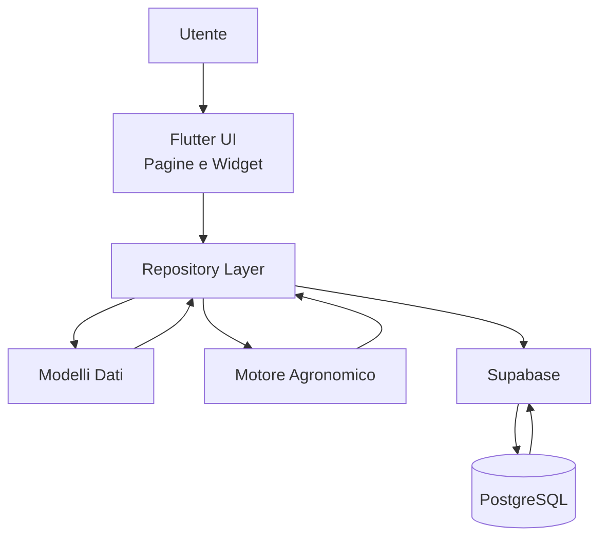
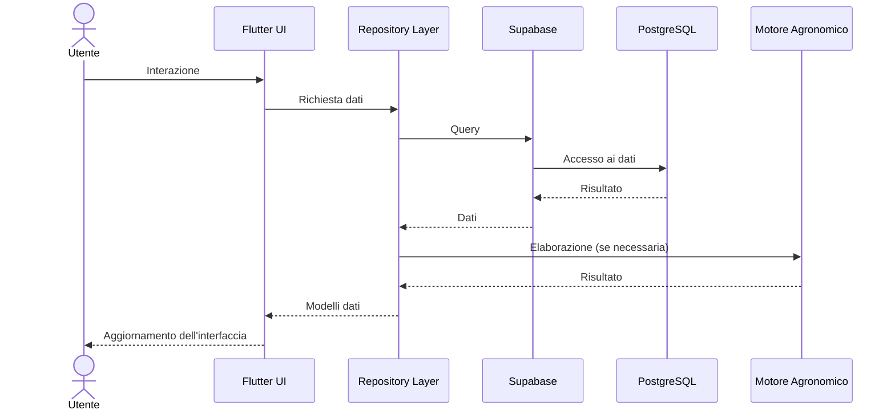

# 1. Scopo del documento

## 1.1 Finalità

Il presente Manuale Tecnico costituisce il documento di riferimento per l'architettura software del progetto **Orto Smart**.

Il suo scopo è descrivere in modo organico la struttura dell'applicazione, le tecnologie impiegate, l'organizzazione del codice, il modello dati, i principali componenti software e le scelte progettuali adottate durante lo sviluppo.

Il documento rappresenta il riferimento tecnico ufficiale del progetto e deve essere mantenuto costantemente allineato all'evoluzione del codice sorgente.

---

## 1.2 Destinatari

Il manuale è destinato principalmente a:

- sviluppatori coinvolti nel progetto;
- futuri collaboratori;
- manutentori dell'applicazione;
- chiunque abbia la necessità di comprendere l'architettura e il funzionamento interno di Orto Smart.

Non costituisce un manuale d'uso dell'applicazione, ma un documento tecnico dedicato agli aspetti progettuali e implementativi.

---

## 1.3 Obiettivi

Gli obiettivi principali del Manuale Tecnico sono:

- documentare l'architettura software dell'applicazione;
- descrivere l'organizzazione del progetto e dei suoi componenti;
- illustrare il modello dati e la struttura del database;
- documentare le principali scelte architetturali;
- facilitare la manutenzione e l'evoluzione del software;
- fornire una base di riferimento per lo sviluppo delle future funzionalità.

---

## 1.4 Aggiornamento del documento

Il Manuale Tecnico è parte integrante del progetto Orto Smart.

Ogni modifica significativa all'architettura, al database o ai principali componenti dell'applicazione deve essere accompagnata dal corrispondente aggiornamento della documentazione.

Mantenere il manuale sincronizzato con il codice sorgente garantisce la coerenza della documentazione e facilita la manutenzione del progetto nel lungo periodo.

## 2.1 Obiettivi dell'architettura

L'architettura di **Orto Smart** è stata progettata per realizzare un'applicazione robusta, modulare e facilmente estendibile, in grado di accompagnare l'evoluzione del progetto nel lungo periodo.

Fin dalle prime fasi di sviluppo è stato adottato un approccio orientato alla separazione delle responsabilità (*Separation of Concerns*), organizzando il software in componenti indipendenti e ben definiti. Ogni componente svolge un ruolo specifico e comunica con gli altri attraverso interfacce chiare, riducendo le dipendenze e semplificando la manutenzione del codice.

Questa impostazione consente di introdurre nuove funzionalità, correggere eventuali problemi e migliorare le prestazioni senza dover modificare l'intera struttura dell'applicazione.

Gli obiettivi principali dell'architettura sono:

- separare l'interfaccia utente dalla logica applicativa;
- isolare l'accesso ai dati mediante il **Repository Layer**;
- mantenere il Motore Agronomico indipendente dal database e dall'interfaccia utente;
- favorire il riutilizzo dei componenti software;
- semplificare le attività di test, manutenzione ed evoluzione del progetto;
- garantire un'architettura scalabile, adatta all'integrazione di nuove funzionalità.

L'architettura è stata inoltre progettata per supportare gli sviluppi previsti del progetto, tra cui l'espansione del Motore Agronomico, la gestione avanzata delle attività, l'integrazione con sistemi di irrigazione automatica, l'utilizzo dei dati meteorologici e l'introduzione di ulteriori moduli intelligenti.

L'obiettivo finale è disporre di una base software stabile, coerente e facilmente manutenibile, capace di sostenere la crescita di Orto Smart senza compromettere la qualità del codice e della documentazione.

## 2.2 Principi progettuali

L'architettura di Orto Smart si basa su un insieme di principi progettuali che guidano tutte le decisioni di sviluppo. L'obiettivo è realizzare un'applicazione ordinata, coerente e facilmente evolvibile, mantenendo una chiara separazione tra le diverse responsabilità del sistema.

Ogni nuova funzionalità viene progettata nel rispetto di questi principi, così da preservare nel tempo la qualità del codice e la semplicità dell'architettura.

I principi fondamentali adottati sono i seguenti.

### Modularità

L'applicazione è suddivisa in moduli indipendenti, ciascuno con una responsabilità ben definita. Questa organizzazione consente di sviluppare, modificare o sostituire un componente senza influire sul funzionamento degli altri.

### Separazione delle responsabilità

Ogni livello dell'applicazione svolge un compito specifico.

- L'interfaccia utente gestisce la presentazione dei dati e l'interazione con l'utente.
- I Repository si occupano esclusivamente dell'accesso ai dati.
- I modelli rappresentano le entità del dominio applicativo.
- Il Motore Agronomico implementa la logica decisionale e gli algoritmi di elaborazione.

Questa suddivisione riduce l'accoppiamento tra i componenti e rende il sistema più semplice da comprendere e mantenere.

### Riutilizzo del codice

Le funzionalità comuni vengono implementate una sola volta e rese disponibili ai diversi moduli dell'applicazione. Questo approccio riduce la duplicazione del codice e facilita la manutenzione.

### Testabilità

L'architettura è progettata per consentire il test dei singoli componenti in modo indipendente. La separazione tra logica applicativa, accesso ai dati e interfaccia utente permette di verificare il comportamento di ciascun modulo senza dipendere dagli altri.

### Scalabilità

La struttura dell'applicazione è predisposta per accogliere nuove funzionalità senza richiedere modifiche sostanziali all'architettura esistente. Nuovi moduli potranno essere integrati mantenendo la stessa organizzazione del progetto.

### Manutenibilità

Il codice è organizzato in modo chiaro e coerente, favorendo interventi di manutenzione rapidi e riducendo il rischio di introdurre errori durante l'evoluzione del software.

### Efficienza

Le scelte architetturali sono orientate a un utilizzo efficiente delle risorse, con particolare attenzione all'organizzazione del database, alla riduzione delle duplicazioni e alla semplicità delle comunicazioni tra applicazione e backend.

L'adozione sistematica di questi principi costituisce la base dell'architettura di Orto Smart e garantisce una crescita ordinata del progetto nel tempo.

## 2.3 Architettura generale

L'architettura di Orto Smart è organizzata secondo una struttura a livelli (*layered architecture*), nella quale ogni componente svolge una funzione specifica e comunica esclusivamente con i livelli adiacenti.

Questa organizzazione consente di mantenere il codice ordinato, ridurre le dipendenze tra i moduli e facilitare l'introduzione di nuove funzionalità senza compromettere la stabilità dell'applicazione.

Lo schema seguente rappresenta la struttura logica dell'intero sistema.

**Figura 2.1 – Architettura logica di Orto Smart.**

L'utente interagisce esclusivamente con l'interfaccia sviluppata in Flutter. L'interfaccia non accede direttamente al database, ma utilizza il Repository Layer come punto di accesso ai dati.

I Repository gestiscono tutte le comunicazioni con Supabase, trasformano i dati provenienti dal database in modelli Dart e li rendono disponibili all'applicazione.

Il Motore Agronomico utilizza i dati forniti dai Repository per eseguire analisi, elaborazioni e suggerimenti, senza effettuare accessi diretti al database. Questa separazione rende il sistema più modulare, facilmente testabile e semplice da estendere.

L'intera architettura è progettata per mantenere indipendenti i diversi livelli dell'applicazione, garantendo un'elevata manutenibilità e una crescita ordinata del progetto.

## 2.4 Componenti dell'architettura

L'architettura di Orto Smart è composta da un insieme di componenti specializzati che collaborano tra loro per garantire una chiara separazione delle responsabilità e una gestione efficiente dell'applicazione.

Ogni componente svolge un ruolo ben definito e comunica con gli altri esclusivamente attraverso interfacce chiare, mantenendo basso l'accoppiamento e favorendo la manutenibilità del sistema.

### Flutter UI

L'interfaccia utente è sviluppata con Flutter e rappresenta il punto di contatto tra l'utente e l'applicazione.

Gestisce:

- pagine;
- widget;
- navigazione;
- acquisizione degli input dell'utente;
- presentazione dei dati.

La UI non contiene logica di business né accede direttamente al database.

---

### Repository Layer

Il Repository Layer costituisce il livello di accesso ai dati.

I Repository centralizzano tutte le operazioni di lettura e scrittura verso Supabase, trasformando i dati provenienti dal database in oggetti Dart utilizzabili dall'applicazione.

Questo livello isola completamente l'interfaccia utente dalla struttura del database. L'organizzazione e le responsabilità dei Repository sono approfondite nel Capitolo 7.

---

### Modelli dati

I modelli rappresentano le principali entità del dominio applicativo.

Ogni modello descrive la struttura dei dati e fornisce i metodi necessari per la conversione tra gli oggetti Dart e i record del database.

I modelli non contengono logica di business né effettuano interrogazioni dirette al database.

---

### Motore Agronomico

Il Motore Agronomico rappresenta il componente intelligente dell'applicazione.

Riceve i dati dai Repository, applica algoritmi e regole agronomiche e restituisce analisi, suggerimenti e risultati utilizzati dall'interfaccia utente.

La sua indipendenza dal database e dalla grafica ne facilita lo sviluppo, il collaudo e l'estensione con nuovi algoritmi. Il Motore Agronomico viene descritto in dettaglio nel Capitolo 8.

---

### Supabase

Supabase costituisce il backend dell'applicazione.

Fornisce il database PostgreSQL, i servizi di autenticazione, le API di accesso ai dati e i meccanismi di sicurezza necessari al corretto funzionamento del sistema.

L'applicazione comunica esclusivamente con Supabase attraverso il Repository Layer.

---

### PostgreSQL

PostgreSQL rappresenta il livello di persistenza dei dati.

Contiene tutte le informazioni gestite dall'applicazione, organizzate secondo un modello relazionale progettato per garantire integrità, efficienza ed espandibilità.

Il database costituisce la fonte autorevole di tutti i dati utilizzati da Orto Smart. La struttura del database e il modello dati vengono approfonditi nei Capitoli 4 e 5.

---

L'interazione coordinata di questi componenti consente di mantenere un'architettura ordinata, modulare e facilmente evolvibile, rendendo possibile l'introduzione di nuove funzionalità senza alterare la struttura generale dell'applicazione.

## 2.5 Flusso dei dati

Il flusso dei dati all'interno di Orto Smart segue un percorso ben definito, progettato per mantenere separate le responsabilità dei diversi livelli dell'applicazione.

Ogni richiesta dell'utente attraversa una serie di componenti specializzati che elaborano i dati e restituiscono il risultato all'interfaccia. Nessun componente accede direttamente a livelli che non rientrano nelle proprie responsabilità, garantendo così un'architettura ordinata e facilmente manutenibile.

Il diagramma seguente rappresenta il flusso logico delle informazioni.

**Figura 2.2 – Flusso dei dati tra i principali componenti dell'applicazione.**

Il processo può essere riassunto nelle seguenti fasi:

1. L'utente esegue un'azione attraverso l'interfaccia dell'applicazione.
2. La Flutter UI inoltra la richiesta al Repository competente.
3. Il Repository comunica con Supabase per leggere o aggiornare i dati.
4. Supabase interroga il database PostgreSQL ed esegue l'operazione richiesta.
5. I dati vengono restituiti al Repository.
6. Se necessario, il Repository richiede un'elaborazione al Motore Agronomico.
7. Il Repository restituisce all'interfaccia i modelli dati già pronti per l'utilizzo.
8. La Flutter UI aggiorna la schermata mostrando il risultato all'utente.

Questo flusso garantisce che ogni componente operi esclusivamente nell'ambito delle proprie responsabilità, migliorando la leggibilità del codice, facilitando i test e riducendo il rischio di effetti collaterali durante l'evoluzione del progetto.

## 2.6 Vantaggi dell'architettura

L'architettura adottata da Orto Smart offre numerosi vantaggi sia durante lo sviluppo sia nelle future attività di manutenzione ed evoluzione del progetto.

La suddivisione dell'applicazione in componenti indipendenti consente di mantenere il codice ordinato, ridurre la complessità e semplificare l'introduzione di nuove funzionalità.

I principali vantaggi sono i seguenti.

### Manutenibilità

La chiara separazione delle responsabilità permette di intervenire su un singolo componente senza influenzare il funzionamento degli altri, riducendo il rischio di introdurre errori durante le modifiche.

### Scalabilità

L'architettura è predisposta per accogliere nuovi moduli e nuove funzionalità mantenendo invariata la struttura generale dell'applicazione. Questo consente una crescita progressiva del progetto senza dover riprogettare il software.

### Testabilità

Ogni componente può essere verificato in modo indipendente. La separazione tra interfaccia utente, accesso ai dati e logica applicativa facilita la realizzazione di test automatici e rende più semplice individuare eventuali anomalie.

### Riutilizzo del codice

La suddivisione in moduli favorisce il riutilizzo delle componenti comuni, riducendo la duplicazione del codice e migliorandone la qualità complessiva.

### Affidabilità

L'isolamento delle responsabilità limita gli effetti delle modifiche e rende il comportamento dell'applicazione più prevedibile e stabile nel tempo.

### Evoluzione del progetto

L'architettura costituisce una base solida per l'introduzione di nuove funzionalità, come l'espansione del Motore Agronomico, la gestione avanzata delle attività, l'integrazione con sistemi di irrigazione automatica e l'utilizzo di ulteriori sorgenti dati.

Nel complesso, l'architettura di Orto Smart è stata progettata per garantire un equilibrio tra semplicità, flessibilità ed estendibilità, accompagnando l'evoluzione del progetto senza compromettere la qualità del software.

## 2.7 Evoluzione futura

L'architettura di Orto Smart è stata progettata con una visione di lungo periodo, prevedendo fin dalle prime fasi di sviluppo la possibilità di integrare nuove funzionalità senza modificare la struttura portante dell'applicazione.

L'organizzazione modulare del sistema consente di ampliare progressivamente le capacità dell'applicazione, mantenendo invariati i principi progettuali descritti nei paragrafi precedenti.

Tra le principali aree di evoluzione previste rientrano:

- ampliamento del Motore Agronomico con nuovi algoritmi di analisi e supporto decisionale;
- gestione avanzata delle attività e pianificazione automatica dei lavori nell'orto;
- integrazione con sistemi di irrigazione automatica basati su Raspberry Pi ed ESP32;
- utilizzo dei dati meteorologici per supportare irrigazione, pianificazione e analisi agronomiche;
- introduzione di moduli dedicati a raccolti, fertilizzazioni, trattamenti, costi, ricavi e statistiche;
- sviluppo di funzionalità intelligenti basate sull'analisi storica dei dati raccolti.

L'architettura potrà inoltre essere estesa con nuovi servizi e componenti senza compromettere il funzionamento dei moduli esistenti, preservando la compatibilità con le versioni precedenti dell'applicazione.

L'obiettivo è accompagnare la crescita di Orto Smart mantenendo nel tempo un software affidabile, facilmente manutenibile e in grado di adattarsi alle future esigenze del progetto.

