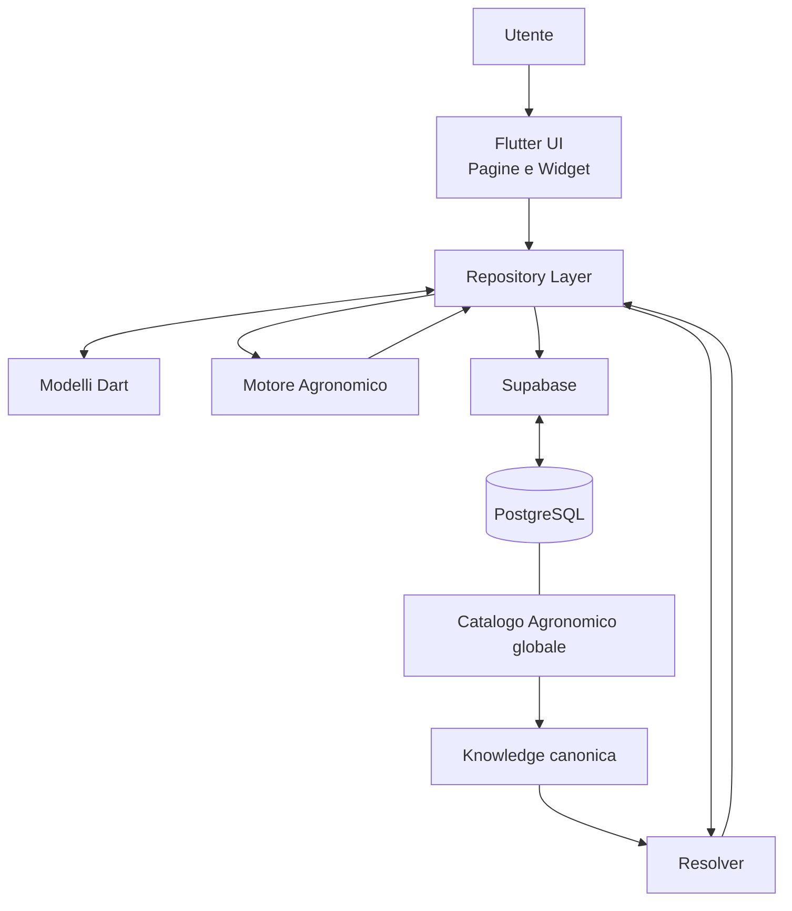

# ORTO SMART

### DOC-001

# Manuale Tecnico e Architetturale

**Versione:** 2.9

**Stato:** Approvato

**Autore:** Renzo Siega

**Progetto:** Orto Smart

**Data prima emissione:** 26/07/2026

**Ultimo aggiornamento:** 24/09/2026

**Repository:** `ortosmart/orto-smart`

---

# Informazioni sul documento

| Campo | Valore |
|--------|--------|
| Documento | DOC-001 |
| Titolo | Manuale Tecnico e Architetturale |
| Versione | 2.9 |
| Stato | Approvato |
| Progetto | Orto Smart |
| Linguaggio | Flutter / Dart |
| Backend | Supabase / PostgreSQL |
| Repository | ortosmart/orto-smart |
| Prima emissione | 26/07/2026 |
| Ultimo aggiornamento | 24/09/2026 |

---

# Cronologia delle revisioni

| Versione | Data | Descrizione |
| -------- | ---- | ----------- |
| 0.1 | 26/07/2026 | Prima emissione del Manuale Tecnico |
| 0.2 | 27/07/2026 | Aggiornamento architettura e struttura documentale |
| 1.0 | 31/07/2026 | Revisione completa e approvazione del Manuale Tecnico |
| 1.1 | 08/08/2026 | Aggiornamento del Motore Agronomico con RecommendationPipeline, DecisionEngine e DecisionWeights |
| 1.2 | 10/08/2026 | Consolidamento dell'evoluzione del Motore Agronomico con FamilyNeedsEngine, integrazione delle priorità familiari e fondamenta dati e di validazione del futuro SuccessionPlanningEngine |
| 1.3 | 11/08/2026 | Prima implementazione del SuccessionPlanningEngine, generazione temporale dei lotti e introduzione della regola sulle conversioni supportate |
| 1.4 | 11/08/2026 | Introduzione di AgronomicWindow, AgronomicWindowValidator e AgronomicWindowEngine per la prima verifica separata della compatibilità agronomica dei lotti pianificati |
| 1.5 | 12/08/2026 | Associazione delle finestre agronomiche a colture e varietà mediante CropAgronomicWindowRule, AgronomicWindowResolver, AgronomicWindowEvaluation e AgronomicWindowService |
| 1.6 | 16/08/2026 | Aggiornamento dell'architettura di persistenza con la baseline Database V1 congelata nella Sessione S017: 52 entità di dominio, struttura tecnica `profile_edit_locks`, ownership, accesso familiare monoutente, modello single-writer, sicurezza, integrità e strategia di implementazione incrementale |
| 1.7 | 16/08/2026 | Aggiornamento della S018 con supporto alle finestre agronomiche multiple e predisposizione dell'ambiente locale Supabase mediante WSL 2, Docker Desktop e Supabase CLI per la futura implementazione incrementale della baseline Database V1 |
| 1.8 | 18/08/2026 | Aggiornamento della S019 con prima migration Database V1, implementazione delle Fondazioni, schema `private`, helper autorizzativi, trigger metadata, prima matrice di sicurezza con 13 policy RLS, verifiche locali positive e negative e definizione delle RPC sicure e atomiche come prossimo incremento tecnico |
| 1.9 | 20/08/2026 | Aggiornamento della S020 con hardening di `profile_edit_locks`, implementazione e verifica delle prime cinque RPC server-side per acquisizione, heartbeat, rilascio, richiesta e annullamento del takeover, consolidamento delle regole di sicurezza concorrente e distinzione delle operazioni di takeover ancora da completare |
| 2.0 | 23/08/2026 | Aggiornamento con la Sessione S021: completamento del protocollo `profile_edit_locks`, hardening delle transizioni concorrenti, audit server-side e definizione del successivo Write Path autoritativo delle entità di Categoria A |
| 2.1 | 24/08/2026 | Aggiornamento con la Sessione S022: introduzione del primo Write Path autoritativo di Categoria A per `gardens`, Profile Write Authority, RPC `create_garden` e `update_garden`, blocco delle scritture dirette su `public.gardens` e validazioni server-side del Write Path |
| 2.2 | 28/08/2026 | Aggiornamento con la Sessione S023: hardening concorrente di `update_garden`, Write Path autoritativo di `seasons`, introduzione dell'identità tecnica del client e della sessione applicativa, integrazione Flutter della Profile Write Authority, gate locale fail-closed e adapter tipizzato per le scritture delle stagioni |
| 2.3 | 01/09/2026 | Aggiornamento con la Sessione S024: implementazione V1 di `beds` e `bed_geometries`, geometria storicizzata, cinque RPC autoritative, integrazione Flutter del Write Path delle aiuole, nuova `CreateBedPage` e configurazione Supabase parametrizzabile |
| 2.4 | 06/09/2026 | Aggiornamento con la Sessione S025: completamento dell'integrazione UI dei Write Path autoritativi di `beds`, introduzione di `CivilDate`, nuove pagine di modifica e gestione geometrica, attivazione e disattivazione dell'aiuola, rilettura autoritativa e comportamento fail-closed |
| 2.5 | 11/09/2026 | Aggiornamento con la Sessione S026: implementazione del Catalogo DB V1 `botanical_families` → `crops` → `crop_varieties`, identificativi UUID, Profile ownership, nove RPC autoritative, RLS in lettura, revoca delle scritture dirette, Profile Write Authority, concorrenza ottimistica, validazioni gerarchiche e agronomiche, allineamento locale/remoto delle migration e definizione della S027 come integrazione Flutter del Catalogo V1 |
| 2.6 | 13/09/2026 | Aggiornamento con la Sessione S027: integrazione Flutter del Catalogo V1 mediante `BotanicalFamily`, riallineamento di `Crop` e `CropVariety`, nuovi Repository e result type tipizzati, letture RLS, scritture RPC-only, Profile Write Authority fail-closed, gestione `row_version`, compatibilità legacy controllata e verifica finale con 914/914 test superati |
| 2.7 | 17/09/2026 | Aggiornamento con la Sessione S028: implementazione del Write Path autoritativo di `plantings`, introduzione del modello persistente completo, RPC `create_planting`, `update_planting` e `set_planting_status`, lifecycle autoritativo, controlli di sovrapposizione spaziale e temporale, integrazione con la geometria storicizzata delle aiuole, riallineamento di `PlantingRepository`, `AddPlantingPage`, `BedPage` e componenti correlati, Profile Write Authority fail-closed, concorrenza mediante `row_version` e verifica finale con 997 test superati |
| 2.8 | 18/09/2026 | Aggiornamento con la Sessione S029: integrazione UI del lifecycle autoritativo di `plantings`, azioni contestuali in `PlantingCard`, gestione delle transizioni mediante `set_planting_status`, conferma esplicita di `end_date` per `finished` e `removed`, mantenimento dell'occupazione nello stato `harvested`, refresh autoritativo su `version_conflict` e `invalid_transition` e aggiornamento dei test dedicati |
| 2.9 | 24/09/2026 | Aggiornamento con la Sessione S030: evoluzione del Catalogo Agronomico da modello Profile-owned a architettura globale, multisorgente, tracciabile, versionabile, contestualizzabile ed editorialmente controllata; introduzione di identità botaniche globali, Catalog Authority e capability, provenienza e ingestion, workflow editoriale, Knowledge agronomica canonica, pubblicazione, WITHDRAW, Resolver e read model canonici; riallineamento del contratto operativo da `variety_id` a `cultivar_id` opzionale; aggiornamento dell'integrazione Flutter, della documentazione architetturale e delle verifiche locali e remote |

---

# Indice

## 1. Scopo del documento
1.1 Finalità  
1.2 Destinatari  
1.3 Obiettivi  
1.4 Aggiornamento del documento

## 2. Architettura generale
2.1 Obiettivo  
2.2 Visione architetturale  
2.3 Architettura a livelli  
2.4 Tecnologie utilizzate  
2.5 Principi architetturali  
2.6 Componenti principali  
2.7 Flusso generale delle informazioni  
2.8 Evoluzione dell'architettura  
2.9 Considerazioni finali

## 3. Struttura del progetto
3.1 Obiettivo  
3.2 Organizzazione generale  
3.3 Struttura delle directory principali  
3.4 Cartella core  
3.5 Cartella data  
3.6 Cartella models  
3.7 Cartella repositories  
3.8 Cartella pages  
3.9 Cartella widgets  
3.10 Cartella services  
3.11 File principali  
3.12 Considerazioni finali

## 4. Modello dati
4.1 Obiettivo  
4.2 Principi del modello dati  
4.3 Entità principali  
4.4 Relazioni tra le entità  
4.5 Flusso dei dati applicativi  
4.6 Evoluzione del modello dati  
4.7 Considerazioni finali

## 5. Database PostgreSQL
5.1 Obiettivo  
5.2 Architettura del database  
5.3 Tabelle principali  
5.4 Relazioni e vincoli  
5.5 Integrità dei dati  
5.6 Prestazioni  
5.7 Sicurezza  
5.8 Evoluzione futura  
5.9 Considerazioni finali

## 6. Repository Layer
6.1 Obiettivo  
6.2 Architettura del Repository Layer  
6.3 Repository implementati  
6.4 Flusso delle operazioni  
6.5 Gestione degli errori  
6.6 Vantaggi dell'architettura  
6.7 Evoluzione futura  
6.8 Considerazioni finali

## 7. Interfaccia Utente
7.1 Obiettivo  
7.2 Architettura dell'interfaccia  
7.3 Navigazione  
7.4 Pagine principali  
7.5 Widget principali  
7.6 Gestione dello stato  
7.7 Principi di progettazione  
7.8 Evoluzione futura  
7.9 Considerazioni finali

## 8. Motore Agronomico
8.1 Obiettivo  
8.2 Architettura del Motore Agronomico  
8.3 Componenti principali  
8.4 Flusso delle elaborazioni  
8.5 Validazione  
8.6 Vantaggi dell'architettura  
8.7 Evoluzione futura  
8.8 Considerazioni finali

## 9. Test e Qualità del Software
9.1 Obiettivo  
9.2 Strategia di test  
9.3 Flutter Analyze  
9.4 Test automatici  
9.5 Qualità del codice  
9.6 Gestione delle regressioni  
9.7 Evoluzione futura  
9.8 Considerazioni finali

## 10. Evoluzione del Progetto
10.1 Visione generale  
10.2 Principi evolutivi  
10.3 Aree di sviluppo  
10.4 Scalabilità dell'architettura  
10.5 Integrazioni future  
10.6 Roadmap di alto livello  
10.7 Considerazioni finali

---

# Prefazione

Il presente Manuale Tecnico e Architetturale costituisce il documento di riferimento per la progettazione software di **Orto Smart**.

Il suo obiettivo è descrivere in modo organico l'architettura dell'applicazione, le principali scelte progettuali e l'organizzazione dei componenti che ne costituiscono il funzionamento.

Il manuale è stato redatto con l'intento di documentare non solo lo stato attuale del progetto, ma anche i principi architetturali che ne guideranno l'evoluzione futura, mantenendo una chiara distinzione tra la struttura del sistema, il processo di sviluppo e la pianificazione delle attività.

La documentazione è organizzata in capitoli tematici, ciascuno dedicato a uno specifico livello dell'architettura software, con l'obiettivo di facilitare la consultazione, la manutenzione e l'evoluzione del progetto nel tempo.

Il presente documento costituisce il riferimento tecnico ufficiale di Orto Smart e viene aggiornato in occasione delle principali evoluzioni dell'architettura dell'applicazione.

---

# 1. Scopo del documento

## 1.1 Finalità

Il presente Manuale Tecnico costituisce il documento di riferimento per l'architettura software del progetto **Orto Smart**.

Il suo scopo è descrivere in modo sistematico la struttura dell'applicazione, le tecnologie impiegate, l'organizzazione del codice, il modello dati, i principali componenti software e le scelte progettuali adottate durante lo sviluppo.

Il documento rappresenta il riferimento tecnico ufficiale del progetto e deve essere mantenuto costantemente allineato all'evoluzione del codice sorgente.

---

## 1.2 Destinatari

Il manuale è destinato principalmente a:

- sviluppatori coinvolti nel progetto;
- futuri collaboratori;
- manutentori dell'applicazione;
- chiunque abbia la necessità di comprendere l'architettura e il funzionamento interno di Orto Smart.

Non costituisce un manuale d'uso dell'applicazione, ma un documento tecnico dedicato agli aspetti progettuali e implementativi.

---

## 1.3 Obiettivi

Gli obiettivi principali del Manuale Tecnico sono:

- documentare l'architettura software dell'applicazione;
- descrivere l'organizzazione del progetto e dei suoi componenti;
- illustrare il modello dati e la struttura del database;
- documentare le principali scelte architetturali;
- facilitare la manutenzione e l'evoluzione del software;
- fornire una base di riferimento per lo sviluppo delle future funzionalità.

---

## 1.4 Aggiornamento del documento

Il Manuale Tecnico è parte integrante del progetto Orto Smart.

Ogni modifica significativa dell'architettura, del database o dei principali componenti dell'applicazione deve essere accompagnata dal corrispondente aggiornamento del presente Manuale Tecnico.

Mantenere il Manuale Tecnico sincronizzato con il codice sorgente garantisce la coerenza della documentazione e facilita la manutenzione del progetto nel lungo periodo.

# 2. Architettura del sistema

## 2.1 Obiettivi dell'architettura

L'architettura di **Orto Smart** è progettata per realizzare un'applicazione robusta, modulare, sicura, facilmente estendibile e capace di accompagnare l'evoluzione del progetto nel lungo periodo.

Fin dalle prime fasi di sviluppo è stato adottato un approccio orientato alla separazione delle responsabilità (*Separation of Concerns*), organizzando il software in componenti indipendenti e ben definiti. Ogni componente svolge un ruolo specifico e comunica con gli altri attraverso interfacce controllate, riducendo le dipendenze e semplificando la manutenzione del codice.

L'evoluzione del progetto fino alla Sessione S030 ha progressivamente rafforzato questo principio introducendo, oltre alla separazione tra Flutter, Repository, Motore Agronomico e persistenza, ulteriori confini architetturali tra:

- dati operativi dell'orto;
- identità botaniche e agronomiche globali;
- dati provenienti da fonti esterne;
- dati candidati e dati approvati;
- Knowledge agronomica canonica;
- risoluzione della Knowledge applicabile;
- proposta applicativa;
- decisione esplicita dell'utente;
- fatto operativo persistito.

Gli obiettivi principali dell'architettura sono:

- separare l'interfaccia utente dalla logica applicativa;
- isolare l'accesso ai dati mediante il **Repository Layer**;
- mantenere il Motore Agronomico indipendente dalla persistenza;
- rendere il database autorevole per sicurezza, integrità, autorizzazioni e invarianti persistenti;
- mantenere il client Flutter non autorevole per le decisioni di sicurezza;
- distinguere la Knowledge agronomica canonica dai dati operativi dell'orto;
- garantire provenienza, tracciabilità e versionamento dei dati agronomici;
- impedire che dati esterni modifichino automaticamente il Catalogo approvato;
- impedire che una variazione della Knowledge canonica modifichi automaticamente fatti operativi già confermati;
- favorire il riutilizzo dei componenti software;
- semplificare test, manutenzione ed evoluzione del progetto;
- garantire un'architettura scalabile per i futuri moduli applicativi.

L'architettura è inoltre predisposta per supportare l'espansione del Motore Agronomico, la gestione avanzata delle attività, l'integrazione con sistemi di irrigazione automatica, l'utilizzo dei dati meteorologici e l'introduzione di ulteriori moduli di supporto decisionale.

L'obiettivo finale è disporre di una base software stabile, coerente, verificabile e facilmente manutenibile, capace di sostenere la crescita di Orto Smart senza compromettere qualità del codice, sicurezza dei dati e tracciabilità delle decisioni.

## 2.2 Principi progettuali

L'architettura di Orto Smart si basa su un insieme di principi progettuali che guidano le decisioni di sviluppo. L'obiettivo è realizzare un'applicazione ordinata, coerente e facilmente evolvibile, mantenendo una chiara separazione tra le diverse responsabilità del sistema.

Ogni nuova funzionalità viene progettata nel rispetto di questi principi, così da preservare nel tempo la qualità del codice e la coerenza dell'architettura.

### Modularità

L'applicazione è suddivisa in componenti con responsabilità definite. Questa organizzazione consente di sviluppare, modificare o sostituire una parte del sistema limitando l'impatto sugli altri componenti.

### Separazione delle responsabilità

Ogni livello dell'applicazione svolge un compito specifico.

- La Flutter UI gestisce presentazione, navigazione e interazione con l'utente.
- I Repository costituiscono il confine applicativo verso persistenza e servizi backend.
- I modelli Dart rappresentano i dati utilizzati dal dominio applicativo.
- Il Motore Agronomico implementa elaborazioni, valutazioni e algoritmi di supporto decisionale.
- Supabase espone i servizi backend utilizzati dal client.
- PostgreSQL applica integrità, autorizzazioni, invarianti persistenti, concorrenza e Write Path autoritativi.
- Il Catalogo Agronomico globale conserva identità, provenienza, workflow editoriale e Knowledge canonica.
- Il Resolver individua la Knowledge canonica applicabile a un determinato contesto senza trasformarla automaticamente in una decisione operativa.

Questa suddivisione riduce l'accoppiamento e impedisce che responsabilità appartenenti a livelli differenti vengano confuse.

### Autorità server-side

Le verifiche che determinano se una modifica persistente è ammessa non vengono affidate al solo client Flutter.

Quando un Write Path è protetto, il backend verifica le condizioni necessarie lato server, comprese — secondo il dominio interessato — autenticazione, ownership, autorità, capability, concorrenza, integrità referenziale e invarianti del dominio.

Il client può eseguire controlli preliminari per migliorare l'esperienza utente, ma tali controlli non sostituiscono quelli autoritativi del backend.

### Separazione tra Knowledge e fatto operativo

La Knowledge agronomica canonica rappresenta conoscenza approvata e contestualizzabile.

Un fatto operativo rappresenta invece una decisione realmente applicata all'orto.

Di conseguenza:

```text
Knowledge canonica
        ↓
Resolver
        ↓
proposta applicativa
        ↓
valutazione / conferma dell'utente
        ↓
fatto operativo persistito
```

La risoluzione di una Knowledge non comporta quindi automaticamente la modifica di una `Planting` o di un altro dato operativo.

I valori agronomici eventualmente salvati in un fatto operativo costituiscono snapshot della decisione confermata e non vengono modificati automaticamente quando cambia successivamente la Knowledge canonica.

### Tracciabilità e provenienza

I dati agronomici provenienti da fonti esterne non diventano automaticamente Knowledge canonica.

Il modello introdotto nella Sessione S030 separa:

```text
fonte
  ↓
acquisizione
  ↓
osservazione
  ↓
revisione editoriale
  ↓
Knowledge canonica
  ↓
pubblicazione
```

Questo consente di conservare provenienza, revisioni e stato editoriale evitando sovrascritture automatiche del Catalogo approvato.

### Riutilizzo del codice

Le funzionalità comuni vengono implementate una sola volta e rese disponibili ai diversi moduli dell'applicazione. Questo approccio riduce la duplicazione e facilita la manutenzione.

### Testabilità

L'architettura è progettata per consentire il test dei componenti in modo indipendente. La separazione tra logica applicativa, accesso ai dati, backend autoritativo e interfaccia utente permette di verificare ciascun livello con test appropriati.

### Scalabilità

La struttura dell'applicazione è predisposta per accogliere nuove funzionalità senza richiedere la riprogettazione dell'intero sistema.

### Manutenibilità

Il codice e il database vengono evoluti mediante modifiche controllate, migration versionate e documentazione sincronizzata, riducendo il rischio di regressioni e incoerenze.

### Efficienza

Le scelte architetturali sono orientate a un utilizzo efficiente delle risorse, con particolare attenzione alla riduzione delle duplicazioni, alla separazione tra dati globali e dati operativi e alla memorizzazione soltanto delle informazioni realmente utili.

## 2.3 Architettura generale

Orto Smart utilizza un'architettura a livelli nella quale Flutter costituisce il client applicativo, Supabase espone i servizi backend e PostgreSQL rappresenta il livello persistente e autoritativo.

La Sessione S030 ha esteso questa architettura introducendo nel backend il Catalogo Agronomico V1 globale e i relativi livelli di provenienza, workflow editoriale, Knowledge canonica, pubblicazione e risoluzione.

Lo schema logico generale può essere rappresentato nel modo seguente:



**Figura 2.1 – Architettura logica di Orto Smart dopo la Sessione S030.**

L'utente interagisce con l'interfaccia Flutter. La UI utilizza i Repository per accedere ai dati e ai servizi backend e non deve aggirare i confini di persistenza definiti dall'architettura.

Il Repository Layer converte i dati tra rappresentazione backend e dominio Dart e costituisce il confine applicativo verso Supabase.

Il Motore Agronomico utilizza i dati messi a disposizione dall'applicazione per produrre analisi, valutazioni e suggerimenti senza assumere direttamente il ruolo di livello persistente.

Il database PostgreSQL conserva sia i dati operativi dell'orto sia le strutture globali del Catalogo Agronomico, mantenendo tuttavia distinti i rispettivi domini e modelli di autorità.

Nel Catalogo Agronomico, la catena canonica delle identità utilizzata dopo il cutover S030 è:

```text
botanical_taxa
      ↓
    crops
      ↓
crop_cultivars
```

Il Catalogo comprende inoltre le strutture necessarie a parametri agronomici, contesti, fonti, acquisizioni, osservazioni, alias e mapping, workflow editoriale, Knowledge canonica, pubblicazione e risoluzione.

Il Resolver rappresenta il livello che seleziona la Knowledge canonica applicabile. Il risultato della risoluzione può alimentare una proposta applicativa, ma non costituisce automaticamente un fatto operativo.

## 2.4 Componenti dell'architettura

### Flutter UI

L'interfaccia utente è sviluppata con Flutter e rappresenta il punto di contatto tra l'utente e l'applicazione.

Gestisce:

- pagine;
- widget;
- navigazione;
- acquisizione degli input;
- presentazione dei dati;
- richieste di conferma delle decisioni operative.

La UI non costituisce un confine di sicurezza autorevole.

Quando una funzione richiede autorizzazioni o capability specifiche, la UI può adattare ciò che mostra all'utente, ma la decisione definitiva rimane server-side.

### Repository Layer

Il Repository Layer costituisce il confine applicativo di accesso ai dati e ai servizi backend.

I Repository:

- centralizzano letture e scritture;
- convertono i payload backend in modelli Dart;
- invocano le RPC previste dai Write Path autoritativi;
- gestiscono gli esiti tipizzati;
- applicano comportamento fail-closed dove previsto;
- impediscono alle pagine di dipendere direttamente dai dettagli della persistenza.

Dopo S030 il Repository Layer comprende anche l'accesso ai read model canonici del Catalogo e alle capability della Catalog Authority.

### Modelli Dart

I modelli rappresentano le entità utilizzate dal dominio applicativo.

Dopo il cutover S030 la terminologia tecnica corrente del Catalogo utilizza, tra gli altri:

- `Crop`;
- `CropCultivar`;
- `CatalogCapabilities`.

La precedente entità applicativa `CropVariety` appartiene all'architettura S027 precedente al cutover e non costituisce più il modello tecnico corrente del Catalogo.

La UI italiana può continuare a utilizzare il termine **Varietà** quando risulta più naturale per l'utente.

### Motore Agronomico

Il Motore Agronomico rappresenta il livello di elaborazione e supporto decisionale dell'applicazione.

Riceve dati e contesto, applica regole e algoritmi e produce valutazioni o suggerimenti.

La sua responsabilità rimane distinta da quella del database:

- il database conserva dati, vincoli, autorità e Knowledge persistente;
- il Resolver individua la Knowledge canonica applicabile;
- il Motore Agronomico elabora il contesto e produce valutazioni;
- l'utente conferma le decisioni operative quando richiesto;
- il Write Path persiste il fatto operativo.

### Supabase

Supabase costituisce il backend applicativo e fornisce:

- accesso a PostgreSQL;
- autenticazione;
- Data API;
- RPC;
- integrazione con RLS e privilegi del database.

Le migration Supabase costituiscono la sorgente riproducibile dello schema implementato.

Le nuove strutture esposte attraverso la Data API devono disporre dei privilegi espliciti necessari; l'esistenza di una tabella o vista nel database non implica da sola che debba essere accessibile al client.

### PostgreSQL

PostgreSQL rappresenta il livello persistente e autoritativo.

Gestisce, secondo il dominio:

- integrità referenziale;
- vincoli;
- ownership;
- RLS;
- privilegi;
- concorrenza;
- Write Path;
- capability;
- provenienza;
- revisioni;
- workflow editoriale;
- pubblicazione;
- Knowledge canonica.

La Sessione S030 ha consolidato nel database il Catalogo Agronomico globale, mantenendolo separato dai dati operativi del singolo orto.

### Catalog Authority

La Catalog Authority rappresenta il modello di autorizzazione specifico del Catalogo Agronomico globale.

Le capability implementate distinguono:

- gestione delle identità;
- ingestion;
- review;
- publication.

Questa autorità non deriva automaticamente dall'ownership di un Profile o di un Garden.

L'inizializzazione dell'autorità è esplicita e controllata. Le funzioni dedicate comprendono:

- `get_my_catalog_capabilities()`;
- `claim_initial_catalog_authority()`.

Il claim iniziale non viene eseguito automaticamente dal client.

### Catalogo Agronomico e Knowledge canonica

Il Catalogo Agronomico V1 non è una semplice anagrafica di colture.

L'architettura S030 separa:

- identità botaniche e agronomiche;
- parametri;
- contesti;
- fonti;
- acquisizioni;
- osservazioni;
- alias e mapping;
- revisione editoriale;
- Knowledge canonica;
- pubblicazione;
- risoluzione.

Questa separazione consente di importare informazioni da più fonti senza confondere il dato acquisito con quello approvato.

### Resolver

Il Resolver individua la Knowledge canonica applicabile al contesto richiesto.

La sua funzione è risolvere la conoscenza, non prendere autonomamente una decisione operativa per l'utente.

Pertanto:

```text
Knowledge risolta != Planting modificato
```

e:

```text
raccomandazione agronomica != fatto operativo
```

## 2.5 Flusso dei dati

Il flusso applicativo varia in funzione del tipo di operazione.

### Lettura operativa

Per una normale lettura di dati operativi:

```text
Utente
  ↓
Flutter UI
  ↓
Repository
  ↓
Supabase
  ↓
PostgreSQL
  ↓
Repository
  ↓
Flutter UI
```

Il Repository converte il risultato nella rappresentazione Dart richiesta dall'applicazione.

### Scrittura operativa protetta

Per una scrittura soggetta a Write Path autoritativo:

```text
Utente
  ↓
Flutter UI
  ↓
Repository
  ↓
RPC autoritativa
  ↓
verifiche server-side
  ↓
PostgreSQL
  ↓
esito tipizzato
  ↓
Repository
  ↓
Flutter UI
```

Il client non sostituisce le verifiche autoritative del server.

### Lettura del Catalogo Agronomico

Dopo S030 le letture canoniche di colture e cultivar utilizzano read model dedicati:

```text
crop_catalog_read
        ↓
CropRepository
        ↓
Crop
```

e:

```text
crop_cultivar_catalog_read
        ↓
CropCultivarRepository
        ↓
CropCultivar
```

I read model sono configurati con semantica `security_invoker=true`.

### Ingestion e revisione

L'acquisizione di informazioni agronomiche esterne segue un percorso separato:

```text
Fonte esterna
      ↓
acquisizione
      ↓
osservazione
      ↓
dato candidato
      ↓
revisione editoriale
      ↓
Knowledge canonica
      ↓
pubblicazione
```

Nessuna fonte esterna può sovrascrivere automaticamente il Catalogo approvato.

### Utilizzo della Knowledge

Quando l'applicazione necessita di conoscenza agronomica contestualizzata:

```text
Knowledge canonica pubblicata
            ↓
         Resolver
            ↓
    Knowledge applicabile
            ↓
   logica applicativa /
   Motore Agronomico
            ↓
         proposta
            ↓
 conferma dell'utente
            ↓
   fatto operativo
```

Questo flusso mantiene distinta la conoscenza disponibile dalla decisione realmente adottata.

## 2.6 Vantaggi dell'architettura

L'architettura adottata offre vantaggi sia nello sviluppo sia nella manutenzione e nell'evoluzione futura.

### Manutenibilità

La separazione delle responsabilità permette di modificare un componente limitando gli effetti sugli altri livelli.

### Scalabilità

Nuovi moduli possono essere aggiunti mantenendo i confini architetturali esistenti.

Il Catalogo globale evita inoltre di duplicare identità e Knowledge per ogni singolo orto.

### Testabilità

UI, Repository, modelli, Motore Agronomico, RPC, vincoli e workflow backend possono essere verificati ai rispettivi livelli.

### Riutilizzo del codice

La modularità favorisce il riutilizzo di componenti e riduce la duplicazione.

### Affidabilità

Vincoli e autorizzazioni critiche vengono applicati nel backend, senza dipendere esclusivamente dal comportamento del client.

### Tracciabilità

La separazione tra fonte, acquisizione, osservazione, revisione, Knowledge e pubblicazione consente di ricostruire l'origine e l'evoluzione dell'informazione agronomica.

### Stabilità storica dei dati operativi

La separazione tra Knowledge corrente e snapshot operativo evita che l'evoluzione del Catalogo alteri retroattivamente decisioni già confermate.

### Evoluzione del progetto

L'architettura costituisce una base per l'espansione del Motore Agronomico, l'automazione dell'irrigazione, la gestione delle attività, l'utilizzo dei dati meteorologici e ulteriori funzionalità di supporto decisionale.

## 2.7 Evoluzione futura

La Sessione S030 ha trasformato il Catalogo Agronomico da precedente area di evoluzione progettuale a componente backend concretamente implementato.

Le evoluzioni successive devono quindi partire dall'architettura ormai consolidata, senza reintrodurre i modelli superati dal cutover.

Tra gli incrementi FUTURE attualmente previsti rientrano:

- backend canonico per le consociazioni tra colture;
- interfaccia editoriale e amministrativa completa del Catalogo Agronomico;
- flusso operativo **Impostazioni → Catalogo Agronomico → Aggiornamento fonti**;
- azione UI esplicita e sicura per l'eventuale `claim_initial_catalog_authority()`;
- integrazione completa del Resolver nei flussi di creazione e pianificazione delle coltivazioni;
- popolamento editoriale del Catalogo con dati agronomici verificabili e fonti tracciate;
- ampliamento del Motore Agronomico con nuovi algoritmi di analisi e supporto decisionale;
- gestione avanzata delle attività e pianificazione dei lavori;
- integrazione con sistemi di irrigazione automatica;
- utilizzo dei dati meteorologici per irrigazione, pianificazione e analisi agronomiche;
- moduli dedicati a raccolti, fertilizzazioni, trattamenti, costi, ricavi e statistiche;
- ulteriori incrementi previsti dalla Database V1 non ancora implementati.

Il popolamento reale del Catalogo dovrà avvenire mediante dati verificati e approvati. Fino all'avvio operativo non devono essere introdotti seed dimostrativi o dati provvisori destinati a confondersi con i dati reali.

L'architettura continuerà a evolvere in modo incrementale mediante migration versionate, verifiche riproducibili, test automatici e aggiornamento coordinato della documentazione.

L'obiettivo rimane accompagnare la crescita di Orto Smart mantenendo un software affidabile, sicuro, tracciabile e facilmente manutenibile.

# 3. Struttura del progetto

## 3.1 Obiettivo

La struttura del progetto rappresenta l'organizzazione fisica del codice sorgente di Orto Smart.

L'obiettivo principale è mantenere una chiara separazione tra i diversi componenti dell'applicazione, facilitando lo sviluppo, la manutenzione e l'introduzione di nuove funzionalità.

L'organizzazione delle cartelle riflette direttamente l'architettura descritta nel capitolo precedente: ogni directory è dedicata a una specifica responsabilità e contiene esclusivamente gli elementi necessari allo svolgimento del proprio compito.

Questa impostazione rende il progetto più semplice da comprendere, favorisce il riutilizzo del codice e permette di individuare rapidamente il punto in cui intervenire durante lo sviluppo.

La struttura è progettata per evolvere insieme all'applicazione, mantenendo nel tempo ordine, coerenza e scalabilità.

## 3.2 Organizzazione generale

Il codice sorgente principale dell'applicazione è contenuto nella cartella `lib/`, che rappresenta il cuore del progetto Flutter.

Al suo interno il codice è organizzato in directory specializzate, ciascuna dedicata a un preciso livello dell'architettura software.

La struttura generale utilizzata dall'applicazione è:

```text
lib/
├── core/
│   ├── agronomy/
│   ├── config/
│   ├── date/
│   ├── identity/
│   ├── profile/
│   └── write_authority/
├── data/
│   ├── models/
│   └── repositories/
├── pages/
├── services/
├── widgets/
└── main.dart
```

La directory `core/agronomy/` raccoglie i componenti del dominio agronomico indipendenti dalla persistenza, mentre `data/` contiene i modelli e i Repository che costituiscono il confine applicativo verso Supabase.

L'evoluzione S030 del Catalogo Agronomico non modifica questo principio organizzativo: i nuovi modelli `CropCultivar` e `CatalogCapabilities` e i Repository dedicati vengono integrati mantenendo separati dominio applicativo, accesso ai dati e autorità server-side.

Ogni directory svolge quindi una responsabilità specifica e contribuisce a mantenere il progetto ordinato e manutenibile.

## 3.3 Struttura delle directory principali

La cartella `lib/` contiene i componenti software sviluppati per Orto Smart. La sua organizzazione segue i principi architetturali descritti nel Capitolo 2, mantenendo separati interfaccia utente, dominio applicativo, accesso ai dati, servizi e componenti trasversali.

Le principali directory del progetto sono:

| Directory | Responsabilità |
|-----------|----------------|
| `core/` | Componenti condivisi, configurazione, identità, contesto Profile, Write Authority e dominio agronomico. |
| `data/` | Modelli Dart e Repository per l'accesso ai dati e ai servizi backend. |
| `pages/` | Schermate dell'applicazione e gestione dell'interazione utente. |
| `widgets/` | Componenti grafici riutilizzabili. |
| `services/` | Servizi applicativi e logica di coordinamento. |
| `main.dart` | Punto di ingresso dell'applicazione Flutter. |
| `supabase_config.dart` | Configurazione della connessione a Supabase. |

Questa organizzazione consente di individuare rapidamente il livello responsabile di una funzionalità e riduce il rischio di introdurre dipendenze improprie tra UI, dominio e persistenza.

## 3.4 Cartella `core`

La directory `core/` contiene elementi condivisi dall'intera applicazione che non appartengono a una singola schermata o a uno specifico Repository.

Tra le aree principali rientrano:

- `agronomy/`, per modelli, motori, validatori e componenti del dominio agronomico indipendenti dalla persistenza;
- `config/`, per le configurazioni generali;
- `date/`, per la gestione delle date civili;
- `identity/`, per l'identità tecnica del client e della sessione applicativa;
- `profile/`, per il contesto del Profile corrente;
- `write_authority/`, per il coordinamento applicativo della Profile Write Authority.

La sottocartella `date/` contiene `CivilDate`, helper condiviso che interpreta e presenta le date civili nel formato italiano `GG/MM/AAAA`, mantenendo il formato canonico ISO `AAAA-MM-GG` nei modelli, nei payload RPC e nel backend.

La sottocartella `identity/` distingue:

- l'identità stabile dell'installazione o istanza client, conservata localmente;
- l'identità della sessione applicativa, nuova a ogni avvio.

La persistenza dell'identificatore stabile del client utilizza `shared_preferences`, mentre la generazione degli identificativi tecnici utilizza `uuid`. Il token del lease non appartiene all'identità persistente del client.

La sottocartella `profile/` mantiene il contesto applicativo del Profile e impedisce l'accesso al ciclo operativo protetto finché identità, appartenenza e stato della sessione non sono stati risolti coerentemente.

La sottocartella `write_authority/` contiene i componenti applicativi utilizzati per la Profile Write Authority: modello del lock, scheduler, controller, scope e risultati tipizzati. Il gate locale costituisce un controllo preventivo, ma non sostituisce le verifiche autoritative eseguite dal database.

La **Catalog Authority introdotta nella S030 è distinta dalla Profile Write Authority**. Non deriva dall'ownership del Profile e le relative capability vengono ottenute dal backend mediante il Repository dedicato. Non deve quindi essere interpretata come un'estensione del lease Profile.

La directory `core/` mantiene pertanto separate le responsabilità trasversali del client dalle decisioni autoritative appartenenti al backend.

## 3.5 Cartella `data`

La directory `data/` raccoglie i componenti dedicati alla rappresentazione e all'accesso ai dati dell'applicazione.

È suddivisa principalmente in:

- `models/`, che contiene i modelli Dart utilizzati dall'applicazione;
- `repositories/`, che implementa il confine di accesso verso Supabase.

Il livello `data/` non attribuisce autonomamente autorità alle operazioni. I Repository possono eseguire controlli preventivi e convertire gli esiti backend in tipi Dart, mentre autorizzazioni, capability e invarianti persistenti rimangono responsabilità del server.

La Sessione S030 ha mantenuto questa organizzazione introducendo i componenti necessari al Catalogo globale senza creare percorsi diretti dalla UI alle tabelle PostgreSQL.

## 3.6 Cartella `models`

La directory `models/` contiene le classi che rappresentano i dati utilizzati dall'applicazione.

Tra i modelli operativi e infrastrutturali rientrano, secondo il dominio interessato:

- Garden;
- Bed;
- BedGeometry;
- Season;
- Planting;
- Crop;
- CropCultivar;
- CatalogCapabilities.

I modelli hanno il compito di:

- rappresentare i dati restituiti dal backend;
- convertire i payload Supabase in oggetti Dart;
- fornire la struttura necessaria ai Repository e alla logica applicativa;
- rappresentare, quando previsto, metadati tecnici quali `rowVersion`.

Non tutti i modelli devono necessariamente esporre una conversione generica verso una scrittura diretta. Nei domini protetti da RPC autoritative, il payload di scrittura deve rispettare il contratto del relativo Write Path.

Dalla Sessione S023 il modello `Season` espone `rowVersion`, necessario per il controllo di concorrenza ottimistico. Il valore rappresenta la versione server-side della riga e non viene incrementato autonomamente dal client.

La Sessione S030 ha sostituito nel contratto tecnico corrente il precedente modello `CropVariety` con `CropCultivar`. Il termine italiano **Varietà** può continuare a essere utilizzato nella UI, ma il dominio tecnico corrente utilizza `cultivarId`, `cultivar_id` e `CropCultivar`.

`CatalogCapabilities` rappresenta invece le capability restituite dal backend per la Catalog Authority e consente al client di conoscere le operazioni potenzialmente disponibili senza trasformare tale informazione in un'autorizzazione client-side.

I modelli non costituiscono il luogo in cui vengono decise le autorizzazioni persistenti né effettuano direttamente interrogazioni al database.

## 3.7 Cartella `repositories`

La directory `repositories/` implementa il Repository Layer descritto nel Capitolo 2.

Ogni Repository costituisce un confine applicativo verso un determinato insieme di dati o servizi backend.

Le responsabilità principali comprendono:

- eseguire le letture previste verso Supabase;
- utilizzare read model quando definiti dal contratto backend;
- invocare le RPC autoritative previste per le scritture protette;
- convertire payload e risultati nei tipi Dart;
- validare in modo fail-closed gli esiti quando previsto;
- gestire errori di comunicazione ed esiti applicativi;
- evitare che pagine e widget dipendano direttamente dai dettagli della persistenza.

Per i dati operativi Profile-owned, i Repository protetti continuano a utilizzare il contesto della **Profile Write Authority** quando richiesto dal relativo Write Path. Il database esegue comunque la verifica definitiva di identità, ownership, client, sessione, token, lease, takeover, invarianti e versione della riga.

Il Catalogo Agronomico globale segue invece un modello differente.

Dopo S030:

- `CropRepository` legge il Catalogo canonico tramite `crop_catalog_read`;
- `CropCultivarRepository` legge le cultivar tramite `crop_cultivar_catalog_read`;
- `CatalogAuthorityRepository` espone la lettura delle capability e l'operazione esplicita di inizializzazione dell'autorità prevista dal backend.

Il Catalogo globale non è Profile-owned e la sua autorità non viene ricavata dalla Profile Write Authority.

`CatalogAuthorityRepository` utilizza le funzioni backend dedicate, tra cui:

```text
get_my_catalog_capabilities()
claim_initial_catalog_authority()
```

Il claim iniziale non viene eseguito automaticamente.

I read model:

```text
crop_catalog_read
crop_cultivar_catalog_read
```

sono il contratto di lettura corrente utilizzato dal client per colture e cultivar e sono configurati lato database con `security_invoker=true`.

Il precedente `CropVarietyRepository`, introdotto nella S027, appartiene alla fase storica precedente al cutover S030 e non costituisce più il Repository corrente del Catalogo.

Anche il Repository delle consociazioni richiede una distinzione importante: il motore applicativo delle associazioni rimane disponibile, ma il backend canonico delle consociazioni non è ancora stato implementato. Per evitare interrogazioni verso una relazione canonica inesistente, il Repository corrente restituisce insiemi vuoti fino al futuro incremento dedicato.

Il Repository Layer mantiene quindi separati:

```text
dati operativi Profile-owned
        ↓
Profile Write Authority / RPC operative

Catalogo globale
        ↓
Catalog Authority / capability / read model / RPC dedicate
```

Questa distinzione impedisce di applicare impropriamente il modello di ownership del singolo orto al Catalogo Agronomico globale.

## 3.8 Cartella `pages`

La directory `pages/` contiene tutte le schermate dell'applicazione, ovvero i componenti che costituiscono l'interfaccia utente di Orto Smart.

Ogni pagina rappresenta una specifica funzionalità del sistema, come la dashboard, la gestione dell'orto, delle aiuole, delle colture, dell'irrigazione o delle attività.

Le pagine hanno il compito di:

- gestire l'interazione con l'utente;
- acquisire gli input;
- richiedere i dati ai Repository;
- visualizzare le informazioni ricevute;
- aggiornare l'interfaccia in base allo stato dell'applicazione.

Le pagine non implementano direttamente la logica di business né effettuano accessi al database. Ogni operazione sui dati viene delegata ai Repository o ai servizi dedicati, mantenendo una chiara separazione delle responsabilità.

## 3.9 Cartella `widgets`

La directory `widgets/` raccoglie i componenti grafici riutilizzabili dell'applicazione.

Un widget rappresenta una porzione dell'interfaccia che può essere utilizzata in più pagine senza duplicare il codice. Questo approccio favorisce la modularità dell'interfaccia utente e rende più semplice la manutenzione del progetto.

Tra gli esempi di widget riutilizzabili rientrano:

- schede informative;
- pulsanti personalizzati;
- componenti grafici;
- layout delle aiuole;
- elementi di navigazione;
- finestre di dialogo.

L'utilizzo di widget dedicati consente di mantenere le pagine più semplici e leggibili, migliorando l'organizzazione del codice e facilitando eventuali modifiche future.

## 3.10 Cartella `services`

La directory `services/` contiene i servizi applicativi che implementano funzionalità trasversali utilizzate da più componenti del sistema.

I servizi permettono di concentrare in un unico punto operazioni che non appartengono né all'interfaccia utente né ai Repository, mantenendo il codice ordinato e facilmente riutilizzabile.

Con l'evoluzione del progetto questa cartella ospiterà, ad esempio:

- servizi di supporto al Motore Agronomico;
- gestione delle notifiche;
- elaborazioni automatiche;
- integrazione con sistemi esterni;
- servizi meteorologici;
- gestione dell'irrigazione automatica;
- funzionalità condivise tra più moduli.

La presenza di una directory dedicata ai servizi contribuisce a mantenere l'architettura modulare e facilita l'introduzione di nuove funzionalità senza modificare i componenti esistenti.

## 3.11 File principali

Oltre alle directory principali, il progetto comprende alcuni file fondamentali per l'avvio e la configurazione dell'applicazione.

### `main.dart`

È il punto di ingresso dell’applicazione Flutter.

Ha il compito di inizializzare l’ambiente di esecuzione, Supabase e i servizi necessari all’avvio. Dalla Sessione S023 coordina inoltre:

- il caricamento o la creazione dell’identità tecnica persistente del client;
- la creazione di una nuova identità della sessione applicativa;
- la risoluzione del contesto Profile e la sua esposizione tramite `ProfileContextScope`;
- il rilascio conservativo delle acquisizioni obsolete riferite allo stesso client;
- la creazione del controller e dello scheduler della Profile Write Authority;
- il gate della sessione Profile;
- l’esposizione della Write Authority tramite `ProfileWriteAuthorityScope`;
- il rilascio delle risorse nel ciclo di chiusura dell’applicazione.

Una nuova sessione applicativa non eredita automaticamente un lease ottenuto da una sessione precedente. Le funzionalità protette vengono rese disponibili soltanto dopo la costruzione coerente del contesto Profile e della relativa autorità di scrittura.

### `supabase_config.dart`

Contiene i parametri utilizzati per la connessione al backend Supabase.

Dalla Sessione S024 la configurazione utilizza `String.fromEnvironment` e accetta:

- `SUPABASE_URL`;
- `SUPABASE_ANON_KEY`.

I valori possono essere forniti all’avvio mediante `--dart-define`, consentendo di selezionare esplicitamente un ambiente locale o alternativo senza modificare il sorgente.

In assenza di override vengono utilizzati i valori predefiniti dell’ambiente Supabase remoto. Il remoto rimane quindi il target predefinito, mentre l’uso dell’ambiente locale richiede una scelta esplicita al momento dell’avvio.

La separazione della configurazione dal resto del codice migliora l’organizzazione del progetto, riduce il rischio di modifiche manuali errate e rende ripetibili le verifiche sui diversi ambienti.

## 3.12 Considerazioni finali

La struttura del progetto Orto Smart è stata progettata per garantire ordine, modularità e facilità di manutenzione durante l'intero ciclo di vita dell'applicazione.

La suddivisione del codice in directory specializzate riflette direttamente l'architettura descritta nel Capitolo 2 e consente di mantenere chiaramente separate le responsabilità dei diversi componenti del sistema.

Questa organizzazione permette di:

- individuare rapidamente il codice relativo a una specifica funzionalità;
- semplificare lo sviluppo di nuovi moduli;
- ridurre il rischio di introdurre errori durante le modifiche;
- favorire il riutilizzo del codice;
- rendere il progetto facilmente comprensibile anche a nuovi sviluppatori.

La struttura attuale rappresenta una base solida ma sufficientemente flessibile per accompagnare la crescita di Orto Smart. Con l'introduzione di nuove funzionalità potranno essere aggiunte ulteriori directory e componenti, mantenendo comunque i principi di modularità, separazione delle responsabilità e scalabilità che caratterizzano l'intera architettura del progetto.

Nel Capitolo 4 verrà descritto il modello dati dell'applicazione, analizzando le principali entità gestite da Orto Smart e le relazioni che le collegano all'interno del database.

# 4. Modello dati

## 4.1 Obiettivo

Il modello dati rappresenta il fondamento dell'applicazione Orto Smart.

Il suo scopo è descrivere in modo strutturato le informazioni gestite dal sistema, definendo le entità del dominio, le relative responsabilità e le relazioni che le collegano.

Con l'evoluzione del progetto il modello dati è passato da un nucleo prevalentemente operativo a una struttura che distingue esplicitamente:

- identità e dati del Profile;
- struttura fisica e storica dell'orto;
- stagioni e coltivazioni operative;
- identità botaniche e agronomiche globali;
- Catalogo Agronomico;
- provenienza dei dati esterni;
- workflow editoriale;
- Knowledge agronomica canonica;
- dati operativi confermati dall'utente.

La Sessione S030 ha consolidato questa separazione introducendo il Catalogo Agronomico V1 globale e completando il cutover dal precedente modello Profile-owned del Catalogo S026/S027.

Il modello dati costituisce quindi il collegamento tra PostgreSQL, Repository, dominio applicativo e Motore Agronomico, mantenendo distinti i dati globali condivisi dalla realtà operativa di uno specifico orto.

## 4.2 Principi del modello dati

Il modello dati di Orto Smart è progettato secondo principi di coerenza, integrità, modularità, estendibilità, tracciabilità ed efficienza.

### Coerenza

Ogni concetto deve avere una rappresentazione autorevole chiaramente identificabile.

La normalizzazione viene utilizzata per evitare duplicazioni improprie, mentre eventuali copie intenzionali di valori operativi devono avere una funzione precisa, come nel caso degli snapshot salvati su una coltivazione.

### Integrità

Le relazioni tra le entità vengono protette mediante chiavi esterne, vincoli e controlli server-side.

L'integrità non viene demandata esclusivamente al client Flutter.

### Modularità

I domini principali vengono mantenuti distinti.

In particolare:

```text
dati operativi dell'orto
        !=
Catalogo Agronomico globale
        !=
provenienza / ingestion
        !=
workflow editoriale
        !=
Knowledge canonica
```

Questa separazione consente a ciascun dominio di evolvere senza confondere responsabilità differenti.

### Estendibilità

Il modello è progettato per essere ampliato mediante migration incrementali e strutture compatibili con l'architettura esistente.

### Tracciabilità

Per la conoscenza agronomica non è sufficiente memorizzare il valore finale.

Il sistema deve poter distinguere:

```text
fonte
  ↓
acquisizione
  ↓
osservazione
  ↓
revisione
  ↓
Knowledge canonica
  ↓
pubblicazione
```

Le revisioni e la provenienza costituiscono quindi parte del modello dati.

### Stabilità del fatto operativo

Una raccomandazione o una Knowledge agronomica può evolvere nel tempo, mentre una decisione già applicata all'orto deve conservarne il contesto storico.

Per questo motivo i valori agronomici confermati e memorizzati su un fatto operativo possono costituire snapshot intenzionali.

Una successiva modifica della Knowledge canonica non modifica automaticamente i fatti operativi già persistiti.

### Efficienza

Il modello privilegia la normalizzazione e limita le duplicazioni non necessarie.

Le informazioni esterne che possono essere mantenute nelle relative fonti non devono essere replicate integralmente nel database quando è sufficiente conservare provenienza, dati agronomicamente utili o riferimenti necessari.

## 4.3 Domini ed entità principali

Il modello dati corrente comprende più domini collegati ma distinti.

### Profile

Rappresenta il contesto proprietario dei dati operativi personali dell'applicazione.

Il Profile rimane centrale per i dati dell'orto e per la relativa Profile Write Authority, ma **non costituisce il proprietario del Catalogo Agronomico globale** introdotto con S030.

### Garden

Rappresenta un orto gestito dall'applicazione.

Contiene le informazioni generali dell'orto ed è il riferimento per le relative aiuole.

### Bed

Rappresenta l'identità stabile di una singola aiuola appartenente a un Garden.

I dati identificativi vengono mantenuti separati dalla geometria storicizzata.

### BedGeometry

Rappresenta la geometria dell'aiuola valida in uno specifico intervallo temporale.

Comprende dimensioni, decorrenza `validFrom`, eventuale termine `validTo` e informazioni necessarie alla concorrenza.

La separazione tra `Bed` e `BedGeometry` consente di modificare nel tempo la configurazione fisica dell'aiuola senza riscriverne retroattivamente la storia.

### Season

Rappresenta una stagione agricola.

Consente di organizzare le coltivazioni e gli eventi operativi nel relativo contesto temporale.

### BotanicalTaxon

Nel database il Catalogo globale utilizza `botanical_taxa` come struttura canonica per le identità tassonomiche.

I rank previsti comprendono:

- `FAMILY`;
- `GENUS`;
- `SPECIES`;
- `VARIETY`;
- `CULTIVAR`.

Le identità botaniche sono globali e non dipendono dal Profile del singolo utente.

La normalizzazione dei testi consente confronti coerenti senza sostituire l'identità stabile delle entità.

### Crop

Rappresenta l'identità agronomica canonica di una coltura nel Catalogo globale.

Dopo il cutover S030 `crops` non costituisce più una tabella Profile-owned del precedente Catalogo DB V1.

Le letture applicative canoniche vengono esposte attraverso:

```text
crop_catalog_read
```

Il modello Dart `Crop` rappresenta la coltura utilizzata dal client.

### CropCultivar

Rappresenta una cultivar appartenente a una specifica coltura.

La relazione canonica è:

```text
Crop
  ↓
CropCultivar
```

Nel database la tabella corrente è:

```text
crop_cultivars
```

mentre il client utilizza il modello:

```text
CropCultivar
```

La precedente terminologia tecnica `CropVariety`, `varietyId` e `variety_id` appartiene al modello precedente al cutover S030 e non costituisce più il contratto tecnico corrente.

Nell'interfaccia italiana può continuare a essere utilizzato il termine **Varietà**.

Le letture canoniche vengono esposte attraverso:

```text
crop_cultivar_catalog_read
```

### CatalogCapabilities

Rappresenta lato Flutter le capability della Catalog Authority restituite dal backend.

Le capability distinguono le responsabilità di:

- gestione delle identità;
- ingestion;
- review;
- publication.

Il modello informa il client sulle capability disponibili ma non sostituisce l'autorizzazione server-side.

### Planting

Rappresenta una coltivazione realmente registrata in un'aiuola.

Il contratto persistente corrente associa una `Planting` a:

- una `Bed`;
- una `Season`;
- una `Crop`;
- opzionalmente una `CropCultivar`.

La relazione coltura/cultivar viene protetta anche mediante il vincolo composito:

```text
(cultivar_id, crop_id)
        ↓
crop_cultivars(id, crop_id)
```

In questo modo una cultivar non può essere associata a una coltura diversa da quella alla quale appartiene.

Il precedente campo `variety_id` è stato rimosso durante il cutover S030.

La `Planting` mantiene inoltre i dati necessari alla gestione operativa, tra cui geometria di occupazione, intervallo temporale, lifecycle e snapshot agronomici previsti dal contratto persistente.

Gli snapshot appartengono alla decisione operativa confermata e non vengono aggiornati automaticamente quando cambia il Catalogo.

## 4.4 Catalogo Agronomico globale

La Sessione S030 ha introdotto un modello dati dedicato al Catalogo Agronomico V1.

La catena canonica delle principali identità è:

```text
botanical_taxa
      ↓
    crops
      ↓
crop_cultivars
```

Questa struttura sostituisce come stato corrente il precedente modello S026:

```text
botanical_families
      ↓
    crops
      ↓
crop_varieties
```

Il modello S026 rimane parte della storia evolutiva del progetto, ma non rappresenta più lo schema corrente.

Il perimetro S030 comprende complessivamente **26 tabelle** dedicate alla nuova architettura del Catalogo e alle relative strutture di supporto.

Oltre alle identità canoniche, il modello comprende aree dedicate a:

- Catalog Authority;
- registry dei parametri agronomici;
- vocabolari di contesto;
- fonti;
- acquisizioni;
- osservazioni;
- alias delle identità;
- mapping;
- workflow editoriale;
- revisioni;
- Knowledge agronomica canonica;
- pubblicazione.

Il Catalogo è globale e non appartiene a un singolo Garden o Profile.

## 4.5 Provenienza, ingestion e workflow editoriale

I dati provenienti da fonti esterne vengono mantenuti separati dai dati approvati.

Il flusso concettuale è:

```text
Fonte esterna
      ↓
acquisizione
      ↓
osservazione
      ↓
dato candidato
      ↓
revisione editoriale
      ↓
Knowledge canonica
      ↓
pubblicazione
```

L'ingestion non equivale quindi all'approvazione.

Una fonte esterna non può sovrascrivere automaticamente il Catalogo approvato.

Il workflow editoriale permette di mantenere una catena esplicita delle revisioni mediante `previous_revision_id`.

Quando una revisione entra nel perimetro immutabile previsto dall'architettura, la semantica viene preservata per garantire la ricostruzione storica.

Anche il ritiro di contenuti pubblicati deve preservare le informazioni canoniche necessarie alla tracciabilità.

## 4.6 Knowledge agronomica e Resolver

La Knowledge agronomica canonica rappresenta conoscenza approvata e pubblicabile.

Essa rimane distinta sia dalle osservazioni provenienti dalle fonti sia dai fatti operativi del singolo orto.

Il Resolver ha il compito di individuare la Knowledge canonica applicabile a un determinato contesto.

Il flusso logico è:

```text
Knowledge canonica
        ↓
Resolver
        ↓
Knowledge applicabile
        ↓
proposta applicativa
        ↓
conferma dell'utente
        ↓
fatto operativo
```

Il Resolver non modifica autonomamente una `Planting`.

La selezione della Knowledge e la persistenza di una decisione operativa sono quindi due operazioni concettualmente distinte.

Questa separazione permette di aggiornare nel tempo la conoscenza agronomica senza alterare retroattivamente la storia reale dell'orto.

## 4.7 Relazioni principali

Le principali relazioni operative possono essere sintetizzate nel modo seguente:

```text
Profile
   │
   └───────< Garden
                 │
                 └───────< Bed
                              │
                              └───────< Planting >─────── Season
                                            │
                                            ├──────────── Crop
                                            │
                                            └─────── CropCultivar
                                                     (opzionale)
```

Il Catalogo globale segue invece una struttura indipendente dall'ownership del Profile:

```text
BotanicalTaxon
      │
      ▼
     Crop
      │
      ▼
 CropCultivar
```

Le principali regole sono:

- un Garden appartiene al relativo contesto Profile;
- un Garden può contenere più Bed;
- ogni Bed appartiene a un Garden;
- una Bed può contenere più Planting nel tempo;
- ogni Planting appartiene a una Bed;
- ogni Planting appartiene a una Season;
- ogni Planting fa riferimento a una Crop canonica;
- una Planting può fare riferimento a una CropCultivar;
- una CropCultivar appartiene a una sola Crop;
- la combinazione `cultivar_id` / `crop_id` della Planting deve essere coerente;
- le identità del Catalogo sono globali e non vengono duplicate per ciascun Profile.

La geometria storicizzata della Bed e l'intervallo temporale della Planting consentono inoltre di verificare l'occupazione dello spazio rispetto alla configurazione fisica valida nel periodo interessato.

## 4.8 Flusso dei dati applicativi

Il modello dati non utilizza un unico flusso indistinto per tutte le informazioni.

### Dati operativi

Per i dati dell'orto:

```text
PostgreSQL
      ↓
Supabase
      ↓
Repository
      ↓
Modelli Dart
      ↓
logica applicativa / UI
```

Le scritture protette utilizzano i rispettivi Write Path autoritativi.

### Catalogo

Per colture e cultivar:

```text
PostgreSQL
      ↓
read model canonico
      ↓
Supabase
      ↓
Repository
      ↓
Crop / CropCultivar
      ↓
applicazione
```

### Knowledge agronomica

Per il supporto decisionale:

```text
Knowledge canonica
      ↓
Resolver
      ↓
logica applicativa /
Motore Agronomico
      ↓
proposta
      ↓
utente
      ↓
fatto operativo
```

Questa separazione impedisce di confondere una conoscenza generale con una decisione realmente applicata.

## 4.9 Evoluzione del modello dati

Il modello dati viene sviluppato incrementalmente mediante migration versionate.

Con S030 il Catalogo Agronomico globale, la provenienza, il workflow editoriale, la Knowledge canonica, la pubblicazione e il Resolver costituiscono componenti implementati e non devono più essere descritti come semplice evoluzione futura.

Restano invece FUTURE, tra gli altri:

- backend canonico delle consociazioni tra colture;
- ulteriori integrazioni operative del Resolver;
- gestione completa delle attività agronomiche;
- eventi di irrigazione e automazione;
- fertilizzazioni e trattamenti;
- raccolti;
- costi e ricavi;
- statistiche e analisi storiche;
- ulteriori moduli previsti dalla Database V1 non ancora implementati.

Il popolamento reale del Catalogo dovrà avvenire mediante dati verificati e approvati.

Fino all'avvio della gestione reale dell'orto il database non deve essere popolato con dati dimostrativi o provvisori destinati a confondersi con quelli operativi.

## 4.10 Considerazioni finali

Il modello dati di Orto Smart è evoluto da un nucleo dedicato prevalentemente alla gestione dell'orto a una struttura che distingue esplicitamente realtà operativa, identità globali e conoscenza agronomica.

La Sessione S030 rappresenta un passaggio architetturale rilevante perché consolida:

- Catalogo Agronomico globale;
- tassonomia botanica canonica;
- identità `Crop` e `CropCultivar`;
- provenienza multisorgente;
- workflow editoriale;
- Knowledge canonica;
- pubblicazione;
- Resolver;
- collegamento delle Planting al nuovo Catalogo.

Il principio fondamentale rimane che il database protegge integrità e autorità, il Catalogo conserva conoscenza tracciabile, il Resolver individua la Knowledge applicabile e l'applicazione trasforma tale conoscenza in una proposta che diventa fatto operativo soltanto attraverso il flusso previsto.

Nei Capitoli 5, 6, 7 e 8 vengono approfonditi rispettivamente il database PostgreSQL, il Repository Layer, l'interfaccia utente e il Motore Agronomico.

# 5. Database PostgreSQL

## 5.1 Obiettivo

PostgreSQL costituisce il livello di persistenza autoritativo di Orto Smart ed è responsabile della conservazione delle informazioni che richiedono integrità, relazioni, sicurezza e ricostruibilità storica.

Orto Smart utilizza **Supabase** come piattaforma backend, sfruttando PostgreSQL per la persistenza relazionale e i servizi Supabase per autenticazione e accesso applicativo.

La progettazione del database distingue:

- la baseline logica e architetturale **Database V1**, definita nella Sessione S017;
- la sua implementazione fisica incrementale mediante migration versionate;
- le successive decisioni architetturali che ne hanno specializzato o sostituito parti del modello;
- lo stato fisicamente implementato e verificato;
- gli elementi della baseline non ancora realizzati.

La baseline S017 comprende **52 entità di dominio** e la struttura tecnica separata `profile_edit_locks`.

Questo numero descrive la baseline nominale storica e non deve essere interpretato come conteggio dello schema PostgreSQL corrente: l'implementazione successiva ha introdotto strutture tecniche, tabelle di supporto e, con S030, un nuovo perimetro fisico per il Catalogo Agronomico.

Il riferimento specialistico per schema, entità, relazioni, sicurezza, invarianti, migration e stato implementativo è:

```text
DOC-004 – Manuale Database
```

Il presente capitolo mantiene invece la visione tecnica necessaria a comprendere il ruolo del database nell'architettura complessiva dell'applicazione.

## 5.2 Architettura del database

L'architettura PostgreSQL di Orto Smart segue un modello relazionale nel quale persistenza e logica applicativa mantengono responsabilità distinte.

Il database protegge:

- identità persistenti;
- relazioni;
- integrità referenziale;
- ownership dei dati operativi;
- autorizzazioni;
- invarianti;
- temporalità;
- concorrenza;
- provenienza;
- revisioni;
- Knowledge canonica;
- fatti operativi.

Il dominio Dart e il Motore Agronomico elaborano invece le informazioni e producono risultati che non devono necessariamente diventare nuove strutture persistenti.

Un esempio rimane `AgronomicWindow`: è un risultato calcolato dalle relative regole e non richiede una tabella persistente `agronomic_windows`.

Il flusso generale è:

```text
Flutter UI
    ↓
Application / Domain
    ↓
Repository
    ↓
Supabase Client
    ↓
Supabase / PostgreSQL
```

Il client Flutter viene considerato **non fidato** dal punto di vista della sicurezza.

Una validazione eseguita nel client può migliorare l'esperienza utente, ma non sostituisce i controlli server-side necessari.

### Dati operativi e Catalogo globale

Dopo S030 è fondamentale distinguere due perimetri.

I dati relativi alla gestione reale dell'orto seguono il modello operativo basato sul Profile:

```text
Profile
  ↓
Garden
  ↓
Bed / Season / Planting / ...
```

Il Catalogo Agronomico segue invece un modello globale:

```text
botanical_taxa
      ↓
    crops
      ↓
crop_cultivars
```

Il Catalogo globale non appartiene a un singolo Profile e non utilizza la Profile Write Authority come fonte della propria autorità editoriale.

### Persistenza e Knowledge

Il database distingue inoltre:

```text
osservazione esterna
        ≠
Knowledge canonica
        ≠
fatto operativo
```

Questa separazione impedisce che un dato acquisito da una fonte esterna diventi automaticamente conoscenza approvata o modifichi una decisione già applicata all'orto.

## 5.3 Stato implementativo corrente

L'implementazione fisica del Database V1 è proceduta incrementalmente dalla Sessione S019 alla Sessione S030.

### Fondazioni e Profile Write Authority

Le prime sessioni hanno introdotto e consolidato:

- `profiles`;
- `profile_memberships`;
- `gardens`;
- `workers`;
- `seasons`;
- `profile_edit_locks`;
- schema `private`;
- helper autorizzativi;
- metadata;
- RLS;
- protocollo single-writer;
- takeover;
- Write Path autoritativi.

Il protocollo `profile_edit_locks` comprende:

```text
acquire_profile_edit_lock
heartbeat_profile_edit_lock
release_profile_edit_lock
request_profile_edit_takeover
cancel_profile_edit_takeover
reject_profile_edit_takeover
grant_profile_edit_takeover
complete_profile_edit_takeover
get_profile_edit_lock_state
```

La Profile Write Authority è utilizzata per le scritture operative che richiedono il relativo contratto autoritativo.

### Garden, Season e Bed

Sono stati implementati Write Path server-side per:

```text
gardens
seasons
beds
bed_geometries
bed_geometry_corrections
```

Le operazioni sensibili utilizzano RPC autoritative, controllo delle invarianti e, quando previsto, concorrenza ottimistica mediante:

```text
row_version
expected_row_version
```

L'identità stabile della Bed rimane separata dalla geometria valida nel tempo.

### Planting

`plantings` rappresenta la coltivazione realmente effettuata.

Il modello autoritativo comprende il contesto:

```text
profile_id
garden_id
season_id
bed_id
crop_id
cultivar_id
```

`cultivar_id` è opzionale.

Il precedente `variety_id`, presente nel modello S028/S029, è stato rimosso durante il cutover S030.

La coerenza tra cultivar e coltura è protetta mediante la relazione composita:

```text
(cultivar_id, crop_id)
        ↓
crop_cultivars(id, crop_id)
```

Il Write Path comprende:

```text
create_planting
update_planting
set_planting_status
```

e applica, secondo il contratto dell'operazione:

- Profile Write Authority;
- autorizzazione server-side;
- validazioni;
- concorrenza ottimistica;
- controllo delle entità collegate;
- controllo della geometria;
- controllo delle sovrapposizioni;
- comportamento fail-closed.

La semantica spaziale utilizza intervalli half-open:

```text
[start_position_cm, start_position_cm + length_cm)
```

Due coltivazioni possono quindi toccarsi sul confine senza risultare sovrapposte.

Il lifecycle autoritativo utilizza:

```text
sown
  ↓
growing
  ↓
harvest_ready
  ↓
harvested
  ↓
finished
```

con possibilità di passaggio a:

```text
removed
```

nei punti previsti dal contratto.

`harvested` mantiene l'occupazione dell'aiuola.

Soltanto gli stati terminali previsti dal contratto chiudono l'occupazione temporale.

La cancellazione fisica non appartiene al normale lifecycle utente. Un eventuale hard delete rimane riservato a un futuro strumento amministrativo o tecnico per correzioni eccezionali.

### Catalogo Agronomico

Le Sessioni S026 e S027 avevano introdotto il primo Catalogo DB V1:

```text
botanical_families
      ↓
    crops
      ↓
crop_varieties
```

con ownership Profile, Profile Write Authority e integrazione Flutter dedicata.

Questa architettura costituisce uno stadio storico e non rappresenta più il modello corrente.

La Sessione S030 ha completato il cutover verso il **Catalogo Agronomico V1 globale**, organizzato in **11 tranche tecniche**.

La catena canonica corrente è:

```text
botanical_taxa
      ↓
    crops
      ↓
crop_cultivars
```

Le strutture legacy:

```text
botanical_families
catalog_crops_s030
crop_varieties
```

sono state rimosse al completamento del cutover.

Il nuovo perimetro S030 comprende **26 tabelle** dedicate al Catalogo e alle relative strutture di supporto.

L'architettura comprende:

- identità botaniche globali;
- identità agronomiche globali;
- Catalog Authority;
- registry dei parametri agronomici;
- vocabolari di contesto;
- fonti;
- acquisizioni;
- osservazioni;
- alias;
- mapping;
- workflow editoriale;
- revisioni;
- Knowledge agronomica canonica;
- pubblicazione;
- Resolver.

Le letture applicative canoniche per colture e cultivar vengono esposte mediante:

```text
crop_catalog_read
crop_cultivar_catalog_read
```

configurate con:

```text
security_invoker = true
```

### Catalog Authority

La Catalog Authority è distinta dalla Profile Write Authority.

Le capability previste distinguono:

```text
can_manage_identity
can_ingest
can_review
can_publish
```

Il backend espone, tra le altre, le funzioni:

```text
get_my_catalog_capabilities()
claim_initial_catalog_authority()
```

Le funzioni sensibili utilizzano i principi previsti dal contratto server-side, tra cui `SECURITY DEFINER`, `search_path` controllato e privilegi espliciti.

Il claim iniziale dell'autorità è un'operazione esplicita e non viene eseguito automaticamente dal client.

### Knowledge e Resolver

La Knowledge canonica è separata dalle osservazioni e dai dati candidati.

Il Resolver individua la Knowledge applicabile a uno specifico contesto, ma non modifica automaticamente una `Planting`.

Il flusso rimane:

```text
Knowledge
   ↓
Resolver
   ↓
proposta
   ↓
conferma utente
   ↓
fatto operativo
```

## 5.4 Relazioni e vincoli

Le entità sono collegate mediante:

- `PRIMARY KEY`;
- `FOREIGN KEY`;
- `UNIQUE`;
- `NOT NULL`;
- `CHECK`;
- indici;
- vincoli temporali;
- relazioni composite quando necessarie.

Le relazioni con semantica propria non vengono incorporate automaticamente nelle entità principali.

Questo principio consente di rappresentare correttamente:

- configurazioni temporali;
- relazioni storicizzate;
- assegnazioni;
- target;
- fatti realmente avvenuti.

Quando una configurazione possiede validità temporale viene utilizzata, quando appropriato, una semantica del tipo:

```text
[valid_from, valid_to)
```

Una nuova configurazione non deve quindi riscrivere retroattivamente quella storicamente valida.

Rimane fondamentale la distinzione:

```text
configurazione
      ≠
evento
```

e:

```text
pianificazione
      ≠
fatto realmente avvenuto
```

Un esempio è:

```text
planned_plantings
        ↓
plantings
```

La pianificazione non diventa implicitamente realtà.

### Vincoli Catalogo

Nel Catalogo S030 i vincoli proteggono anche:

- identità globali;
- normalizzazione delle chiavi di confronto;
- relazioni tra identità botaniche e agronomiche;
- coerenza Crop/Cultivar;
- provenienza;
- workflow editoriale;
- revisioni;
- Knowledge;
- pubblicazione.

Per le `plantings`, il vincolo composito tra `cultivar_id` e `crop_id` impedisce associazioni incoerenti.

Il database deve impedire, quando previsto dal dominio:

- riferimenti inesistenti;
- ownership incompatibile;
- intervalli non validi;
- sovrapposizioni vietate;
- quantità impossibili;
- transizioni non consentite;
- relazioni semanticamente incompatibili;
- modifiche che violino la ricostruibilità storica.

Il dettaglio completo degli invarianti è mantenuto nel DOC-004.

## 5.5 Integrità dei dati

L'integrità costituisce una responsabilità primaria del database.

Il principio adottato è:

```text
integrità del dominio
        ↓
protezione server-side
        ↓
validazione applicativa aggiuntiva
```

Il client non può essere considerato l'unico garante di una regola persistente.

Tra gli invarianti rilevanti rientrano:

- integrità referenziale;
- ownership;
- autorizzazione;
- validità temporale;
- controllo delle sovrapposizioni;
- identità stabile delle Bed;
- geometria storicizzata;
- coerenza Crop/Cultivar;
- lifecycle delle Planting;
- concorrenza ottimistica;
- separazione tra pianificazione e realtà;
- separazione tra configurazioni ed eventi;
- provenienza della Knowledge;
- coerenza delle revisioni;
- preservazione della storia editoriale;
- preservazione dei fatti operativi;
- idempotenza quando richiesta.

Un dato sconosciuto non deve essere trasformato automaticamente in un valore neutro che ne cambi il significato.

Allo stesso modo, una correzione non deve distruggere arbitrariamente la ricostruibilità di un evento storico.

Il principio generale rimane:

> integrità e correttezza del dato prima della comodità del client.

## 5.6 Prestazioni e ottimizzazione

Le ottimizzazioni vengono introdotte sulla base di esigenze concrete, senza compromettere integrità e chiarezza del modello.

Il criterio generale è:

```text
dato persistente necessario
        +
dato affidabilmente derivabile
        ↓
persistenza minima sufficiente
```

La normalizzazione rimane il comportamento predefinito.

Una duplicazione è accettabile quando possiede una funzione esplicita, come uno snapshot necessario a conservare il contesto storico di una decisione operativa.

I risultati derivabili non vengono persistiti automaticamente.

Gli indici devono essere valutati in funzione delle effettive modalità di accesso, con particolare attenzione a:

- chiavi esterne;
- filtri frequenti;
- ordinamenti;
- intervalli temporali;
- unicità;
- relazioni utilizzate frequentemente;
- read model e percorsi applicativi effettivi.

Per i dati meteorologici non è previsto duplicare in Supabase l'intero archivio grezzo già disponibile attraverso la fonte meteorologica autorevole.

Devono essere conservati soltanto i dati, gli snapshot, le sintesi o i riferimenti necessari alle funzioni agronomiche e alla ricostruzione delle decisioni.

Lo stesso principio si applica alle fonti esterne del Catalogo: l'obiettivo non è creare copie indiscriminate delle fonti, ma conservare ciò che serve a provenienza, valutazione, Knowledge e tracciabilità.

## 5.7 Sicurezza

La sicurezza segue un approccio:

```text
deny-by-default
+
least privilege
+
server-side authority
```

Supabase Auth gestisce l'identità autenticata, mentre PostgreSQL protegge l'accesso mediante RLS, privilegi, vincoli e funzioni server-side.

### Row Level Security

Le tabelle esposte tramite Data API vengono protette mediante RLS quando previsto dal relativo modello di accesso.

Per i dati operativi Profile-owned, le policy rispettano ownership e membership.

Per il Catalogo globale, il modello di autorizzazione non deve essere confuso con l'ownership del Profile: vengono utilizzate la Catalog Authority e le relative capability.

### Profile Write Authority

La Profile Write Authority coordina il writer dei dati operativi protetti.

Il lock non sostituisce:

- autenticazione;
- autorizzazione;
- RLS;
- vincoli;
- concorrenza ottimistica;
- controlli atomici.

Costituisce un livello ulteriore di coordinamento.

Le RPC autoritative verificano server-side gli elementi richiesti dal relativo contratto e non assumono come attendibili le dichiarazioni di autorizzazione provenienti dal client.

### Catalog Authority

La Catalog Authority protegge le operazioni sensibili sul Catalogo globale.

Le capability separano gestione delle identità, ingestion, review e publication.

Questa separazione evita che la possibilità di utilizzare un Catalogo equivalga automaticamente alla possibilità di modificarne le identità o pubblicarne la Knowledge.

### Operazioni sensibili

Le operazioni che richiedono atomicità o verifiche autoritative devono utilizzare funzioni server-side e transazioni appropriate.

Il principio è:

```text
verifica
   +
autorizzazione
   +
validazione
   +
modifica
   =
operazione autoritativa
```

Quando utilizzato, `SECURITY DEFINER` deve essere accompagnato da un contratto di sicurezza esplicito, comprendente un `search_path` sicuro e privilegi coerenti con il principio del minimo privilegio.

I privilegi di esecuzione devono essere concessi esplicitamente ai ruoli necessari e revocati quando non richiesti.

Le credenziali privilegiate non devono essere incorporate nel client Flutter.

### Data API

Le migration che introducono nuovi oggetti esposti alla Data API devono includere esplicitamente i privilegi necessari.

RLS e `GRANT` svolgono funzioni differenti e devono essere entrambi valutati:

```text
GRANT
  ↓
possibilità di raggiungere l'oggetto

RLS
  ↓
possibilità di accedere alle righe consentite
```

Una nuova tabella non deve essere considerata correttamente integrata soltanto perché esiste fisicamente nello schema.

## 5.8 Migration e verifiche

Le migration PostgreSQL/Supabase costituiscono la fonte riproducibile dell'evoluzione dello schema.

Ogni incremento deve considerare congiuntamente:

- schema;
- relazioni;
- vincoli;
- sicurezza;
- RLS;
- privilegi;
- RPC;
- compatibilità applicativa;
- migrazione dei dati;
- test.

Il flusso generale è:

```text
migration
   ↓
ricostruzione da zero
   ↓
verifica schema
   ↓
verifica sicurezza
   ↓
verifica Repository / dominio
   ↓
flutter analyze
   ↓
test
```

La ricostruzione completa locale viene verificata mediante:

```text
supabase db reset
```

e il database viene sottoposto a lint.

Alla conclusione della S030 sono stati verificati:

```text
supabase db reset
→ completato con successo
```

e:

```text
supabase db lint --local
→ No schema errors found
```

Il lint del database remoto ha restituito anch'esso:

```text
No schema errors found
```

Le acceptance S030 dedicate alle tranche finali sono state completate con successo e le fixture utilizzate per le verifiche sono state sottoposte a rollback.

La migration finale del cutover è:

```text
20260923154831_finalize_global_catalog_cutover.sql
```

ed è stata applicata anche all'ambiente remoto.

La versione finale della migration risultava allineata:

```text
local  = 20260923154831
remote = 20260923154831
```

La riproducibilità mediante migration rimane un requisito: modifiche manuali non tracciate allo schema non devono diventare una dipendenza dell'applicazione.

## 5.9 Evoluzione post-S030

La baseline Database V1 rimane il riferimento storico e progettuale generale, ma la sua implementazione procede attraverso decisioni e incrementi documentati.

S030 ha completato il nuovo perimetro del Catalogo Agronomico e non deve più essere descritta come sviluppo futuro.

Restano invece aperti, tra gli incrementi successivi:

- backend canonico delle consociazioni;
- operazioni amministrative protette ancora non implementate;
- integrazione completa del Resolver nei flussi di pianificazione e inserimento;
- ulteriori entità della Database V1 non ancora tradotte fisicamente;
- attività;
- irrigazione;
- fertilizzazioni;
- trattamenti;
- raccolti;
- costi e ricavi;
- ulteriori eventi e funzioni operative;
- eventuale hard delete amministrativo di Planting;
- evoluzioni future della multiutenza.

Rimane inoltre da verificare o ripristinare il percorso UI per la creazione del primo Garden quando il Profile non possiede ancora orti.

Il Write Path backend per Garden esiste già; la verifica riguarda il percorso applicativo che consente all'utente di raggiungere la creazione iniziale.

Il popolamento operativo dovrà rispettare una sequenza controllata.

In particolare, prima dell'utilizzo reale:

```text
verifica DB locale pulito
        ↓
verifica separata DB remoto
        ↓
popolamento Catalogo verificato
        ↓
creazione Garden reale
        ↓
creazione Bed reali
        ↓
apertura Season reale
        ↓
registrazione Planting reali
```

Non devono essere introdotti dati dimostrativi o provvisori destinati a confondersi con il futuro patrimonio operativo reale.

L'implementazione continuerà mediante incrementi piccoli e verificabili, evitando migration di tipo big bang.

## 5.10 Considerazioni finali

PostgreSQL costituisce il livello autoritativo della persistenza di Orto Smart.

Dalla baseline S017 fino al cutover S030, l'architettura ha progressivamente consolidato:

- struttura Profile-owned dei dati operativi;
- Profile Write Authority;
- Write Path autoritativi;
- concorrenza ottimistica;
- geometria storicizzata delle aiuole;
- modello autoritativo delle Planting;
- lifecycle delle coltivazioni;
- Catalogo Agronomico globale;
- Catalog Authority;
- provenienza multisorgente;
- workflow editoriale;
- Knowledge canonica;
- pubblicazione;
- Resolver.

Lo stato corrente non coincide quindi né con il database operativo originario né con la sola baseline nominale S017.

È il risultato delle migration e delle decisioni architetturali approvate fino alla S030.

I principi che devono continuare a guidarne l'evoluzione sono:

- integrità prima della comodità del client;
- sicurezza server-side;
- privilegio minimo;
- RLS e privilegi espliciti;
- autorità coerente con il dominio interessato;
- concorrenza controllata;
- comportamento fail-closed;
- tracciabilità;
- preservazione della storia;
- separazione tra Knowledge e fatto operativo;
- persistenza minima sufficiente;
- migration riproducibili;
- verifiche locali e remote;
- implementazione incrementale.

Il **DOC-004 – Manuale Database** rimane il riferimento specialistico per il dettaglio completo dello schema, delle migration, degli invarianti e dello stato di implementazione.

# 6. Repository Layer

## 6.1 Obiettivo

Il Repository Layer rappresenta il confine applicativo tra il dominio Flutter e le sorgenti persistenti gestite tramite Supabase/PostgreSQL.

Il suo compito è incapsulare l'accesso ai dati e impedire che pagine, widget e componenti del dominio dipendano direttamente dai dettagli dello schema SQL o dalle modalità con cui vengono invocate le API Supabase.

I Repository gestiscono, secondo il contratto della specifica entità:

- letture;
- invocazione delle RPC;
- conversione dei payload;
- costruzione dei modelli Dart;
- mapping degli esiti server-side;
- gestione fail-closed delle risposte non riconoscibili.

Il Repository non sostituisce l'autorità del database.

Le verifiche applicative possono costituire un preflight, ma autorizzazione, integrità e decisione finale delle operazioni protette rimangono server-side.

## 6.2 Architettura del Repository Layer

Il flusso generale è:

```text
Flutter UI
    ↓
Application / Domain
    ↓
Repository Layer
    ↓
Supabase Flutter SDK
    ↓
PostgreSQL
```

Ogni livello mantiene una responsabilità distinta.

- **Flutter UI**: presentazione e interazione con l'utente.
- **Application / Domain**: regole e coordinamento applicativo.
- **Repository**: accesso ai dati e mapping dei contratti persistenti.
- **Modelli Dart**: rappresentazione applicativa delle entità.
- **Supabase**: comunicazione con il backend.
- **PostgreSQL**: persistenza, integrità e autorità server-side.

Non tutte le scritture utilizzano la stessa autorità.

Per i dati operativi Profile-owned il flusso può comprendere:

```text
Repository
    ↓
Profile Write Authority
    ↓
RPC autoritativa
    ↓
PostgreSQL
```

Per il Catalogo Agronomico globale il modello è distinto:

```text
Repository
    ↓
Catalog Authority / capability
    ↓
RPC autoritativa
    ↓
PostgreSQL
```

La Profile Write Authority e la Catalog Authority non sono intercambiabili.

Il client non deve inoltre ricostruire autonomamente regole di autorizzazione che appartengono al server.

## 6.3 Repository principali implementati

Orto Smart utilizza Repository specializzati per mantenere separati i diversi domini applicativi.

### GardenRepository

`GardenRepository` gestisce l'accesso applicativo ai Garden.

Le scritture protette utilizzano le RPC autoritative:

```text
create_garden
update_garden
```

`update_garden` utilizza `expected_row_version` per la concorrenza ottimistica e consente al backend di rilevare modifiche concorrenti mediante `version_conflict`.

Il Repository non esegue una scrittura diretta sulla tabella come alternativa al Write Path autoritativo.

### BedRepository

`BedRepository` gestisce le aiuole e la relativa geometria storicizzata.

Il contratto mantiene distinti:

```text
Bed
BedGeometry
```

Le operazioni autoritative comprendono:

```text
create_bed
update_bed
set_bed_active
change_bed_geometry
correct_bed_geometry
```

Il Repository utilizza la Profile Write Authority quando richiesta dal contratto e converte gli esiti RPC in risultati applicativi.

Le pagine non devono gestire direttamente il token del lease.

Le operazioni che utilizzano concorrenza ottimistica trasmettono la versione attesa della risorsa interessata.

Le risposte sconosciute, incomplete o incoerenti vengono trattate in modalità fail-closed.

### SeasonRepository

`SeasonRepository` gestisce la lettura e le operazioni sulle stagioni.

Le RPC autoritative comprendono:

```text
create_season
update_season
activate_season
```

`create_season` crea una stagione inizialmente inattiva.

`update_season` modifica i dati consentiti dal contratto senza cambiare arbitrariamente il Garden di appartenenza.

`activate_season` applica lato server l'invariante relativo alla stagione attiva del Garden.

Le operazioni protette utilizzano la Profile Write Authority e la concorrenza ottimistica quando prevista.

### ProfileContextRepository

`ProfileContextRepository` risolve il contesto Profile dell'utente autenticato.

Fornisce all'applicazione le informazioni necessarie per costruire una sessione coerente e per utilizzare i flussi operativi Profile-owned.

Il ProfileContext non rappresenta l'autorità del Catalogo Agronomico globale.

### ProfileEditLockRepository

`ProfileEditLockRepository` incapsula il protocollo server-side di `profile_edit_locks`.

Il Repository utilizza le RPC del protocollo e converte gli stati restituiti dal backend nel corrispondente modello applicativo.

La validità dell'autorità non viene decisa autonomamente dal Repository: stato del lock, lease e tempi autoritativi provengono dal server.

Il protocollo comprende:

```text
acquire_profile_edit_lock
heartbeat_profile_edit_lock
release_profile_edit_lock
request_profile_edit_takeover
cancel_profile_edit_takeover
reject_profile_edit_takeover
grant_profile_edit_takeover
complete_profile_edit_takeover
get_profile_edit_lock_state
```

### CropRepository

Dopo il cutover S030, `CropRepository` rappresenta il punto di accesso applicativo alle colture del **Catalogo Agronomico globale**.

Il Repository non utilizza più il precedente contratto Profile-owned del Catalogo S026/S027.

Le letture correnti vengono effettuate attraverso il read model canonico:

```text
crop_catalog_read
```

Il read model è configurato con:

```text
security_invoker = true
```

`CropRepository` non espone più il precedente percorso applicativo di scrittura personale delle colture.

L'identità e la gestione editoriale del Catalogo appartengono al backend autoritativo del Catalogo e alle capability previste per la Catalog Authority.

Il modello Dart corrente rimane:

```text
Crop
```

ma il relativo contratto deve essere letto secondo il Catalogo globale S030 e non secondo la precedente struttura Profile-owned.

### CropCultivarRepository

`CropCultivarRepository` rappresenta il punto di accesso applicativo alle cultivar.

Le letture vengono effettuate mediante:

```text
crop_cultivar_catalog_read
```

anch'esso configurato con:

```text
security_invoker = true
```

Il modello Dart utilizzato è:

```text
CropCultivar
```

La terminologia tecnica precedente:

```text
CropVariety
CropVarietyRepository
varietyId
variety_id
```

non appartiene più al contratto applicativo corrente dopo il cutover S030.

Nell'interfaccia utente italiana può continuare a essere utilizzato il termine **Varietà**.

La relazione tra cultivar e coltura rimane determinata dal Catalogo canonico.

### CatalogAuthorityRepository

`CatalogAuthorityRepository` incapsula le operazioni applicative relative alle capability della Catalog Authority.

Espone il percorso per la lettura delle capability tramite:

```text
get_my_catalog_capabilities()
```

e il percorso esplicito per l'inizializzazione dell'autorità mediante:

```text
claim_initial_catalog_authority()
```

Il claim iniziale non viene eseguito automaticamente.

Il Repository non attribuisce autonomamente capability all'utente e non sostituisce le verifiche server-side.

Il modello applicativo utilizzato per rappresentare le capability è:

```text
CatalogCapabilities
```

Le capability distinguono almeno i perimetri relativi a:

```text
identity
ingestion
review
publication
```

### PlantingRepository

`PlantingRepository` gestisce l'accesso applicativo alle coltivazioni persistite in `public.plantings`.

Il modello Dart utilizzato è:

```text
Planting
```

Il Repository espone il flusso corrente attraverso operazioni quali:

```text
getPlantingsByBed
createPlanting
updatePlanting
setPlantingStatus
```

Le scritture ordinarie passano attraverso:

```text
create_planting
update_planting
set_planting_status
```

e non utilizzano come alternativa normale:

```text
.insert()
.update()
.delete()
.upsert()
```

sulla tabella `plantings`.

Il flusso delle scritture protette è:

```text
Flutter UI
    ↓
PlantingRepository
    ↓
Profile Write Authority
    ↓
RPC autoritativa
    ↓
PostgreSQL
```

La Profile Write Authority locale costituisce un gate applicativo; l'autorità definitiva rimane server-side.

La concorrenza utilizza:

```text
row_version
expected_row_version
```

quando previsto dal contratto.

Le risposte RPC vengono convertite in result type applicativi e i payload sconosciuti, incompleti o incoerenti producono comportamento fail-closed.

Dopo S030 il riferimento opzionale alla cultivar utilizza:

```text
cultivar_id
```

e il relativo modello applicativo utilizza la terminologia `cultivar`.

Il precedente `variety_id` non appartiene più al contratto persistente corrente.

`setPlantingStatus` gestisce il lifecycle autoritativo separatamente dall'aggiornamento ordinario della coltivazione.

### CropAssociationRepository

Il motore delle consociazioni rimane disponibile nel dominio applicativo, ma il backend canonico delle associazioni tra colture non è ancora stato implementato nel nuovo Catalogo S030.

Per evitare query verso una relazione canonica inesistente, lo stato corrente di `CropAssociationRepository` restituisce insiemi vuoti.

Questo comportamento è intenzionale e temporaneo.

Non deve essere interpretato come assenza concettuale delle consociazioni dal progetto.

La realizzazione del backend canonico delle associazioni rimane un elemento **FUTURE**.

## 6.4 Letture e scritture

Il Repository Layer distingue esplicitamente le operazioni di lettura dai percorsi di scrittura autoritativi.

### Letture

Le letture possono utilizzare:

- tabelle protette da RLS;
- read model;
- viste;
- RPC di lettura;
- altre interfacce server-side previste dal relativo contratto.

Per il Catalogo S030, le letture principali utilizzate dal client comprendono:

```text
crop_catalog_read
crop_cultivar_catalog_read
```

Il Repository converte il payload restituito dal backend nel modello Dart corrispondente.

### Scritture

Una scrittura protetta non viene trasformata in una sequenza arbitraria di operazioni dirette sulle tabelle.

Il flusso generale è:

```text
UI / dominio
    ↓
Repository
    ↓
eventuale gate applicativo
    ↓
RPC autoritativa
    ↓
validazione e autorizzazione server-side
    ↓
transazione / modifica
```

Il gate applicativo dipende dal dominio.

Per esempio:

```text
dati operativi
    → Profile Write Authority

Catalogo globale
    → Catalog Authority / capability
```

Il Repository non deve confondere questi due modelli.

## 6.5 Mapping degli esiti e gestione degli errori

Il Repository Layer traduce le risposte tecniche del backend in risultati utilizzabili dal dominio e dalla UI.

Gli esiti vengono gestiti esplicitamente quando fanno parte del contratto della specifica operazione.

Esempi comprendono:

```text
created
updated
activated
unchanged
version_conflict
forbidden
write_forbidden
not_found
invalid_input
invalid_transition
```

oltre agli esiti specifici previsti dalle singole RPC.

Non tutti gli status sono necessariamente condivisi da tutti i Repository.

Il mapping deve riflettere il contratto effettivo della singola operazione.

Un payload:

- sconosciuto;
- incompleto;
- incoerente;
- non confermabile;

non viene interpretato come successo.

Il comportamento adottato è **fail-closed**.

Quando un errore può lasciare la UI con uno stato non più affidabile, il flusso applicativo può richiedere una nuova lettura autoritativa prima di presentare il risultato definitivo all'utente.

Questo principio viene applicato, tra gli altri casi, al lifecycle delle Planting in presenza di conflitti o transizioni non più valide.

I dettagli tecnici interni non devono essere esposti direttamente all'utente quando non sono necessari alla comprensione dell'errore.

## 6.6 Repository e autorità

Uno dei principi consolidati dell'architettura corrente è che il Repository **non è l'autorità finale**.

Il Repository:

- prepara la richiesta;
- utilizza il contesto applicativo disponibile;
- può applicare controlli preliminari;
- invoca il backend;
- interpreta il risultato.

Il database:

- autentica il contesto server-side;
- verifica l'autorizzazione;
- applica gli invarianti;
- controlla la concorrenza;
- esegue la modifica;
- restituisce l'esito autoritativo.

Il modello può essere sintetizzato come:

```text
Repository
    ↓
richiesta
    ↓
server authority
    ↓
decisione
    ↓
risultato
    ↓
Repository
```

Questo principio è particolarmente importante perché Orto Smart possiede ora più domini di autorità.

```text
Profile Write Authority
        ≠
Catalog Authority
```

La prima protegge il writer dei dati operativi Profile-owned.

La seconda protegge le operazioni sensibili sul Catalogo Agronomico globale.

## 6.7 Relazione con il Motore Agronomico

Il Motore Agronomico può utilizzare i dati forniti dai Repository senza accedere direttamente al database.

Con S030 questa separazione assume ulteriore importanza per la Knowledge agronomica.

Il flusso concettuale è:

```text
Repository / Resolver
        ↓
dati e Knowledge applicabili
        ↓
Motore Agronomico
        ↓
proposta
        ↓
UI
        ↓
conferma utente
        ↓
Repository
        ↓
fatto operativo
```

Una proposta derivata dalla Knowledge non deve diventare automaticamente una modifica persistente.

Il Resolver individua la Knowledge applicabile; il Motore Agronomico può utilizzarla per formulare una proposta; il normale flusso applicativo determina se e come tale proposta diventa un fatto operativo.

## 6.8 Vantaggi dell'architettura

Il Repository Layer consente di:

- separare UI e persistenza;
- centralizzare l'accesso ai dati;
- evitare duplicazioni dei percorsi di accesso;
- mantenere i dettagli Supabase fuori dalle pagine;
- rendere espliciti i contratti server-side;
- distinguere letture e scritture autoritative;
- applicare mapping tipizzati degli esiti;
- utilizzare comportamento fail-closed;
- facilitare i test;
- sostituire o evolvere il backend con impatto controllato sul resto dell'applicazione.

L'architettura consente inoltre di modificare il modello persistente senza obbligare la UI a conoscere direttamente tabelle, viste, vincoli o dettagli delle RPC.

## 6.9 Evoluzione futura

Il Repository Layer continuerà a crescere insieme ai domini ancora da implementare.

Tra gli sviluppi FUTURE rientrano Repository o estensioni dedicate a:

- backend canonico delle consociazioni;
- workflow operativo di ingestion;
- workflow editoriale completo;
- integrazione completa del Resolver;
- attività agronomiche;
- irrigazione;
- raccolti;
- fertilizzazioni;
- trattamenti;
- costi e ricavi;
- statistiche e analisi storiche;
- ulteriori entità previste dalla Database V1.

L'introduzione di nuovi Repository dovrà mantenere la distinzione tra:

```text
accesso applicativo
        ≠
autorità server-side
```

e dovrà evitare di reintrodurre scritture dirette quando il relativo dominio richiede un Write Path autoritativo.

## 6.10 Considerazioni finali

Il Repository Layer costituisce il confine stabile tra applicazione Flutter e backend di Orto Smart.

Dopo S030 il suo ruolo non consiste soltanto nell'incapsulare query Supabase, ma anche nel rappresentare correttamente contratti differenti:

- dati operativi Profile-owned;
- Profile Write Authority;
- Catalogo Agronomico globale;
- Catalog Authority;
- read model canonici;
- Planting collegate a Crop e CropCultivar;
- Knowledge e Resolver.

Il Repository prepara e interpreta le operazioni, ma l'autorità definitiva rimane nel backend.

Questa separazione consente di mantenere il client semplice, testabile e non fidato, preservando nel database sicurezza, integrità e invarianti.

Nel Capitolo 7 – Interfaccia Utente vengono descritte l'organizzazione delle pagine, la navigazione e le modalità con cui tali contratti vengono presentati all'utente.

# 7. Interfaccia Utente

## 7.1 Obiettivo

L'Interfaccia Utente costituisce il livello attraverso il quale l'utilizzatore interagisce con Orto Smart.

È sviluppata con Flutter e deve consentire di utilizzare le funzioni disponibili senza esporre i dettagli tecnici relativi a PostgreSQL, Supabase, RPC, RLS o meccanismi di autorizzazione.

L'interfaccia è progettata per:

- utilizzo da computer durante configurazione e pianificazione;
- utilizzo da dispositivi mobili durante le attività nell'orto;
- percorsi operativi brevi;
- messaggi comprensibili;
- conferma esplicita delle operazioni che modificano fatti operativi;
- riallineamento allo stato autoritativo del backend quando necessario.

La UI non rappresenta il livello autoritativo del sistema.

## 7.2 Architettura dell'interfaccia

L'interfaccia utilizza pagine e widget Flutter mantenendo separati:

```text
presentazione
    ↓
logica applicativa
    ↓
Repository
    ↓
backend autoritativo
```

Il flusso generale è:

```text
Utente
  ↓
Flutter UI
  ↓
Page / Widget
  ↓
Application / Domain
  ↓
Repository
  ↓
Supabase
  ↓
PostgreSQL
```

Le pagine:

- raccolgono input;
- mostrano informazioni;
- applicano validazioni utili all'esperienza utente;
- invocano il livello applicativo o i Repository;
- interpretano gli esiti ricevuti;
- aggiornano la rappresentazione.

Non devono:

- sostituire le verifiche server-side;
- modificare direttamente dati protetti aggirando i Repository;
- assumere che una scrittura sia riuscita senza un esito confermabile;
- trasformare automaticamente una proposta agronomica in fatto operativo.

## 7.3 Navigazione dell'applicazione

La navigazione è organizzata intorno alle principali aree funzionali dell'applicazione.

Lo schema concettuale comprende:

```text
Home / Dashboard
      │
      ├── Orto
      │    └── Aiuole
      │         └── Coltivazioni
      │
      ├── Irrigazione
      ├── Attività
      └── Impostazioni
           └── Catalogo Agronomico
```

Non tutte le sezioni previste dall'architettura complessiva possiedono già lo stesso livello di implementazione.

La UI deve quindi distinguere chiaramente:

- funzioni operative disponibili;
- schermate informative;
- funzioni ancora FUTURE.

La presenza di una voce nell'architettura generale non implica automaticamente che il relativo workflow sia già completo.

## 7.4 Pagine operative principali

### HomePage / Dashboard

La schermata principale costituisce il punto di accesso alle funzioni disponibili dell'applicazione.

La Dashboard deve rappresentare lo stato effettivamente disponibile senza simulare dati operativi non presenti nel database.

### GardenPage

`GardenPage` rappresenta il Garden e consente di raggiungere le relative aiuole.

Il backend dispone già del Write Path autoritativo per la creazione e la modifica del Garden.

Alla conclusione della S030 rimane tuttavia **APERTA** una verifica specifica sul percorso UI per la creazione del primo Garden quando il Profile non possiede ancora alcun orto.

Durante lo smoke test S030, con database privo di Garden, l'applicazione ha mostrato correttamente lo stato equivalente a:

```text
Nessun orto trovato per questo profilo
```

ma non è stato possibile proseguire verso le Aiuole.

Deve quindi essere verificato se:

- la pagina di creazione del primo Garden esista ma non sia raggiungibile;
- il relativo comando venga nascosto da una condizione;
- manchi l'integrazione UI necessaria.

Questo limite riguarda il percorso applicativo e non l'esistenza del Write Path backend.

### CreateBedPage

`CreateBedPage` consente di creare una nuova aiuola raccogliendo separatamente identità e geometria iniziale.

Utilizza:

```text
BedRepository.createBed
```

e il relativo Write Path autoritativo.

Il campo data utilizza il formato visuale italiano:

```text
GG/MM/AAAA
```

convertito nel formato canonico richiesto dal contratto applicativo prima dell'invio.

### EditBedPage

`EditBedPage` consente di modificare i dati generali dell'aiuola.

Utilizza:

```text
BedRepository.updateBed
```

e la versione letta della risorsa come versione attesa quando previsto dal contratto.

La UI distingue gli esiti rilevanti senza assumere ottimisticamente il successo della scrittura.

### ChangeBedGeometryPage

`ChangeBedGeometryPage` registra una variazione fisica ordinaria della geometria dell'aiuola.

Utilizza:

```text
BedRepository.changeBedGeometry
```

La variazione ordinaria e la correzione storica rimangono operazioni semanticamente distinte.

Quando il backend indica che l'operazione richiede una correzione storica, la UI non converte automaticamente la richiesta.

### CorrectBedGeometryPage

`CorrectBedGeometryPage` consente di correggere un dato storico errato della geometria.

Utilizza:

```text
BedRepository.correctBedGeometry
```

e richiede una motivazione esplicita della correzione.

Le modifiche della geometria rimangono subordinate alla compatibilità con le coltivazioni persistite.

### BedPage

`BedPage` mostra il dettaglio di una singola aiuola e le relative coltivazioni.

Le coltivazioni vengono recuperate mediante:

```text
PlantingRepository.getPlantingsByBed
```

La pagina integra:

- dati generali della Bed;
- geometria;
- attivazione/disattivazione;
- modifica;
- variazione geometrica;
- correzione storica;
- coltivazioni persistite;
- lifecycle delle coltivazioni.

Le operazioni:

```text
change_bed_geometry
correct_bed_geometry
```

possono essere bloccate quando la nuova geometria è incompatibile con Planting esistenti.

Un possibile esito autoritativo è:

```text
blocked_by_plantings
```

La pagina non aggira tale vincolo.

## 7.5 Inserimento e modifica delle coltivazioni

### AddPlantingPage

`AddPlantingPage` gestisce creazione e modifica delle coltivazioni realmente effettuate.

Utilizza:

```text
PlantingRepository
```

e, per le scritture:

```text
create_planting
update_planting
```

Il normale flusso applicativo non esegue scritture dirette sulla tabella `plantings`.

I metodi agronomici persistiti comprendono:

```text
purchased_seedlings
nursery_then_transplant
direct_rows
direct_broadcast
```

Il concetto `manual` non costituisce un metodo agronomico persistito.

La pagina raccoglie, secondo il metodo selezionato, informazioni relative a:

- Crop;
- data di inizio;
- posizione;
- lunghezza;
- larghezza occupata;
- file;
- distanza tra file;
- piante;
- distanza tra piante;
- quantità di seme;
- note.

Il contratto tecnico corrente di `Planting` supporta inoltre il riferimento opzionale alla cultivar mediante:

```text
cultivarId
cultivar_id
```

e ha rimosso il precedente contratto:

```text
varietyId
variety_id
```

Alla conclusione della S030, tuttavia, `AddPlantingPage` non espone ancora un selettore operativo della cultivar.

Nel flusso di creazione corrente il valore viene inviato come:

```text
cultivarId: null
```

mentre nel flusso di modifica la pagina conserva il `cultivarId` eventualmente già presente nella `Planting`.

La selezione esplicita della cultivar nel flusso UI di inserimento rimane quindi un'integrazione successiva.

Nell'interfaccia italiana può continuare a essere utilizzato il termine **Varietà**, mentre il contratto tecnico utilizza `Cultivar`.

Le invarianti definitive rimangono server-side.

### Metodi di avvio

Per:

```text
purchased_seedlings
nursery_then_transplant
```

sono utilizzati i dati relativi alle piante e alle distanze previsti dal contratto.

Per:

```text
direct_rows
```

sono gestiti il numero di file e la distanza tra le file.

Per:

```text
direct_broadcast
```

il modello rappresenta la semina a spaglio mediante area occupata e quantità di seme, senza introdurre artificialmente file o distanze tra piante.

La geometria applicativa deve rimanere compatibile con le invarianti server-side.

### Stato iniziale

Lo stato iniziale dipende dal metodo di avvio.

In termini generali:

```text
purchased_seedlings
nursery_then_transplant
        ↓
growing
```

mentre:

```text
direct_rows
direct_broadcast
        ↓
sown
```

Il lifecycle successivo non viene gestito mediante il normale aggiornamento della Planting.

## 7.6 Lifecycle delle coltivazioni

Il lifecycle utilizza:

```text
PlantingRepository.setPlantingStatus
```

che richiama:

```text
set_planting_status
```

Le transizioni previste sono:

```text
sown
  → growing
  → removed

growing
  → harvest_ready
  → removed

harvest_ready
  → harvested
  → removed

harvested
  → finished
  → removed

finished
  → nessuna transizione

removed
  → nessuna transizione
```

`harvested` non libera l'aiuola.

La Planting continua a occupare spazio fino a:

```text
finished
```

oppure:

```text
removed
```

Per le transizioni intermedie:

```text
end_date = null
```

Per gli stati terminali la UI richiede la conferma della data di fine secondo i vincoli previsti dal contratto.

La data proposta può essere quella corrente, ma la validazione definitiva rimane server-side.

La cancellazione fisica ordinaria non viene proposta nel normale lifecycle.

Un eventuale hard delete rimane FUTURE e dovrà essere riservato a correzioni amministrative o tecniche eccezionali.

## 7.7 PlantingCard

`PlantingCard` rappresenta una Planting persistita.

Visualizza le informazioni principali e propone le azioni lifecycle compatibili con lo stato corrente.

La precedente azione generica:

```text
Elimina
```

non appartiene più al normale flusso operativo.

Anche lo stato legacy:

```text
planned
```

non viene utilizzato dalla card corrente.

Il widget comunica la transizione richiesta mediante:

```dart
onStatusChange
```

Il flusso è:

```text
PlantingCard
    ↓
BedPage
    ↓
PlantingRepository.setPlantingStatus
    ↓
set_planting_status
```

La persistenza non viene eseguita direttamente dal widget.

Per `harvested`, la UI informa esplicitamente che l'aiuola rimane occupata fino alla conclusione o rimozione della coltivazione.

Gli stati terminali non propongono ulteriori transizioni lifecycle.

## 7.8 Catalogo Agronomico nella UI

Il cutover S030 ha modificato il contratto applicativo del Catalogo.

La precedente UI basata sul Catalogo personale S026/S027 non rappresenta più l'architettura corrente.

Sono stati rimossi dal contratto Flutter corrente:

```text
BotanicalFamily
BotanicalFamilyRepository
CropVariety
CropVarietyRepository
```

insieme ai precedenti Write Path personali del Catalogo.

Le letture correnti utilizzano invece:

```text
Crop
CropCultivar
CropRepository
CropCultivarRepository
```

sui read model canonici del Catalogo globale.

### Pagina Varietà

Nell'interfaccia italiana rimane utilizzabile il termine **Varietà**, pur essendo `Cultivar` il termine tecnico del modello.

Lo smoke test finale S030 ha verificato che la pagina sia raggiungibile anche con Catalogo vuoto.

In assenza di cultivar viene mostrato correttamente uno stato equivalente a:

```text
Nessuna varietà presente
```

La precedente azione di aggiunta personale della varietà non è più disponibile.

Questo comportamento è coerente con il cutover: il Catalogo non è più un catalogo Profile-owned modificabile mediante il precedente flusso utente.

### Amministrazione del Catalogo

La UI amministrativa/editoriale completa del Catalogo Agronomico non è ancora implementata.

Rimangono FUTURE:

- interfaccia sicura per l'eventuale claim iniziale della Catalog Authority;
- gestione delle identità;
- ingestion;
- revisione;
- pubblicazione;
- aggiornamento delle fonti;
- workflow editoriale completo.

La collocazione approvata per il futuro workflow di aggiornamento delle fonti è:

```text
Impostazioni
    ↓
Catalogo Agronomico
    ↓
Aggiornamento fonti
```

L'importazione deve produrre dati candidati da revisionare.

Nessun dato esterno deve sovrascrivere automaticamente il Catalogo approvato.

## 7.9 Gestione dello stato e sincronizzazione

La UI deve mantenersi coerente con lo stato autoritativo del backend.

Il flusso generale è:

```text
Utente
  ↓
azione UI
  ↓
Repository
  ↓
RPC / lettura
  ↓
PostgreSQL
  ↓
esito
  ↓
eventuale rilettura
  ↓
aggiornamento UI
```

In presenza di esiti che rendono potenzialmente obsoleta la rappresentazione locale, la UI deve rileggere i dati quando previsto dal flusso.

Nel lifecycle delle Planting questo principio viene applicato, tra gli altri, agli esiti:

```text
version_conflict
invalid_transition
```

`BedPage` riallinea le coltivazioni allo stato persistito prima di presentare il risultato all'utente.

Non vengono effettuati retry automatici di scritture dal risultato incerto.

Il principio è:

```text
richiesta
   ↓
decisione autoritativa
   ↓
rilettura quando necessaria
   ↓
rappresentazione aggiornata
```

## 7.10 Principi di progettazione dell'interfaccia

### Semplicità

Ogni schermata deve mostrare le informazioni necessarie all'attività corrente evitando complessità non utili all'utente.

### Coerenza

Pagine, comandi, messaggi e componenti devono utilizzare convenzioni uniformi.

### Autorità esplicita

La UI non deve presentare come riuscita un'operazione non confermata dal backend.

### Conferma dell'utente

Una proposta agronomica non deve trasformarsi automaticamente in una modifica operativa.

Il flusso previsto è:

```text
suggerimento
    ↓
utente
    ↓
conferma
    ↓
scrittura
```

### Utilizzo sul campo

L'interfaccia deve essere utilizzabile anche tramite dispositivi mobili durante il lavoro nell'orto.

### Stati vuoti

L'assenza di dati deve essere rappresentata esplicitamente senza generare eccezioni o simulare contenuti inesistenti.

Gli smoke test S030 hanno verificato correttamente stati vuoti relativi al Catalogo e all'assenza di Garden.

### Evoluzione controllata

Una funzione FUTURE non deve essere documentata o presentata come già operativa.

L'interfaccia deve evolvere insieme ai relativi contratti backend.

## 7.11 Evoluzione futura

Tra gli sviluppi UI successivi rientrano:

- verifica o ripristino del percorso per la creazione del primo Garden;
- UI amministrativa/editoriale del Catalogo;
- azione esplicita e sicura per il claim iniziale della Catalog Authority;
- workflow `Impostazioni → Catalogo Agronomico → Aggiornamento fonti`;
- ingestion e revisione dei dati candidati;
- pubblicazione della Knowledge;
- integrazione completa del Resolver nei flussi di pianificazione e inserimento;
- backend e UI canonici delle consociazioni;
- attività agricole;
- irrigazione;
- raccolti;
- fertilizzazioni;
- trattamenti;
- costi e ricavi;
- statistiche;
- notifiche e promemoria;
- ulteriori ottimizzazioni per smartphone e tablet.

Le nuove funzioni dovranno mantenere la separazione tra:

```text
UI
≠
dominio
≠
Repository
≠
autorità server-side
```

## 7.12 Considerazioni finali

L'interfaccia Flutter costituisce il punto di contatto tra l'utente e i domini applicativi di Orto Smart.

Alla conclusione della S030 risultano consolidati nell'interfaccia:

- gestione delle Bed;
- geometria storicizzata;
- visualizzazione delle Planting;
- creazione e modifica autoritativa delle coltivazioni;
- lifecycle delle Planting;
- gestione dei conflitti e rilettura autoritativa;
- accesso in lettura al Catalogo globale;
- terminologia tecnica Crop/Cultivar;
- gestione corretta degli stati vuoti verificati durante lo smoke test.

Rimangono invece distinti come sviluppi successivi i workflow amministrativi ed editoriali del Catalogo e il completamento delle altre aree operative.

La UI deve continuare a rappresentare fedelmente ciò che il backend rende realmente disponibile, senza anticipare funzioni non ancora implementate e senza sostituire le decisioni autoritative del server o le conferme dell'utente.

Nel Capitolo 8 viene approfondito il Motore Agronomico e il modo in cui dati, regole e Knowledge vengono trasformati in suggerimenti applicativi.

# 8. Motore Agronomico

## 8.1 Obiettivo

Il Motore Agronomico costituisce il dominio applicativo incaricato di elaborare informazioni relative alle coltivazioni e di produrre valutazioni, pianificazioni e suggerimenti a supporto dell'utente.

Il motore non rappresenta un'autorità di persistenza e non modifica autonomamente i fatti operativi.

Il principio generale è:

```text
dati disponibili
    ↓
elaborazione agronomica
    ↓
valutazione / suggerimento
    ↓
utente
    ↓
eventuale conferma
    ↓
Write Path autoritativo
```

La logica agronomica rimane separata da:

- interfaccia utente;
- Repository Layer;
- persistenza;
- autorizzazione;
- Knowledge agronomica canonica.

Questa separazione consente di evolvere algoritmi e fonti informative senza trasformare automaticamente una conoscenza o una raccomandazione in un fatto operativo.

## 8.2 Architettura

Il Motore Agronomico è composto da moduli specializzati e testabili.

Il flusso principale delle raccomandazioni può essere rappresentato come:

```text
Repository / modelli
        ↓
FreeSpaceAdapter
        ↓
SuggestionEngine
        ↓
SuggestionCandidate
        ↓
 ┌──────────────┬──────────────────┐
 ↓              ↓                  ↓
RotationEngine  AssociationEngine  SpaceScoreCalculator
 └──────────────┴──────────────────┘
                ↓
CandidateAgronomicEvaluation
                ↓
DecisionEngine
                ↓
RecommendationPipeline
                ↓
RecommendationMapper
                ↓
risultato applicativo
                ↓
Flutter UI
```

La `RecommendationPipeline` orchestra il processo senza incorporare tutte le regole agronomiche in un unico componente.

Il `DecisionEngine` applica i criteri di valutazione mediante `DecisionWeights`.

Il `FamilyNeedsEngine` mantiene separata la priorità familiare dal punteggio agronomico.

Altri sottosistemi del dominio gestiscono:

- pianificazione temporale delle successioni;
- fabbisogni familiari quantitativi;
- finestre agronomiche;
- valutazione stagionale.

## 8.3 Componenti della raccomandazione

### PlantingValidator

`PlantingValidator` verifica la coerenza dei dati di una coltivazione utilizzati dal dominio applicativo.

Le validazioni client-side o di dominio non sostituiscono i vincoli autoritativi applicati dal database durante la persistenza.

### FreeSpaceEngine

`FreeSpaceEngine` analizza lo spazio occupato e disponibile nelle aiuole.

I risultati possono essere adattati mediante `FreeSpaceAdapter` per l'utilizzo nella pipeline delle raccomandazioni.

### SuggestionEngine

`SuggestionEngine` genera i candidati iniziali da sottoporre alle successive valutazioni.

Il componente non determina autonomamente la raccomandazione finale.

### RotationEngine

`RotationEngine` valuta la compatibilità del candidato rispetto alla storia colturale dell'aiuola.

Dopo il cutover S030, la famiglia botanica deve essere identificata attraverso l'identità canonica del Catalogo.

Il confronto tecnico utilizza l'identificatore stabile della famiglia botanica; il nome della famiglia rimane informazione di presentazione e non deve essere utilizzato come chiave autoritativa.

### AssociationEngine

`AssociationEngine` rappresenta il componente del dominio dedicato alla valutazione delle consociazioni.

Il motore continua a esistere nel dominio applicativo.

Alla conclusione della S030, tuttavia, il backend canonico delle associazioni tra colture non è ancora stato implementato nel nuovo Catalogo globale.

Per questo motivo lo stato applicativo corrente non deve interpretare l'assenza di associazioni restituite dal Repository come conoscenza agronomica negativa.

Il backend canonico delle consociazioni rimane **FUTURE**.

### SpaceScoreCalculator

`SpaceScoreCalculator` valuta l'utilizzo dello spazio confrontando il fabbisogno del candidato con lo spazio disponibile.

### CandidateAgronomicEvaluation

`CandidateAgronomicEvaluation` raccoglie le valutazioni necessarie al processo decisionale, comprendendo:

- candidato;
- valutazione dello spazio;
- risultato della rotazione;
- risultato delle associazioni.

### DecisionEngine

`DecisionEngine` interpreta le valutazioni già prodotte dagli altri componenti.

Non genera autonomamente i candidati e non sostituisce i motori specializzati.

La configurazione corrente di `DecisionWeights` utilizza:

```text
spazio         40%
rotazione      30%
consociazione  30%
```

La somma dei pesi deve essere pari a `1.0` e i singoli valori non possono essere negativi.

### FamilyNeedsEngine

`FamilyNeedsEngine` rappresenta la priorità familiare associata alle colture.

Utilizza `FamilyCropNeed` e `FamilyNeedPriority`.

I livelli previsti sono:

```text
none
low
medium
high
```

convertiti rispettivamente nei valori:

```text
0.0
0.3
0.6
1.0
```

La priorità familiare non costituisce un ulteriore peso del `DecisionEngine`.

La `RecommendationPipeline` mantiene la gerarchia:

```text
1. fascia agronomica
2. priorità familiare
3. punteggio agronomico
```

Una priorità familiare maggiore può quindi influenzare l'ordine all'interno della stessa fascia agronomica senza trasformare una valutazione agronomicamente inferiore in una superiore.

### RecommendationMapper

`RecommendationMapper` converte i risultati del dominio nel modello destinato all'interfaccia.

### RecommendationPipeline

`RecommendationPipeline` coordina i componenti del sistema di raccomandazione.

La pipeline:

- genera o riceve i candidati;
- coordina le valutazioni;
- costruisce `CandidateAgronomicEvaluation`;
- utilizza `DecisionEngine`;
- integra la priorità familiare;
- applica l'ordinamento;
- utilizza `RecommendationMapper`;
- restituisce il risultato applicativo.

## 8.4 Pianificazione quantitativa e temporale

La pianificazione delle successioni è mantenuta separata dal sistema generale di raccomandazione.

Il flusso è:

```text
FamilyConsumptionNeed
        ↓
FamilyConsumptionNeedValidator
        ↓
SuccessionPlanningEngine
        ↓
PlannedPlantingBatch
        ↓
PlannedPlantingBatchValidator
```

### FamilyConsumptionNeed

`FamilyConsumptionNeed` rappresenta il fabbisogno quantitativo di una coltura nel tempo.

Comprende:

- `cropId`;
- quantità;
- unità;
- intervallo temporale.

È distinto da `FamilyCropNeed`, che rappresenta invece una priorità qualitativa.

Le unità previste comprendono:

- pezzi;
- grammi;
- chilogrammi.

### FamilyConsumptionNeedValidator

`FamilyConsumptionNeedValidator` verifica la validità strutturale del fabbisogno.

Tra i casi non validi rientrano:

- coltura non specificata;
- quantità minore o uguale a zero;
- intervallo temporale minore o uguale a zero.

### PlannedPlantingBatch

`PlannedPlantingBatch` rappresenta un lotto di coltivazione pianificato nel tempo.

Costituisce l'unità prodotta da `SuccessionPlanningEngine`.

Il contratto corrente comprende l'identità della Crop e il riferimento opzionale alla Cultivar mediante:

```text
cropId
cultivarId
```

Il precedente riferimento `varietyId` non appartiene più al contratto corrente di `PlannedPlantingBatch`.

La pianificazione contempla i principali metodi di avvio:

```text
purchased_seedlings
nursery_then_transplant
direct_rows
direct_broadcast
```

Il lotto pianificato rimane distinto da una `Planting` realmente persistita.

Una pianificazione non diventa automaticamente una coltivazione operativa.

### PlannedPlantingBatchValidator

`PlannedPlantingBatchValidator` mantiene separate le regole di validità del lotto dalla logica che lo genera.

### SuccessionPlanningEngine

`SuccessionPlanningEngine` genera una successione temporale deterministica di `PlannedPlantingBatch` a partire da un fabbisogno familiare e da un intervallo temporale.

Il motore:

- valida il fabbisogno;
- verifica l'intervallo;
- genera il primo lotto alla data iniziale;
- applica `intervalDays`;
- non genera lotti oltre la data finale;
- propaga `cropId`;
- propaga l'eventuale `cultivarId`;
- verifica ogni lotto prodotto;
- impedisce combinazioni incoerenti tra metodo di avvio e tipo di quantità.

Il contratto corrente utilizza quindi:

```text
SuccessionPlanningEngine
        ↓
cropId
+
cultivarId opzionale
        ↓
PlannedPlantingBatch
```

La migrazione terminologica e tecnica S030 da `varietyId` a `cultivarId` risulta applicata anche a questo sottosistema del dominio agronomico.

Questo allineamento riguarda il contratto tecnico dei componenti e non implica che l'interfaccia utente disponga già di tutti i flussi necessari per selezionare una Cultivar: come descritto nel Capitolo 7, `AddPlantingPage` non espone ancora un selettore operativo della cultivar nel flusso di creazione corrente.

### Conversioni

Il pianificatore non introduce conversioni agronomiche prive dei dati necessari.

La conversione supportata dalla V1 è:

```text
pieces → plants
```

Non vengono invece assunte automaticamente conversioni come:

```text
pieces → area
kilograms → plants
```

quando richiederebbero dati di resa o altre informazioni agronomiche non disponibili.

Il principio è:

```text
fabbisogno familiare
        ↓
conversione supportata da dati
        ↓
quantità di impianto
```

e non:

```text
fabbisogno
        ↓
assunzione arbitraria
        ↓
quantità di impianto
```

La pianificazione temporale rimane inoltre distinta dalla verifica della compatibilità stagionale, affidata ai componenti dedicati alle finestre agronomiche.

## 8.5 Finestre agronomiche

La verifica della stagionalità è separata dalla pianificazione temporale.

I componenti principali sono:

```text
AgronomicWindow
AgronomicWindowValidator
AgronomicWindowEngine
CropAgronomicWindowRule
AgronomicWindowResolver
AgronomicWindowEvaluation
AgronomicWindowService
```

### AgronomicWindow

`AgronomicWindow` rappresenta una finestra stagionale annuale relativa a un metodo di avvio.

Comprende:

- metodo;
- mese/giorno iniziale;
- mese/giorno finale.

Non contiene un anno specifico.

Può rappresentare sia finestre comprese nello stesso anno:

```text
15 marzo → 30 settembre
```

sia finestre che attraversano il cambio dell'anno:

```text
1 ottobre → 28 febbraio
```

Gli estremi sono inclusivi.

### AgronomicWindowValidator

`AgronomicWindowValidator` verifica la validità delle combinazioni mese/giorno.

Una finestra che attraversa il cambio dell'anno non è considerata invalida soltanto perché l'estremo iniziale, nell'ordinamento del calendario, è successivo a quello finale.

### AgronomicWindowEngine

`AgronomicWindowEngine` verifica se una data appartiene a una finestra e se un `PlannedPlantingBatch` è compatibile con essa.

La compatibilità richiede:

```text
metodo compatibile
+
data appartenente alla finestra
```

Il motore non genera i lotti e non seleziona autonomamente le regole applicabili.

## 8.6 Regole e valutazione stagionale

### CropAgronomicWindowRule

`CropAgronomicWindowRule` rappresenta nel dominio l'associazione tra una coltura e una finestra agronomica, con possibilità di specializzazione per una specifica cultivar.

Dopo il cutover S030, il contratto corrente utilizza:

```text
cropId
cultivarId
AgronomicWindow
```

La semantica è:

```text
cultivarId == null
        ↓
regola generale della Crop

cultivarId != null
        ↓
regola specifica della Cultivar
```

Questa struttura consente di mantenere una regola generale per la coltura e introdurre una specializzazione per la cultivar soltanto quando necessaria.

Il principio è:

```text
dato generale della Crop
        +
specializzazione della Cultivar quando disponibile
```

Gli identificativi rimangono rappresentati nel dominio Dart mediante `String`, coerentemente con gli UUID utilizzati dal Database V1 e dal Catalogo globale.

La S030 ha completato anche l'allineamento terminologico di questo sottosistema dal precedente contratto `variety` al contratto corrente `cultivar`.

Nel codice corrente:

```text
CropAgronomicWindowRule
    → cultivarId

PlannedPlantingBatch
    → cultivarId

SuccessionPlanningEngine
    → cultivarId

AgronomicWindowResolver
    → cultivarId
```

Il precedente `varietyId` non appartiene più al contratto corrente di questi componenti.

### AgronomicWindowResolver

`AgronomicWindowResolver` seleziona le finestre agronomiche applicabili a una determinata Crop, eventuale Cultivar e metodo di avvio.

Il resolver utilizza:

```text
cropId
cultivarId
PlannedPlantingStartMethod
```

e supporta più finestre agronomiche applicabili.

La gerarchia corrente è:

```text
finestre specifiche della Cultivar
        ↓
se presenti, utilizza l'insieme specifico

altrimenti
        ↓
finestre generali della Crop

nessuna finestra applicabile
        ↓
conoscenza agronomica non disponibile
```

Il fallback opera quindi tra livelli di specificità e non tra singole finestre.

Quando esistono regole specifiche per la Cultivar, viene utilizzato il relativo insieme senza combinarlo con le regole generali della Crop.

In assenza di regole specifiche vengono utilizzate le regole generali della Crop.

Il resolver può inoltre operare a partire da un `PlannedPlantingBatch`, utilizzandone:

```text
cropId
cultivarId
startMethod
```

Il resolver non verifica direttamente se la data del lotto appartenga alle finestre selezionate.

Questa responsabilità rimane separata e appartiene ad `AgronomicWindowEngine`.

### Distinzione dal Resolver S030

`AgronomicWindowResolver` **non deve essere confuso** con il Resolver della Knowledge introdotto nel Catalogo Agronomico S030.

Sono componenti differenti.

```text
AgronomicWindowResolver
    → componente del dominio agronomico
    → seleziona le finestre agronomiche applicabili

Resolver della Knowledge S030
    → componente del Catalogo globale
    → risolve la Knowledge canonica applicabile
```

Il primo opera sulle regole delle finestre agronomiche utilizzate dal dominio applicativo.

Il secondo appartiene alla nuova architettura globale, multisorgente, tracciabile, versionabile e contestualizzabile della Knowledge agronomica.

L'evoluzione futura potrà integrare progressivamente i due livelli, ma essi mantengono responsabilità distinte.

### AgronomicWindowEvaluation

`AgronomicWindowEvaluation` rappresenta il risultato strutturato della verifica stagionale.

Gli stati sono:

```text
compatible
incompatible
unknown
```

La distinzione fondamentale è:

```text
unknown != incompatible
```

`compatible` significa che:

- esiste almeno una finestra applicabile;
- almeno una delle finestre valutate contiene la data del lotto.

`incompatible` significa che:

- esiste almeno una finestra applicabile;
- tutte le finestre applicabili sono state valutate;
- nessuna contiene la data del lotto.

`unknown` significa invece che:

- non esiste alcuna finestra agronomica applicabile;
- il sistema non dispone quindi di informazioni sufficienti per esprimere una valutazione.

L'assenza di conoscenza non deve pertanto essere interpretata come incompatibilità.

Il modello conserva inoltre:

- `matchedWindow`, quando viene individuata una finestra compatibile;
- `evaluatedWindows`, con l'insieme delle finestre considerate;
- `reasons`, con le motivazioni associate alla valutazione.

### AgronomicWindowService

`AgronomicWindowService` coordina:

```text
AgronomicWindowResolver
        +
AgronomicWindowEngine
        ↓
AgronomicWindowEvaluation
```

Il servizio mantiene separate le responsabilità:

- `AgronomicWindowResolver` determina quali finestre sono applicabili;
- `AgronomicWindowEngine` verifica la compatibilità temporale;
- `AgronomicWindowEvaluation` rappresenta il risultato;
- `AgronomicWindowService` coordina il processo.

Il servizio non incorpora direttamente tutte le regole agronomiche e non modifica la pianificazione prodotta da `SuccessionPlanningEngine`.

## 8.7 Catalogo S030 e Knowledge agronomica

La S030 introduce un cambiamento architetturale importante per l'evoluzione del Motore Agronomico.

Il Catalogo non è più una semplice raccolta Profile-owned di parametri utilizzabili direttamente dal client.

Il flusso concettuale corrente è:

```text
fonti
  ↓
acquisizioni / osservazioni
  ↓
candidati
  ↓
workflow editoriale
  ↓
Knowledge canonica pubblicata
  ↓
Resolver S030
  ↓
dato applicabile al contesto
  ↓
Motore Agronomico
  ↓
suggerimento
```

Il Resolver S030 può determinare quale Knowledge sia applicabile, ma non decide automaticamente un fatto operativo.

Il Motore Agronomico può utilizzare tale Knowledge per produrre una valutazione o una proposta.

La trasformazione in fatto operativo segue invece:

```text
Knowledge
    ↓
Resolver
    ↓
Motore Agronomico
    ↓
proposta
    ↓
utente
    ↓
conferma
    ↓
Write Path
    ↓
fatto operativo
```

Questo principio impedisce che un aggiornamento del Catalogo modifichi retroattivamente e automaticamente una Planting reale.

I dati agronomici eventualmente copiati in una Planting come snapshot operativo rimangono parte del fatto storico della coltivazione.

## 8.8 Consociazioni dopo S030

Il dominio dispone già di `AssociationEngine`.

La nuova architettura del Catalogo S030 non dispone però ancora del backend canonico definitivo per le associazioni tra colture.

Lo stato corrente deve quindi essere interpretato come:

```text
AssociationEngine
    → disponibile

backend canonico associazioni S030
    → FUTURE
```

`CropAssociationRepository` evita di interrogare una relazione canonica inesistente e restituisce attualmente insiemi vuoti.

Questo comportamento non significa:

```text
nessuna consociazione esiste
```

ma:

```text
backend canonico non ancora disponibile
```

Il futuro backend dovrà preservare:

- tracciabilità;
- provenienza;
- eventuale contestualizzazione;
- integrazione con il Catalogo globale;
- distinzione tra assenza di conoscenza e associazione negativa.

## 8.9 Flusso delle elaborazioni

Il flusso applicativo generale può essere rappresentato come:

```text
dati operativi
+
Catalogo / Knowledge applicabile
        ↓
Repository / Resolver
        ↓
modelli del dominio
        ↓
Motore Agronomico
        ↓
valutazioni
        ↓
RecommendationPipeline
        ↓
suggerimento
        ↓
Flutter UI
```

Il suggerimento non costituisce una scrittura.

Quando l'utente decide di applicarlo:

```text
suggerimento
    ↓
conferma utente
    ↓
Repository
    ↓
Write Path autoritativo
    ↓
PostgreSQL
```

Questo mantiene separate:

- conoscenza;
- elaborazione;
- proposta;
- decisione dell'utente;
- fatto persistito.

## 8.10 Validazione e affidabilità

La validazione è distribuita su più livelli.

Il dominio utilizza validator specifici, tra cui:

```text
PlantingValidator
FamilyConsumptionNeedValidator
PlannedPlantingBatchValidator
AgronomicWindowValidator
```

Tali componenti impediscono che dati strutturalmente incoerenti vengano utilizzati dagli algoritmi.

Le validazioni del dominio non sostituiscono:

- constraint PostgreSQL;
- RLS;
- RPC autoritative;
- controlli di concorrenza;
- invarianti server-side.

Il principio è:

```text
validazione applicativa
        +
validazione di dominio
        +
integrità server-side
```

con il backend come autorità definitiva per la persistenza.

## 8.11 Dati meteorologici e contestualizzazione

L'evoluzione del Motore Agronomico dovrà considerare progressivamente il contesto reale dell'orto.

Tra i fattori FUTURE rientrano:

- localizzazione;
- temperature;
- rischio di gelo;
- precipitazioni;
- fabbisogno idrico;
- dati meteorologici locali.

L'architettura non deve dipendere rigidamente da classificazioni geografiche generiche quando sono disponibili informazioni locali più rappresentative.

Lo storico meteorologico grezzo non deve essere duplicato inutilmente nel database applicativo.

Orto Smart dovrà conservare soltanto i dati, riepiloghi, decisioni o riferimenti meteorologici realmente necessari al dominio agronomico.

## 8.12 Evoluzione futura

Le principali evoluzioni del Motore Agronomico comprendono:

- integrazione progressiva della Knowledge S030;
- utilizzo del Resolver S030 nei flussi applicativi;
- associazione della Knowledge ai corretti contesti agronomici;
- estensione del contratto `cultivarId` alle eventuali componenti applicative future che richiedano una specializzazione della Crop;
- backend canonico delle consociazioni;
- calendari agronomici reali verificati;
- pianificazione delle successioni basata sui dati canonici;
- utilizzo di resa e produttività verificate;
- miglioramento delle rotazioni;
- integrazione meteorologica;
- supporto all'irrigazione;
- analisi dello storico reale dell'orto;
- ulteriori criteri agronomici verificabili.

La popolazione del Catalogo con dati reali dovrà avvenire soltanto dopo la definizione di fonti verificabili e del relativo processo editoriale.

Non devono essere introdotti dati agronomici provvisori o seed dimostrativi nel database operativo per simulare funzionalità non ancora pronte.

## 8.13 Considerazioni finali

Il Motore Agronomico rappresenta il livello che trasforma dati e conoscenza in supporto decisionale.

La S030 non sostituisce i motori agronomici esistenti: introduce l'infrastruttura necessaria affinché essi possano progressivamente lavorare su Knowledge globale, tracciabile, versionata, contestualizzabile e sottoposta a controllo editoriale.

La separazione fondamentale diventa quindi:

```text
Catalogo / Knowledge
        ↓
Resolver
        ↓
Motore Agronomico
        ↓
proposta
        ↓
utente
        ↓
fatto operativo
```

Il Motore Agronomico non deve inventare informazioni mancanti, interpretare l'assenza di conoscenza come incompatibilità né modificare automaticamente i fatti persistiti.

Questa architettura consente di evolvere progressivamente gli algoritmi mantenendo separati conoscenza agronomica, logica decisionale, interazione dell'utente e persistenza autoritativa.

Nel Capitolo 9 vengono descritti i test e le verifiche utilizzati per garantire qualità e stabilità dell'applicazione.

# 9. Test e Qualità del Software

## 9.1 Obiettivo

La qualità del software rappresenta uno degli obiettivi fondamentali dello sviluppo di Orto Smart.

Per garantire affidabilità, stabilità e facilità di manutenzione, il progetto adotta un processo di verifica continuo durante tutte le fasi di sviluppo, affiancando l'implementazione del codice a controlli automatici e test funzionali.

L'obiettivo non è solamente individuare eventuali errori, ma prevenire l'introduzione di regressioni, mantenere elevata la qualità del codice e assicurare che ogni nuova funzionalità si integri correttamente con quelle già esistenti.

Le attività di verifica comprendono:

- analisi statica del codice;
- test automatici;
- verifiche funzionali;
- verifiche del database;
- verifiche dei Write Path;
- controlli di sicurezza e integrità;
- acceptance test delle tranche implementative.

## 9.2 Strategia di test

Orto Smart adotta una strategia di verifica continua durante l'intero ciclo di sviluppo, con l'obiettivo di individuare tempestivamente eventuali anomalie e garantire la stabilità dell'applicazione.

Ogni nuova funzionalità viene sviluppata seguendo un processo che prevede:

```text
progettazione
        ↓
implementazione
        ↓
verifica del codice
        ↓
test
        ↓
integrazione
        ↓
verifica finale
```

La strategia adottata si basa sui seguenti principi:

- verificare il corretto funzionamento delle nuove funzionalità;
- assicurare che le modifiche non introducano regressioni;
- mantenere elevata la qualità complessiva del codice;
- verificare separatamente i livelli applicativo e persistente;
- mantenere il database riproducibile tramite migration;
- verificare le autorità server-side e i relativi Write Path;
- documentare i risultati effettivamente ottenuti.

Le verifiche vengono pertanto considerate parte integrante del processo di sviluppo e non soltanto un'attività conclusiva.

## 9.3 Flutter Analyze

Durante lo sviluppo di Orto Smart viene utilizzato:

```text
flutter analyze
```

per eseguire l'analisi statica del codice sorgente.

Lo strumento consente di individuare errori sintattici, problemi di tipizzazione, codice non utilizzato e altre anomalie rilevabili dall'analizzatore Dart/Flutter.

L'analisi statica rappresenta una delle verifiche preliminari effettuate dopo l'implementazione di una nuova funzionalità e prima della conclusione della sessione.

L'assenza di errori segnalati dall'analizzatore costituisce un requisito per considerare verificata la qualità statica del codice interessato.

### Verifica S029

Nella Sessione S029, dopo l'integrazione UI del lifecycle delle coltivazioni e dopo l'ultima modifica informativa a `PlantingCard`, è stato eseguito:

```text
flutter analyze
```

con risultato:

```text
No issues found!
```

La verifica ha confermato che le modifiche introdotte nella S029 non hanno generato errori rilevati dall'analisi statica.

### Verifica S030

Anche la Sessione S030 ha completato la verifica statica dell'applicazione.

Il risultato finale documentato è:

```text
flutter analyze
No issues found
```

Il risultato S030 costituisce il riferimento più recente per lo stato corrente del codice Flutter.

## 9.4 Test automatici

Orto Smart utilizza test automatici per verificare il corretto funzionamento delle componenti implementate.

I test riguardano, in funzione della componente interessata:

- logica di dominio;
- Motore Agronomico;
- Repository;
- mapping dei dati;
- Write Path;
- concorrenza;
- Profile Write Authority;
- Catalog Authority;
- interfaccia utente;
- integrazione tra i diversi livelli applicativi.

La suite completa viene eseguita mediante:

```text
flutter test
```

I risultati delle diverse sessioni devono essere mantenuti distinti, evitando di sostituire retroattivamente un risultato storico con quello di una sessione successiva.

### Verifica S029

La Sessione S029 ha aggiunto verifiche dedicate al lifecycle delle coltivazioni.

Il file:

```text
test/pages/bed_page_test.dart
```

è stato esteso per verificare, tra gli altri casi:

```text
sown → growing
harvested → finished
sown → removed
```

oltre alla gestione di:

```text
version_conflict
invalid_transition
```

con rilettura autoritativa dei dati.

La verifica dedicata di `BedPage` ha prodotto:

```text
30/30 test passati
```

È stato inoltre aggiunto:

```text
test/widgets/planting_card_test.dart
```

per verificare le azioni contestuali di `PlantingCard`, gli stati terminali e il messaggio che segnala il mantenimento dell'occupazione nello stato `harvested`.

La verifica dedicata di `PlantingCard` ha prodotto:

```text
9/9 test passati
```

Dopo l'aggiunta dell'ultimo test dedicato a `PlantingCard` è stata nuovamente eseguita l'intera suite:

```text
flutter test

1011/1011 test passati
```

Il risultato di 1011 test costituisce quindi il risultato finale verificato della Sessione S029.

### Verifica S030

La Sessione S030 ha introdotto e verificato il nuovo Catalogo Agronomico globale e i relativi livelli di authority, identità, provenienza, workflow editoriale, Knowledge e Resolver.

La verifica applicativa finale documentata per S030 è:

```text
flutter test

953 test passati
```

Il risultato S030 è distinto dal risultato storico S029 e rappresenta il riferimento più recente documentato per la suite Flutter al termine della S030.

## 9.5 Verifiche del database

A partire dalla progressiva implementazione del Database V1, la qualità del sistema non viene verificata esclusivamente tramite Flutter.

Le migration vengono sottoposte a verifica mediante ambiente Supabase locale e, quando previsto dal workflow, mediante verifica dell'ambiente remoto.

I controlli comprendono:

```text
supabase db reset
supabase db lint --local
```

oltre alle verifiche specifiche delle migration, delle RPC, delle policy RLS e dei Write Path.

### Verifica S030

La Sessione S030 ha confermato:

```text
supabase db reset
completato con successo
```

e:

```text
DB lint locale
No schema errors found
```

È stato inoltre verificato l'ambiente remoto:

```text
DB lint remoto
No schema errors found
```

La migration finale verificata nella S030 è:

```text
20260923154831
```

sia localmente sia sul database remoto.

## 9.6 Acceptance test

Le tranche significative dell'implementazione vengono sottoposte ad acceptance test specifici.

Nella Sessione S030 sono state completate e superate:

```text
Acceptance Tranche 10
superata

Acceptance Tranche 11
superata
```

Gli acceptance test verificano il comportamento complessivo del contratto introdotto dalla relativa tranche e non sostituiscono i test automatici ordinari.

Il principio è:

```text
test automatici
        +
verifiche database
        +
acceptance test
        ↓
verifica complessiva della tranche
```

## 9.7 Qualità del codice

La qualità del codice rappresenta un elemento fondamentale nello sviluppo di Orto Smart.

Per mantenere il software comprensibile, manutenibile ed estendibile vengono adottati criteri orientati a:

- semplicità;
- modularità;
- separazione delle responsabilità;
- riutilizzo del codice;
- riduzione delle dipendenze;
- testabilità;
- autorità esplicita dei livelli server-side.

La qualità viene verificata attraverso:

- analisi statica;
- test automatici;
- verifiche funzionali;
- revisione delle modifiche;
- controlli del database;
- verifica dei contratti tra Repository e backend.

L'obiettivo non è soltanto ottenere codice funzionante, ma mantenere coerenti i diversi livelli dell'architettura.

## 9.8 Gestione delle regressioni

Durante l'evoluzione di Orto Smart viene prestata particolare attenzione alla prevenzione delle regressioni.

Ogni modifica deve essere verificata rispetto alle componenti già consolidate, evitando di considerare sufficiente il solo funzionamento della nuova funzionalità.

L'approccio adottato prevede:

```text
modifica circoscritta
        ↓
analisi statica
        ↓
test mirati
        ↓
suite completa
        ↓
verifica funzionale
        ↓
eventuale verifica DB
```

La distinzione tra risultati storici e correnti è parte della gestione delle regressioni.

Un risultato ottenuto in una sessione precedente non deve essere presentato come risultato della sessione corrente.

## 9.9 Risultati di verifica consolidati

I risultati principali documentati nelle sessioni recenti sono:

| Sessione | Flutter test | Flutter analyze | Verifiche DB / acceptance |
|---|---:|---|---|
| S029 | 1011/1011 | No issues found | Verifiche applicative lifecycle |
| S030 | 953 test passati | No issues found | DB reset OK; DB lint locale OK; DB lint remoto OK; Acceptance Tranche 10 e 11 superate |

I due risultati della suite Flutter non devono essere sommati.

Rappresentano due stati verificati del progetto in momenti differenti:

```text
S029
1011 test
    ↓
S030
953 test
```

Il numero dei test può diminuire tra sessioni senza implicare automaticamente una regressione: modifiche architetturali, rimozione di componenti legacy, sostituzione di test non più pertinenti o riallineamento dei contratti possono modificare la composizione della suite.

La documentazione deve pertanto riportare il risultato effettivamente eseguito nella sessione a cui si riferisce.

## 9.10 Evoluzione futura

La strategia di verifica continuerà ad evolvere parallelamente alla crescita del progetto.

Tra gli sviluppi previsti rientrano:

- incremento della copertura dei test automatici;
- test dedicati ai nuovi moduli del Motore Agronomico;
- ampliamento delle verifiche sul Catalogo Agronomico e sulla Knowledge;
- test del Resolver nei diversi contesti applicativi;
- ampliamento delle verifiche sulle funzionalità di irrigazione;
- test della pianificazione delle attività;
- verifiche di integrazione tra Knowledge e Motore Agronomico;
- consolidamento delle procedure di acceptance;
- continuo miglioramento delle verifiche di sicurezza e concorrenza;
- controllo sistematico delle migration locale/remoto.

Ogni nuova funzionalità dovrà mantenere la separazione tra:

```text
test applicativi
test di dominio
test database
test di sicurezza
acceptance test
```

quando la natura della modifica lo richiede.

## 9.11 Considerazioni finali

La qualità del software rappresenta uno dei principi fondamentali dello sviluppo di Orto Smart e accompagna ogni fase del ciclo di vita del progetto.

L'integrazione tra:

```text
analisi statica
+
test automatici
+
verifiche funzionali
+
verifiche database
+
acceptance test
+
documentazione dei risultati
```

consente di mantenere sotto controllo l'evoluzione dell'applicazione.

La Sessione S029 ha confermato questo metodo nell'integrazione UI del lifecycle delle coltivazioni, raggiungendo:

```text
1011/1011 test passati
```

La Sessione S030 ha successivamente verificato il nuovo stato architetturale del Catalogo Agronomico globale, raggiungendo:

```text
953 test passati
```

e confermando:

```text
flutter analyze
No issues found

DB lint locale
No schema errors found

DB lint remoto
No schema errors found

Acceptance Tranche 10
superata

Acceptance Tranche 11
superata
```

Le fixture utilizzate per le verifiche S030 sono state sottoposte a rollback e non costituiscono dati operativi permanenti.

Il database deve continuare a rimanere privo di dati demo o provvisori fino all'avvio della gestione reale dell'orto.

La strategia di qualità documentata in questo capitolo costituisce quindi il riferimento metodologico per le successive sessioni di sviluppo, mantenendo separati il risultato storico delle singole sessioni, lo stato corrente verificato e le future attività di collaudo.

# 10. Evoluzione del Progetto

## 10.1 Visione generale

Orto Smart è un progetto concepito per evolvere progressivamente, accompagnando le esigenze dell'utente e l'introduzione di nuove funzionalità senza compromettere la stabilità dell'architettura esistente.

Fin dalle prime fasi di sviluppo, particolare attenzione è stata dedicata alla progettazione di una struttura modulare nella quale ogni componente possa essere esteso o sostituito mantenendo la coerenza complessiva del sistema.

L'evoluzione del progetto non riguarda soltanto l'ampliamento delle funzionalità operative, ma anche il progressivo consolidamento delle fondamenta tecniche sulle quali tali funzionalità vengono costruite.

In particolare, l'architettura corrente distingue esplicitamente:

```text
dati operativi
        +
Catalogo Agronomico
        +
Knowledge agronomica
        +
Motore Agronomico
        +
interazione utente
```

Il Catalogo Agronomico introdotto nella Sessione S030 rappresenta un'evoluzione significativa rispetto al precedente modello Profile-owned.

Il nuovo modello è globale, multisorgente, tracciabile, versionabile, contestualizzabile ed editorialmente controllato.

La visione del progetto non si limita quindi alla gestione delle coltivazioni, ma mira a realizzare una piattaforma capace di supportare l'intera gestione dell'orto attraverso:

- registrazione dei fatti operativi;
- pianificazione;
- conoscenza agronomica strutturata;
- valutazioni e suggerimenti;
- analisi storiche;
- gestione delle risorse;
- supporto alle decisioni;
- integrazione progressiva con dati meteorologici e sistemi hardware.

L'evoluzione di Orto Smart sarà guidata da criteri di qualità del software, semplicità di utilizzo, tracciabilità dei dati e solidità architetturale, privilegiando soluzioni verificabili e facilmente manutenibili.

## 10.2 Principi evolutivi

L'evoluzione di Orto Smart sarà guidata da principi progettuali destinati a rimanere validi durante l'intero ciclo di vita del progetto.

Ogni nuova funzionalità dovrà integrarsi con l'architettura esistente rispettando:

- modularità;
- separazione delle responsabilità;
- autorità server-side;
- integrità dei dati;
- tracciabilità;
- testabilità;
- documentazione coerente.

Lo sviluppo seguirà in particolare questi principi:

- evoluzione incrementale attraverso incrementi verificabili;
- mantenimento della storia delle decisioni architetturali;
- utilizzo di migration riproducibili per l'evoluzione persistente;
- separazione tra fatti operativi e Knowledge agronomica;
- separazione tra acquisizione della Knowledge e sua approvazione;
- utilizzo di Write Path autoritativi per le scritture sensibili;
- mantenimento della sicurezza server-side;
- utilizzo di test automatici e acceptance test;
- aggiornamento coerente della documentazione.

Una modifica architetturale non dovrà quindi essere ottenuta riscrivendo retroattivamente la storia del progetto.

Quando emerge una necessità concreta, l'evoluzione dovrà seguire il percorso:

```text
necessità
        ↓
analisi
        ↓
decisione architetturale
        ↓
implementazione versionata
        ↓
verifica
        ↓
documentazione
```

La baseline storica rimane parte della storia del progetto, mentre il contratto corrente viene aggiornato attraverso evoluzioni esplicite e verificabili.

## 10.3 Aree di sviluppo

L'evoluzione di Orto Smart interesserà progressivamente tutte le principali aree funzionali dell'applicazione.

Le principali direttrici comprendono:

- completamento progressivo del Database V1;
- evoluzione del Catalogo Agronomico globale;
- ampliamento della Knowledge agronomica canonica;
- miglioramento del Resolver e della contestualizzazione;
- integrazione progressiva della Knowledge con il Motore Agronomico;
- gestione avanzata delle coltivazioni e delle stagioni;
- pianificazione delle attività agricole;
- gestione dell'irrigazione;
- gestione dei raccolti;
- gestione di costi e ricavi;
- analisi statistiche e storiche;
- integrazione dei dati meteorologici;
- miglioramento dell'interfaccia utente;
- integrazione progressiva con dispositivi hardware.

Il Catalogo Agronomico costituisce in particolare una nuova infrastruttura di conoscenza sulla quale potranno essere costruite funzionalità successive.

Il principio architetturale è:

```text
fonti
        ↓
ingestion
        ↓
revisione
        ↓
Knowledge canonica
        ↓
pubblicazione
        ↓
Resolver
        ↓
utilizzo applicativo
```

La conoscenza non deve quindi essere confusa con un fatto operativo registrato dall'utente.

## 10.4 Scalabilità dell'architettura

L'architettura di Orto Smart è stata progettata con l'obiettivo di supportare la crescita del progetto nel lungo periodo, consentendo l'introduzione di nuove funzionalità senza richiedere modifiche sostanziali alle componenti già consolidate.

La separazione tra:

```text
Flutter UI
        ↓
Repository
        ↓
servizi e dominio
        ↓
Supabase
        ↓
PostgreSQL
```

consente di sviluppare i diversi livelli mantenendo responsabilità distinte.

La stessa separazione è stata estesa con S030 al dominio della conoscenza agronomica:

```text
Catalog Authority
        ↓
Catalogo Agronomico
        ↓
Knowledge canonica
        ↓
Resolver
        ↓
Motore Agronomico
        ↓
applicazione
```

Questa organizzazione consente di evolvere il Catalogo senza trasformare il Catalogo stesso in una parte inseparabile della logica applicativa.

La scalabilità riguarda inoltre il modello dati.

Le nuove entità dovranno essere introdotte mantenendo:

- ownership coerente;
- integrità referenziale;
- controllo delle cancellazioni;
- storicizzazione quando necessaria;
- compatibilità con i dati operativi esistenti;
- Write Path appropriati;
- RLS e controlli server-side.

L'architettura dovrà continuare a privilegiare strutture compatte e ridurre duplicazioni non necessarie, soprattutto per i dati che possono essere recuperati da fonti esterne o da sistemi già autorevoli.

## 10.5 Integrazioni future

L'architettura di Orto Smart è stata progettata per favorire l'integrazione con servizi, dispositivi e componenti esterni mantenendo un basso livello di accoppiamento.

Tra le principali aree di integrazione previste rientrano:

- servizi meteorologici e dati climatici;
- archivio meteorologico personale;
- sistemi di irrigazione automatizzata;
- dispositivi hardware dedicati al monitoraggio dell'orto;
- sistemi di notifica;
- pianificazione delle attività;
- strumenti di analisi statistica;
- supporto alle decisioni;
- eventuali servizi esterni utili al Catalogo Agronomico.

L'integrazione meteorologica dovrà rispettare il principio secondo cui la fonte storica autorevole non deve essere duplicata inutilmente nel database operativo.

Il sistema dovrà invece conservare, quando necessario, i dati agronomicamente utili derivati dall'elaborazione delle informazioni meteorologiche.

Le future integrazioni hardware dovranno inoltre mantenere separati:

```text
dispositivo
        ↓
acquisizione dati
        ↓
normalizzazione
        ↓
servizio applicativo
        ↓
funzionalità Orto Smart
```

Ogni nuova integrazione dovrà rispettare i principi di sicurezza, modularità, testabilità e sostituibilità.

## 10.6 Roadmap di alto livello

L'evoluzione di Orto Smart seguirà una pianificazione progressiva orientata al consolidamento dell'architettura e all'introduzione graduale delle nuove funzionalità.

Il presente Manuale Tecnico descrive la direzione architetturale del progetto e i principi che ne guidano l'evoluzione.

La pianificazione operativa delle attività, delle priorità e delle milestone è invece documentata nel:

**DOC-008 — Roadmap di Sviluppo**

e nella documentazione storica delle sessioni.

Questa separazione consente di mantenere stabile il riferimento architetturale e di modificare la pianificazione senza dover riscrivere il Manuale Tecnico.

Le evoluzioni future dovranno comunque rispettare il principio:

```text
architettura stabile
        +
evoluzione versionata
        +
implementazione incrementale
        +
verifica
        +
documentazione
```

Il fatto che una funzionalità sia prevista nella roadmap non significa che sia già implementata.

La documentazione dovrà sempre distinguere:

```text
IMPLEMENTATO
VERIFICATO
IN SVILUPPO
PIANIFICATO
FUTURE
```

## 10.7 Considerazioni finali

Il presente Manuale Tecnico raccoglie e documenta l'architettura software, i principi progettuali e le principali scelte tecniche che costituiscono il fondamento di Orto Smart.

L'architettura corrente riflette l'evoluzione progressiva del progetto e comprende, oltre ai livelli applicativi originari, il nuovo Catalogo Agronomico globale e la relativa infrastruttura di Knowledge.

La distinzione tra:

```text
fatto operativo
        ≠
Knowledge approvata
```

e:

```text
Knowledge risolta
        ≠
decisione operativa automatica
```

costituisce uno dei principi fondamentali dell'evoluzione futura.

Analogamente, schema, sicurezza, authority, integrazione applicativa, interazione utente e documentazione devono continuare a evolvere come livelli distinti ma coerenti.

Il Database V1 complessivo rimane parzialmente implementato.

Le funzionalità future dovranno pertanto essere introdotte senza confondere ciò che è già implementato con ciò che appartiene alla roadmap.

L'evoluzione di Orto Smart continuerà secondo il principio:

```text
baseline storica
        +
decisioni architetturali versionate
        +
migration riproducibili
        +
sicurezza server-side
        +
integrazione applicativa controllata
        +
test
        +
documentazione coerente
```

In questo modo il progetto potrà crescere mantenendo contemporaneamente:

- stabilità;
- tracciabilità;
- sicurezza;
- manutenibilità;
- coerenza architetturale;
- possibilità di evoluzione.

Il Manuale Tecnico costituisce quindi il riferimento architetturale generale del progetto, mentre gli altri documenti ufficiali ne descrivono gli aspetti specialistici, la cronologia, la roadmap, le decisioni e le procedure operative.
